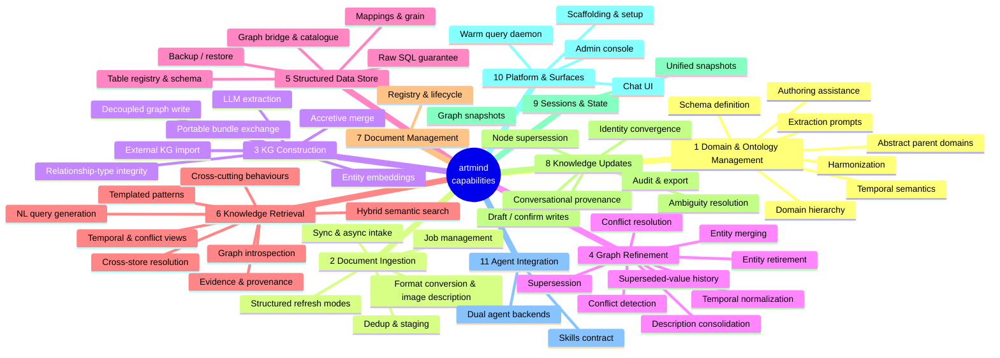

# artmind Capability Map

A feature baseline distilled from **artmind as the reference implementation**. Each leaf
feature is stated implementation-agnostically, with the artmind command (or module) that
anchors it. When evaluating another implementation, score every leaf on the scale below —
this doc is both the *input baseline* (what a knowledge system should offer) and the
*test checklist* (what to verify it actually does).

Every feature carries a stable hierarchical id (`4.5`, `6.2.3`) — reference rows by id
when reviewing or scoring.

**Scoring scale** (per leaf feature):

| Level | Meaning |
|---|---|
| **none** | The capability is absent. |
| **partial** | Present in reduced form — e.g. has vector search but no rank fusion, has snapshots but not unified ones. Note the gap. |
| **full** | Matches or exceeds the reference behaviour described in the feature statement. |

**The `✓` column** marks rows whose statement has been verified against the reference
implementation's source. A blank means the row is still first-draft, derived from command
surface rather than code. Each capability's **Grounding notes** carry what that
verification pass surfaced: why the feature exists in the shape it does, and what to
actually test when scoring another implementation.

## Overview

---

## 1. Domain & Ontology Management

The system's knowledge is organized into user-defined domains, each governed by a schema
(ontology) that drives extraction and querying.

| # | ✓ | Feature | Statement | Reference anchor |
|---|---|---|---|---|
| 1.1 | ✓ | Schema definition | A domain is defined by a single self-contained declarative artifact carrying its identity and routing description, entity-class list, extraction guidance, and temporal semantics; domains are added and removed at runtime by registering/removing the artifact. | `artmind domains add` / `delete` (YAML) |
| 1.2 | ✓ | Domain hierarchy | Domains form parent/child families through dotted naming alone — hierarchy is derived from the names themselves, with no separate registry to maintain; listings render the tree, nesting depth is unbounded, and a parent name used as a query filter rolls up all descendants (see 6.8.4). | `artmind domains list` (e.g. `banking.policy`) |
| 1.3 | ✓ | Schema-carried extraction prompts | The extraction prompts for entities, properties, and relationships are authored in the schema itself — the schema is the single artifact governing extraction — and are inspectable per domain. | `artmind domains entities-prompt` / `properties-prompt` / `relationships-prompt` |
| 1.4 | ✓ | Schema harmonization | Child schemas can be synced against their parent non-destructively: missing entity/prompt blocks are materialized down by copy, child-specific extras are never removed; supports dry-run. Temporal blocks are instead inherited dynamically at load time (see 1.5). | `artmind domains harmonize --dry-run` |
| 1.5 | ✓ | Declarative temporal semantics | The schema declares how time is read from content: document-level fields supplying validity/version, per-entity-class date-property mappings (`valid_from` / `event_at`), a relative anchor, and defaults. A parent's temporal block deep-merges under the child's when the schema loads. | `temporal:` block, `temporal.py` (`load_schema`) |
| 1.6 | ✓ | Abstract parent domains | A parent domain can exist purely as a hierarchy root — no documents ingested under it — serving as the scope for cross-domain queries (`--domain <parent>`) and as the harmonization source for its children. | `banking_schema.yaml` |
| 1.7 | ✓ | Schema authoring assistance | A new domain schema can be generated by an LLM from a domain name and example documents, producing entity classes, prompts, and guidance tuned to the content. | `artmind-create-schema` skill |

> **Scoring note:** the reference implementation validates only the schema's `name` field at
> registration; malformed content surfaces at extraction time. Validation depth is a
> comparison point when scoring implementations, not part of the baseline statement.

> **Scoring note:** the reference implementation's harmonize step determines "missing" by
> diffing `entity_types` list membership, not by checking whether the prose block is already
> present in the child's prompt text — it stays idempotent only because harmonize itself keeps
> the list and prose in lockstep. A schema hand-edited so the two diverge will get blocks
> duplicated on the next harmonize run. Not part of the baseline statement, but worth checking
> when scoring another implementation's "non-destructive sync" claim.

### Grounding notes

**1.1 Schema definition**
*Why it matters* — one file is the entire contract for a domain: identity and routing
description, the entity-class list, three full prose prompt blocks, and the temporal
block. Nothing about a domain lives in code, so a domain is a portable, reviewable,
diffable artifact. Schemas are read from disk at the point of use, which is what makes
runtime add/remove real — no reload, re-index, or restart step exists to forget.
*Test hint* — register a schema and confirm it is listed and immediately usable for
ingestion with no restart; then confirm removing it takes effect just as immediately.

**1.2 Domain hierarchy**
*Why it matters* — hierarchy costs nothing to maintain because it is inferred from names
rather than declared in a registry, so it cannot drift out of sync with the schemas that
exist. This is the mechanism 1.6 and 6.8.4 are built on: a parent filter expands to
`IN $domains OR STARTS WITH (parent + '.')`, and every retrieval path applies it —
including the LLM-to-Cypher path, so a generated query cannot widen its own scope.
*Test hint* — ingest into `p.child`, query with `--domain p`, and assert the child's
entities come back; then repeat the same assertion through the natural-language query
path to confirm scope enforcement survives LLM generation.

**1.3 Schema-carried extraction prompts**
*Why it matters* — extraction behaviour is tuned per domain by editing prose in the
schema, not by changing system code, so the people who understand a domain can shape how
it is read without touching the pipeline. The three `*-prompt` commands are a read-only
window onto exactly what will be sent to the LLM, which makes extraction auditable before
it runs rather than only diagnosable after.
*Test hint* — change a prompt in a schema, confirm the inspection command reflects it and
that extraction behaviour follows, with no code change or redeploy.

**1.4 Schema harmonization**
*Why it matters* — harmonization only ever adds, never rewrites: it's scoped per section, so
a child that never defined a `properties_prompt`/`relationships_prompt` doesn't get one
fabricated for it, and it patches the raw file via targeted substitution rather than a full
re-serialization, so a child's comments and unrelated content survive untouched — a
harmonize run stays a minimal, reviewable diff.
*Test hint* — remove an entity type from a child's `entity_types:` list while leaving its
prose blocks untouched, harmonize, and check whether the parent's block is appended a second
time alongside the existing one (the reference implementation diffs list membership, not
prose content, so it isn't idempotent under that kind of drift).

**1.5 Declarative temporal semantics**
*Why it matters* — time is declared per domain rather than hardcoded, so one normalization
engine serves every domain: each schema states which of *its own* property names carry
validity and event dates, and the engine maps them onto canonical fields. Load-time
inheritance means a family declares shared temporal defaults once at its root, and
children override only where they differ — the opposite trade-off from harmonization
(1.4), which materializes by copy.
*Test hint* — load a child domain's schema and confirm the parent's temporal defaults
appear merged beneath the child's own overrides, with the child's values winning.

**1.6 Abstract parent domains**
*Why it matters* — a family gets a queryable root without that root holding any content
of its own: cross-family questions get a single scope name, and harmonization gets a
single source of truth to push down. It makes the ontology's shape explicit — the parent
declares what the family shares — rather than leaving commonality implicit across siblings.
*Test hint* — confirm a parent-scoped query returns its children's content while the
parent itself has no documents ingested against it.

**1.7 Schema authoring assistance**
*Why it matters* — the same three-prompt, one-file schema contract (1.1) that makes a
domain portable also makes it agent-authorable: the skill's output is exactly what
`domains add` consumes, so a new domain requires no code and no bespoke schema-writing
knowledge beyond sample documents. It's scoped to the operator surface only — the Claude
SDK backend enforces this via a hard skill allowlist (`profiles.py`'s `ADMIN_PROFILE`),
not merely a persona's prose.
*Test hint* — confirm the skill's worked examples and any hardcoded class-naming or
id-prefix guidance match the base-type convention and structural additions (e.g. a
`temporal:` block) the rest of the system currently enforces on schemas — a skill's
reference material can silently drift from the schemas it's meant to model.

## 2. Document Ingestion

Intake of files and directories into the system, with lifecycle management of the work.

| # | ✓ | Feature | Statement | Reference anchor |
|---|---|---|---|---|
| 2.1 | ✓ | Synchronous ingestion | A file or directory can be ingested in one blocking call; when a directory is given, one file's failure is isolated and does not abort the rest of the batch. | `artmind ingest sync` |
| 2.2 | ✓ | Asynchronous ingestion | Ingestion can be submitted as a background job that returns a job id immediately, processed by a worker; one file's failure is isolated and does not abort the rest of the job. | `artmind ingest async`, `worker.py`, admin console ingest dashboard |
| 2.3 | ✓ | Job management | Jobs can be listed (in bulk, or filtered to active/completed), filtered by status, inspected per-file, results retrieved, and failed jobs retried. | `artmind ingest jobs` / `jobs-active` / `jobs-completed` / `job-status` / `job-results` / `retry-job` |
| 2.4 | ✓ | Content deduplication | Identical already-registered content is skipped by default, with an explicit force override. | `--force` |
| 2.5 | ✓ | Staged ingestion | Extraction can run without committing to the graph, leaving output staged for a later commit. | `--stage-only` |
| 2.6 | ✓ | Domain assignment at intake | Every ingested document is assigned to a domain, via flag or interactive prompt; an unrecognized domain is rejected up front, before any ingestion work begins. | `--domain`, `_get_available_domains()` |
| 2.7 | ✓ | Structured refresh modes | Tabular files (csv/xlsx) support replace-on-reingest or full SCD-2 temporal history keyed by business key, with an optional per-row effective-date column; captured history is queryable as of any past date, not just in its current state. | `--refreshMode temporal --businessKey --effectiveDateColumn`, `artmind db timeline --asOf` |
| 2.8 | ✓ | Format-agnostic intake | Documents in heterogeneous source formats are normalized to a common text representation before extraction; the original file is preserved alongside the conversion. | `docling`, `ingest_file()` (`ingest.py`) |
| 2.9 | ✓ | Multimodal image description | Images embedded in an ingested document are captioned by a vision-capable model, and the caption is woven into the document's text in place of the image, making image content visible to text-only downstream extraction. | `_describe_image()`, `ARTMIND_IMAGE_MODEL` |
| 2.10 | ✓ | Chunk-level extraction visibility | For a document mid-extraction or failed, per-chunk status can be inspected individually for each extraction step (entities/properties/relationships), not just as an aggregate progress count. | `artmind ingest job-chunks`, `_fetch_chunks()` (`jobs.py`) |

> **Scoring note:** the reference implementation has no job-cancellation mechanism — a
> queued or processing job runs to completion or failure; nothing can abort it mid-flight.
> Not part of the baseline statement, but worth checking when scoring another
> implementation's job management.

### Grounding notes

**2.1 Synchronous ingestion**
*Why it matters* — a single blocking call gives the caller the true end-to-end result
(registered, converted, chunked, extracted, committed) in the same process, with no
polling or job-id bookkeeping — the right shape for a one-off file or a scripted batch
that wants a hard failure signal inline. Per-file isolation is part of the same
contract: a directory batch is a collection of independent units of work, so one
unreadable or oversized file shouldn't cost the rest of the batch. Internal chunk-level
parallelism (a bounded thread pool during extraction) is entirely contained within the
call — the SDK-level concurrency never turns the CLI invocation itself into something
async.
*Test hint* — ingest a directory containing one corrupt/unreadable file alongside valid
ones and confirm the batch completes with a per-file failure count rather than aborting;
separately, ingest a directory containing dotfiles or a dot-directory (`.DS_Store`, a
nested `.git/`) and confirm they're skipped rather than wastefully attempted — every
intake surface (sync, async, and any UI-driven submission) must agree on this, which is
easy to lose if directory discovery isn't centralized in one place.

**2.2 Asynchronous ingestion**
*Why it matters* — the worker is self-terminating rather than a standing daemon: it
drains whatever's queued and exits, so a submission after an idle period always spawns a
process that re-imports current code from disk, sidestepping the stale-code trap a
long-lived server would have (contrast `artmind serve`, 6.8.3/10.3). The queue-and-worker
primitive is shared infrastructure — both the CLI (`ingest async`) and the admin
console's ingest dashboard submit into the same `ingestion_jobs` table and the same
on-demand worker, so job management (2.3) works identically regardless of which surface
queued the job.
*Test hint* — submit a job, kill the worker mid-batch, and confirm a later submission
resumes draining the queue rather than losing the still-queued files; separately, submit
a directory through both the CLI and the dashboard's ingest form and confirm they select
the same files (directory discovery is centralized in `collect_ingest_files()` for
exactly this reason).

**2.3 Job management**
*Why it matters* — retrying a failed file isn't a blunt restart: it deletes the file's
row from the document registry (so the dedup/rename gate that blocks re-ingesting a
known filename doesn't fire) and resets the job/file bookkeeping, but deliberately
leaves per-chunk extraction state untouched. Since a file's content hash is stable, the
next extraction pass reuses whatever chunks already succeeded and only reruns what
failed — retry composes with resumable extraction (3.1) rather than duplicating it.
Every read operation here (list, status, results) works identically whether the job was
queued from the CLI or the admin console's ingest dashboard, because both surfaces call
the same `jobs.py` functions rather than one wrapping the other.
*Test hint* — fail a job partway through extraction (e.g. one chunk's entities step
errors), retry it, and confirm the already-successful chunks/steps are not
re-extracted — only the failed step reruns. Separately, confirm every job-management
read (list/status/results) returns the same data regardless of which surface (CLI or
admin console) is used to query it.

**2.4 Content deduplication**
*Why it matters* — the two ingestion pipelines solve the same problem differently
because they're deduping different things: a document is an immutable artifact (either
this exact file is already registered, or it isn't — a flat, domain-agnostic identity),
while a table is a mutable, versioned resource scoped to where it's used. Forcing a
document duplicate creates an independent extraction identity (randomized doc/chunk
identity, renamed original) so it never collides with the original in the graph; forcing
a table re-ingest instead versions the same row in place — the same flag name, two
intentionally different mechanics.
*Test hint* — ingest the same file into two different domains without `--force`: for a
KG document, confirm the second ingestion is skipped as a duplicate (global scope); for a
structured file producing a same-named table, confirm both domains keep independent rows
(domain-scoped) — this asymmetry is deliberate and tested
(`test_ingest_structured_file_same_table_name_two_domains_no_overwrite`), not a bug to
expect fixed.

**2.5 Staged ingestion**
*Why it matters* — what's deferred is the full per-document commit pipeline (graph
write, then temporal normalization and supersession hooks), not just a raw write —
`commit_to_graph()` is the single convergence point every ingestion source (this one,
external KG import (3.3), bundle import) and every surface (CLI, admin console) reach at
commit time, so a staged document gets identical treatment whenever it's eventually
committed, regardless of how it got staged. This is the same underlying mechanism as
3.2's KG-JSON artifact — 2.5 is the opt-in at ingest time, 3.2 is what the resulting
artifact is and how it's later consumed.
*Test hint* — stage a document, confirm nothing appears in the graph yet but
`KG_DIR/<domain>/<doc>/document.json` exists, then commit it later and confirm the graph
now reflects it *and* that temporal/supersession normalization ran (not just a bare node
write). Separately — a real gap to probe in any implementation — ingest a directory
mixing documents and tabular files with staging requested, and check whether the tabular
files were staged too or silently committed anyway (the reference implementation commits
them immediately regardless of the flag).

**2.6 Domain assignment at intake**
*Why it matters* — validation is uniform across both file types (KG documents and
structured tables), and deliberately so: a domain's structured-table metadata isn't just
a scoping label, it's what the structured↔graph bridge (5.4/5.6/6.7.1) matches against.
Column-to-entity-class mapping proposals work by fetching that domain's *actual graph
entities* and fuzzy-matching structured column values against them — a domain with no
schema can never have graph entities (extraction requires the schema to run at all), so
a structured table silently registered under a schema-less domain would be permanently
unable to receive mapping proposals with no error ever surfacing. Rejecting the domain
up front, before any file is even read, avoids paying for a document's costly conversion
step only to fail deep inside extraction, and avoids a structured table being registered
under a typo that quietly breaks bridging forever.
*Test hint* — ingest with a nonexistent domain via the non-interactive path (flag or
API) for both a KG document and a structured file, and confirm both are rejected
immediately with a message naming the bad domain — not accepted, and not failed later
with a generic, hard-to-diagnose error.

**2.7 Structured refresh modes**
*Why it matters* — the two modes solve genuinely different problems: replace is a
cheap, disposable snapshot (old data simply doesn't matter once refreshed), while
temporal treats history as data worth keeping correct — it closes rows whose business
key vanished from a batch rather than ignoring the deletion, and never rewrites a row
whose content is unchanged, so a no-op refresh is a true no-op at the storage level, not
just skipped at the file level. Captured history is only as valuable as it is queryable:
`db timeline`'s point-in-time read mirrors the graph store's own `--asOf` convention
(used across every `query graph` command), so a temporal table's history and an entity's
valid-time history are queried the same way — one mental model for "what did this look
like on date X," whether the answer lives in the graph or the structured store.
*Test hint* — refresh a temporal table three times: once with a changed row, once with
a row removed, once with nothing changed — confirm the middle refresh closes exactly the
removed key's row rather than silently dropping it, and the last refresh writes zero new
rows. Then query the table `--asOf` a date preceding the second refresh and confirm it
returns the pre-refresh state, not the current one.

**2.8 Format-agnostic intake**
*Why it matters* — extraction downstream only ever reasons over normalized text, so
supporting a new source format is a conversion-layer concern, not an extraction-layer
one; the pipeline's quality is decoupled from the format the source document happened to
arrive in. This applies uniformly to both intake paths (sync and async both call the
same `ingest_file()`), not just one of them.
*Test hint* — ingest documents in at least two structurally different formats (e.g. a
PDF and a plain markdown file) into the same domain and confirm both extract with
comparable fidelity, and that the original file is retrievable independently of its
converted form.

**2.9 Multimodal image description**
*Why it matters* — the KG extraction LLM only ever sees text, so without this step any
information conveyed purely through an embedded image (a diagram, a photo, a chart)
would be invisible to extraction; captioning turns that visual content into text the
same schema-guided prompts can reason over, before extraction ever runs.
*Test hint* — ingest a document with an embedded image carrying information not
restated in the surrounding prose, then confirm an entity or property derived from the
image's content appears in the extracted graph.

**2.10 Chunk-level extraction visibility**
*Why it matters* — `job-status`'s `chunk_progress` only ever gives a count ("4 of 6
chunks done"), which can't distinguish a job that's genuinely still working through
chunks from one that's silently stuck on a specific chunk's specific step; per-chunk
visibility turns "extraction seems stuck" into "chunk 3's relationships step is the one
still pending," which is what you'd actually act on.
*Test hint* — while a job is mid-extraction, inspect its chunk grid and confirm it shows
independent entities/properties/relationships status per chunk rather than one combined
per-chunk status.

## 3. Knowledge Graph Construction

Turning ingested documents into a graph of entities, properties, and relationships.

| # | ✓ | Feature | Statement | Reference anchor |
|---|---|---|---|---|
| 3.1 | ✓ | LLM extraction | Entities, properties, and relationships are extracted from document chunks by an LLM guided by the domain schema; extraction is resumable at the step level, skipping already-successful entities/properties/relationships steps within each chunk rather than re-running whole chunks. | `artmind ingest extract-kg`, `ingest.py:extract_kg`, `extraction.py` (prompt builders) |
| 3.2 | ✓ | Decoupled graph write | Extraction output is persisted as an intermediate artifact (KG JSON) that can be written to the graph independently of extraction — re-runnable after store failures — and graph commit is the single convergence point for every ingestion source, chaining per-document temporal normalization and supersession detection after the write. | `artmind ingest write-to-graph`, `commit_to_graph()` (`ingest.py`) |
| 3.3 | ✓ | External KG import | Pre-extracted KG artifacts can be pulled from an external repository into local staging, conflict-checked against existing local documents, and committed via the same graph-write step as any other staged extraction. | `artmind ingest pull-kg`, `kg_pull.py:pull_kg` |
| 3.4 | ✓ | Entity embeddings | Entities get vector embeddings to enable semantic entity search. | `artmind ingest embed-entities`, `embed_missing_entity_embeddings()` (`ingest.py`) |
| 3.5 | ✓ | Provenance links | Every extracted entity stays linked to the source chunks it came from via a provenance edge (evidence ids); relationships do not carry their own source-chunk link — only the entities they connect do. | `EXTRACTED_FROM` relationship (`ingest.py:_write_to_neo4j`), `chunks_by_id` (`graph_query.py`) |
| 3.6 | ✓ | Reserved relationship-type enforcement | System-managed relationship types (supersession, extraction-provenance edges) cannot be created by LLM-driven extraction — an extracted relationship that would collide with a reserved type is rejected at write time, not merely by prompt convention. | `RESERVED_REL_TYPES` (`ingest.py`) |
| 3.7 | ✓ | Accretive entity-property merge | Repeated extraction of the same entity (matched by name, class, and domain) merges incoming properties into existing ones — type-aware per field (lists union, strings concatenate, scalars keep the established value) — rather than overwriting, so multiple documents contributing to one entity accumulate rather than clobber. | `_upsert_entity` (`ingest.py`) |
| 3.8 | ✓ | Portable bundle exchange | A staged extraction artifact for one document can be exported as a single portable file and re-imported elsewhere, entering the graph through the same commit path as any other staged extraction — a third route to that convergence point alongside direct extraction (3.2) and external repository pull (3.3), needing no git/ssh transport at all. | admin console `/api/artifacts/{domain}/{doc}/bundle`, `/api/artifacts/import` |

> **Scoring note:** the reference implementation does not link a relationship edge back to
> the chunk(s) it was extracted from — only the entities on either end of a relationship
> carry that link. A relationship's supporting evidence must be inferred from its
> endpoints' evidence, not fetched directly. Not part of the baseline statement, but worth
> checking when scoring another implementation's provenance claims.

### Grounding notes

**3.1 LLM extraction**
*Why it matters* — resumability is granular at the step level, not the chunk level: each
chunk persists independent entities/properties/relationships status, so a resume after a
partial failure re-runs only the step that failed, not the whole chunk's three LLM calls.
This is also not a separate pipeline from ingestion (section 2) — `ingest sync`/`async`
call this exact function inline via `ingest_to_kg()`; the standalone `extract-kg` command
is a re-entry point into the same code for resume/retry, not an alternate implementation.
Relationships can additionally be marked bidirectional by the LLM, in which case the write
layer creates edges in both directions.
*Test hint* — extract a document, force one chunk's relationships step to fail, re-run
extraction, and confirm only that chunk's relationships step re-executes — its
already-`ok` entities/properties steps and every other chunk are left untouched.

**3.2 Decoupled graph write**
*Why it matters* — `commit_to_graph()` is documented as the single convergence point for
every ingestion source (direct extraction, external pull, bundle import) and does more
than write: it chains per-document temporal normalization and per-document supersession
detection immediately after the write succeeds, both best-effort (a down hook logs a
warning but doesn't fail the commit, since the graph write already happened). This is why
4.4/4.7's mechanisms already run automatically at ingest time — the standalone section-4
commands exist for cross-document/backfill scope, not because per-document normalization
is otherwise dormant. When a document's own supersession fires, the commit hook also
re-asserts that document's properties over the accretive merge (3.7) so the newer
version's values win outright instead of concatenating.
*Test hint* — commit a staged document whose content declares it supersedes an earlier
one, and confirm in one call: the graph write, the SUPERSEDES edge, and the superseded
document's properties being overwritten (not merged) by the new values — all without a
separate `normalize-time`/`detect-supersession` invocation.

**3.3 External KG import**
*Why it matters* — pulling is a staging operation, not a commit: `pull_kg()` sparse-clones
only the requested sub-path (validated against traversal and restricted to
`https`/`ssh`/`git` transports), aborts entirely if any incoming document folder name
collides with one already on disk, and then only copies files into local KG storage.
Nothing reaches Neo4j until a separate graph-write step runs — pulled documents are staged
exactly like a `--stage-only` extraction (2.5), reusing the same `commit_to_graph()`
convergence point (3.2) rather than having their own write logic.
*Test hint* — pull from a repo into a domain and confirm nothing appears in the graph yet;
then run the write step and confirm it now does, with temporal/supersession hooks having
run. Separately, pull the same document name twice and confirm the second pull aborts on
conflict rather than overwriting the first.

**3.4 Entity embeddings**
*Why it matters* — the backfill function this command exposes is the same one already
called automatically inside every graph commit (a fresh entity is embedded the moment it's
written), so the standalone command's real job is catching up entities that missed it —
e.g. an embedding service that was down at write time. The same function is reused as the
general re-embed primitive elsewhere: `consolidate.py` nulls an entity's embedding after
rewriting its description so this backfill re-embeds the new text, and
`refine_pipeline.py`'s embed sweep does the same after merging aliases into a canonical
entity — both lean on "missing embedding" as the trigger rather than duplicating embedding
logic. One inconsistency worth noting: this function hand-rolls its own single-domain
rollup predicate (`domain = $d OR domain STARTS WITH ($d+'.')`) instead of importing the
shared `domain_predicate()` helper that every retrieval path in 6.8.4 composes into its
query — functionally equivalent here since only one domain is ever passed, but a second
implementation of the same rollup logic outside the one place 6.8.4 credits as
authoritative.
*Test hint* — write an entity, confirm it has an embedding without ever calling the
backfill command; then null an entity's embedding directly and confirm the backfill
command (or a consolidation/merge pass) picks it up as "missing" and re-embeds it.

**3.5 Provenance links**
*Why it matters* — only entities get a durable link back to source text; relationships
don't. The write layer explicitly strips `chunk_id`/`doc_id` before creating an
Entity→Entity edge, so a relationship's originating chunk is not recoverable from the
graph once written — evidence can be pulled for the entities on either end, but not for
the claim connecting them. The entity-level `EXTRACTED_FROM` edge, meanwhile, is
load-bearing well beyond display: conflict detection's evidence-gathering step reads it to
fetch source text for LLM adjudication and to resolve a document's validity for
supersession verdicts, the `mentions` centrality ranking mode counts it as a degree, and
orphan-entity cleanup on document deletion checks for its absence before deleting a node.
*Test hint* — extract a document, inspect the graph, and confirm every entity has an
`EXTRACTED_FROM` edge to a `DocChunk` but no Entity→Entity relationship carries a chunk or
document id in its properties — the gap should be reproducible, not incidental.

**3.6 Reserved relationship-type enforcement**
*Why it matters* — supersession and extraction-provenance edges are system-managed and
audited elsewhere (supersession only via the temporal helpers that stamp
scope/detected_by/effective provenance; `EXTRACTED_FROM` only via this module's own
per-entity write). If LLM extraction ever produced a relationship that normalized to one
of those type names, writing it naively would let an ordinary document silently mint a
fake supersession or provenance edge with no audit trail. The guard is enforced at the
point relationships are written to Neo4j — after type names are normalized (uppercased,
non-alphanumeric replaced) — so it's a hard backstop, not just a prompt instruction the
LLM might ignore. A deliberate omission: `PART_OF` is not reserved even though a
structural `DocChunk→Document` edge uses that name too, because several shipped domain
schemas legitimately extract `part_of` between entities (e.g. branch/region) — reserving
it there would silently drop real extractions.
*Test hint* — get an LLM extraction to emit a relationship typed `SUPERSEDES` or
`EXTRACTED_FROM` (or something that normalizes to one), write it to the graph, and confirm
it's rejected with a logged warning rather than silently created; separately confirm a
legitimate `part_of` relationship between two entities is *not* blocked.

**3.7 Accretive entity-property merge**
*Why it matters* — this is the default outcome any time extraction produces the same
entity again (matched by name + entity_class + domain) — from a later chunk in the same
document, or a different document entirely — and it's a different mechanism from 4.1's
entity merging, which reconciles *different* names judged to be aliases. Here identity is
already known (the match key is exact); what's being resolved is that two chunks or
documents both asserted something about that one entity, and the merge is type-aware per
field rather than a blind overwrite: list-valued properties union, string values
concatenate as `"old | new"` when they differ, and numeric/boolean values keep whatever
was already there. This is also exactly the behavior 4.6/4.7's supersession hook has to
fight: when a document is detected to supersede another, `commit_to_graph` re-asserts that
document's own property values straight over the merge, because accretive concatenation is
the wrong outcome once one side is known to be authoritative.
*Test hint* — extract two documents into the same domain that both mention an entity with
the same name and class but different descriptive text for one property, write both to the
graph, and confirm the entity's property value reflects both contributions (concatenated
or unioned) rather than the second write clobbering the first — then repeat with one
document marked as superseding the other and confirm that case instead overwrites cleanly.

**3.8 Portable bundle exchange**
*Why it matters* — this complements 3.2/3.3 with a transport that needs nothing beyond a
file: no git remote, no `https`/`ssh`/`git` restriction to enforce, just a zip. It still
converges on the exact same `commit_to_graph()` call as every other ingestion source, so
temporal normalization and supersession detection run identically regardless of how the
document got staged. Import validates every zip member resolves to a path under the
destination directory before extracting anything — a zip-slip guard, the same family of
containment check as 3.3's transport restriction and 7.2's `_delete_path` parent check —
so this is the third place in the codebase independently defending against a path escaping
its intended directory.
*Test hint* — export a staged document's bundle, import it into a different domain/doc
slot, and confirm it stages then commits identically to a CLI `write-to-graph` call;
separately, craft a zip containing a `../`-traversal entry and confirm import rejects it
with no file written, rather than extracting outside the destination directory.

## 4. Graph Refinement & Curation

Maintenance of the graph after construction — the difference between an extraction dump
and a curated knowledge base.

| # | ✓ | Feature | Statement | Reference anchor |
|---|---|---|---|---|
| 4.1 | ✓ | Entity merging | Entity names are clustered by string similarity within their entity class (never across classes), an LLM adjudicates which clustered names are true aliases and picks a canonical name, and approved merges re-wire every relationship from alias to canonical. Cross-domain merges are guarded by default. | `artmind ingest refine-graph`, `refine_graph.py` |
| 4.2 | ✓ | Refinement pipeline | All refinement steps run in dependency order in one command (time → supersession → merge → conflicts → consolidate → embed); deterministic steps apply immediately while judgment-requiring steps produce reviewable proposals, applied only in an explicit second pass. Refining two or more domains together adds a cross-domain conflict pass after every domain's own steps complete. | `artmind ingest refine-pipeline`, `refine_pipeline.py` |
| 4.3 | ✓ | Description consolidation | Accumulated per-chunk entity descriptions are rewritten into clean prose from their source chunks; the original is preserved, chunk/document provenance is recorded, entities with an unresolved conflict are skipped, and superseded source material is marked historical rather than blended in as current. | `artmind ingest consolidate-descriptions`, `consolidate.py` |
| 4.4 | ✓ | Temporal normalization | Canonical validity fields (`valid_from` / `valid_to` / `event_at`) are backfilled from schema-declared temporal mappings, across a domain and every concrete child in its family that holds data. | `artmind ingest normalize-time`, `temporal.py` |
| 4.5 | ✓ | Conflict detection | Contradictions between entities — within one domain family or across separate domains — are detected via embedding-similarity candidate generation and LLM adjudication, and materialized non-destructively as first-class objects; a parent-domain scope expands to every concrete child holding data. | `artmind ingest detect-conflicts`, `conflicts.py` |
| 4.6 | ✓ | Supersession (manual) | A human can assert one document supersedes another, closing the superseded document's validity and retiring entities it solely sourced (see 4.8). Only document-level scope is supported — finer-grained scopes are rejected rather than silently half-applied. | `artmind ingest supersede`, `temporal.py` |
| 4.7 | ✓ | Supersession (automatic) | Documents are scanned for supersession declarations, which are applied as typed edges (see 4.8 for the entity-level effect). | `artmind ingest detect-supersession` |
| 4.8 | ✓ | Entity retirement on supersession | When a document is superseded, entities it solely sourced stop being returned as current by point-in-time queries, while entities still asserted by live documents are unaffected. | `_retire_orphaned_entities` (`temporal.py`) |
| 4.9 | ✓ | Superseded-value history | Property values a superseding document overwrites are preserved in a queryable history partition that is invisible to ordinary entity queries and semantic search. | `entity_history.py`, `artmind query graph entity-versions` |
| 4.10 | ✓ | Conflict resolution | A detected conflict can be explicitly closed as resolved or dismissed, with the reason recorded; closure is never automatic. | `artmind ingest resolve-conflict` |
| 4.11 | ✓ | Supersession via conflict adjudication | When two candidate-matching entities are found not to genuinely disagree but to represent successive revisions of the same authority, a supersession relationship is recorded instead of a conflict — the entity-level effects of supersession (4.8) apply to this route too. | `conflicts.py` (`materialize`, verdict `"superseded"`) |

> **Scoring note:** the reference implementation's precondition for cross-domain conflict
> detection (a prior `refine-graph` run on each target domain) is enforced only as a
> logged warning, not a hard block — a caller can skip it and pairing will simply operate
> on undeduplicated entities. Not part of the baseline statement, but worth checking when
> scoring another implementation's "candidate pairing operates on clean entities" claim.

> **Scoring note:** on an existing graph, entity retirement (4.8) and superseded-value
> history (4.9) recover asymmetrically. Retirement only depends on the `SUPERSEDES` edge
> existing, so re-running supersession detection retroactively retires entities from
> supersessions that predate this capability. History cannot do the same — a snapshot is
> only captured at document-commit time, before the accretive merge overwrites the prior
> value, so a pre-existing supersession has no recoverable history even after a rescan.
> Worth checking whether another implementation's history mechanism has the same
> asymmetry or backfills differently.

### Grounding notes

**4.1 Entity merging**
*Why it matters* — clustering is class-constrained before it is similarity-constrained,
which is what keeps a same-named-but-different-thing pair (e.g. a product and a fee
named after it) from ever entering the same cluster in the first place; the LLM
adjudication step then decides aliasing within that already-safe candidate set. The
default cross-domain guard exists so `detect-conflicts` (4.5) still has same-named
entities from different domains to compare — an unguarded merge would erase the very
pairs conflict detection needs.
*Test hint* — cluster a domain with two same-class, similarly-named-but-distinct
entities and confirm the merge proposal does not group them; separately, run an
all-domains merge with no `--domain` filter and confirm same-named cross-domain pairs
are skipped and reported rather than merged.

**4.2 Refinement pipeline**
*Why it matters* — the propose/apply split exists because the six steps have real cost
and risk asymmetry: time/supersession are cheap, additive, and safe to run unreviewed,
while merge/conflicts/consolidate spend LLM calls and (for merges) delete nodes with no
built-in undo. Running them all through one command also enforces the dependency order
by construction — merges must land before cross-domain conflict detection compares
entities, which a human running the individual commands could get wrong.
*Test hint* — propose against two domains, confirm merge/conflict/consolidate produce
files rather than graph writes while time/supersession show up as already-applied counts,
then apply from that report and confirm the cross-domain conflicts pass ran only once,
after both domains' own merge steps.

**4.3 Description consolidation**
*Why it matters* — the conflict-open skip gate is what makes 4.2's step ordering
(conflicts before consolidate) load-bearing: consolidating an entity mid-dispute would
force the LLM to silently pick a side. Preserving the original in `description_raw` and
recording exact source-chunk ids means a bad consolidation is always recoverable and
auditable, unlike a merge.
*Test hint* — mark an entity with an open conflict and confirm a consolidation run
skips it; separately, consolidate the same entity twice with an unchanged chunk set and
confirm the second run is a no-op (chunk-set-idempotent).

**4.4 Temporal normalization**
*Why it matters* — before the family rollup, a parent-scoped call matched nodes stamped
exactly with the parent domain — normally none, since abstract parent domains hold no
documents — so `normalize-time --domain banking` silently did nothing. The fix expands to
concrete children first and loads each child's own schema, so a family-wide backfill
actually reaches the documents that exist.
*Test hint* — run `normalize-time` against a parent domain whose children hold documents
and confirm the returned `domains_processed` lists the children, not just the parent, and
that counts are nonzero.

**4.5 Conflict detection**
*Why it matters* — candidate pairing is embedding-ANN-driven and class-blocked, not a
brute-force cross product, which is what makes cross-domain detection tractable at all;
string similarity is only a secondary tie-break on the ANN shortlist. The same domain
rollup fix as 4.4 means a parent-domain call now performs real cross-child pairing
instead of the previous no-op — the exact case the CLI's own `1=intra-domain,
2+=cross-domain` help text describes, now also reachable via one family name.
*Test hint* — run `detect-conflicts` against a single parent domain whose children hold
data and confirm the candidate count is nonzero and the report's `domains` field lists
the expanded children while `domains_requested` keeps the original single entry.

**4.6 Supersession (manual)**
*Why it matters* — this is the convergence point all three supersession routes (manual,
automatic notice-scan, and 4.11's conflict-adjudicated route) share, so the entity
retirement in 4.8 was added here once rather than three times. The `--scope` rejection
exists because the alternative was worse: silently closing the whole document's validity
while claiming a `section`/`clause` scope that the graph has no unit to represent —
inconsistent state with no way to reach the promised behavior.
*Test hint* — supersede two documents and confirm entities solely sourced from the older
one retire (4.8) in the same call; separately, confirm `--scope section` or `--scope
clause` is rejected before any graph lookup, not after a partial write.

**4.7 Supersession (automatic)**
*Why it matters* — three independent signals (prose notice, metadata-table row, and a
schema-gated title-family chain) all resolve through the same `apply_supersession()`
convergence point as the manual path, so a document that declares its own supersession
gets the identical entity-retirement and history-capture treatment as one a human
asserts by hand.
*Test hint* — ingest a document with a genuine `## Supersession Notice` section citing an
existing document's version, confirm the edge is applied automatically at commit time
with no separate command, and confirm the superseded document's solely-sourced entities
retire in the same commit.

**4.8 Entity retirement on supersession**
*Why it matters* — this is the fix for a defect where entity-oriented queries
(`pattern1`/`pattern2`/`pattern9`, `entity-listing`) never reflected document-level
supersession at all, because `--asOf` filtering reads `Entity.valid_to`, and nothing
wrote it. The single-source condition — retiring only entities whose entire evidence
traces to the superseded document — is what keeps an entity still asserted by the newer
document, or by any unrelated live document, correctly unaffected; verified live against
a real corpus where entities re-asserted by the newer document (e.g. a policy re-stated
across versions) correctly stayed current while a genuinely dropped provision correctly
retired.
*Test hint* — supersede a document, then query an entity solely sourced from it with
`--asOf today` (should be absent) and without `--asOf` (should reappear, carrying
`status: superseded` and `valid_to`); separately confirm an entity also asserted by the
newer document is unaffected by the same supersession.

**4.9 Superseded-value history**
*Why it matters* — the history zone is a real partition, not a filtered view: snapshot
nodes carry neither the live entity's label nor a class label, so every existing entity
query, the semantic-search vector index, and the merge/conflict machinery are structurally
blind to them rather than relying on a filter someone has to remember. A snapshot is only
written for property values a superseding document actually overwrites — an entity merely
dropped (no overwrite) is handled by 4.8's retirement instead, not duplicated here.
*Test hint* — supersede a document that overwrites a specific property on a re-asserted
entity, confirm a history snapshot exists carrying the old value, and confirm the live
entity and ordinary entity queries never surface the snapshot node itself.

**4.10 Conflict resolution**
*Why it matters* — before this, `query graph conflicts --status resolved|dismissed` was a
filter over a state nothing could produce: `materialize()` only ever wrote `status='open'`
and no other code path — including LLM-generated Cypher, which is hard-blocked from any
write — could change it. Resolution is deliberately explicit-only, matching the system's
stated philosophy that a real disagreement between authorities is a human judgment call,
never something a re-detection pass silently resolves on its own.
*Test hint* — resolve a conflict with a reason, confirm `query graph conflicts --status
resolved` (or `--status all`) surfaces it with the reason attached, and confirm
`--status open` (the default) no longer does.

**4.11 Supersession via conflict adjudication**
*Why it matters* — this is a third, independent path to supersession alongside the
manual (4.6) and notice-scan (4.7) routes, and the only one that can link two documents
neither of which declares a relationship to the other in its own text — it works by
noticing two entities that ANN-matched as candidates are actually the same authority at
different versions rather than a live disagreement. It shares 4.6/4.7's exact
`apply_supersession()` convergence point, so it inherits entity retirement (4.8) for
free; a domain-family-wide `detect-conflicts` run (per 4.5's rollup) can therefore both
write new `SUPERSEDES` edges and retire entities across a whole family in one call.
*Test hint* — construct two entities that are really the same authority at different
versions (differing `valid_from`), run cross-domain or intra-family conflict detection,
and confirm the adjudicator's `superseded` verdict produces a `SUPERSEDES` edge with
`detected_by: adjudicator` rather than a `Conflict` node.

## 5. Structured Data Store

A parallel SQL store for tabular data, joined to the graph rather than flattened into it.

### The three table classifications

Every registered table carries three independent semantic judgments (5.4/5.5/5.6), each
proposed then confirmed on its own. Two of them describe *columns* and are easily
conflated, so the distinction is worth stating plainly: **`bridge` asks whether a document
would discuss a column's values; `mapping` asks what class those values are instances of.**
Those are orthogonal questions — a column can be either, both, or neither.

| | `grain` | `bridge` column | column `mapping` |
|---|---|---|---|
| **Unit** | the whole table | one column | one (column, entity_class) pair |
| **Cardinality** | exactly one per table | at most one role per column | many per column — a column may denote several classes |
| **Question** | what do these rows denote? | would a document discuss these values? | what class are these values instances of? |
| **Answer** | `instance` / `lookup` / `normative` | yes (`term`) | `CUSTOMER`, `PRODUCT`, … — drawn from the domain schema |
| **Evidence used** | table metadata + column profiles | the column's sampled values | sampled values + the schema's class descriptions |
| **What consumes it** | answer synthesis: only `normative` changes behaviour, quarantining the table against the documents that also assert its content | fusion: feed the cell's value to `query vector-text` / `entity-resolve` to pull related graph content | routing: "which tables are about `CUSTOMER`?" (`db bridge --entityClass`) |
| **Confirm with** | `db grain --set` | `db bridge confirm` | `db mappings … confirm` |

Worked example — four columns of one `complaints` table, showing all four combinations:

| column | sampled values | bridge | mapping | why |
|---|---|---|---|---|
| `customer_id` | `CUST-0003`, `CUST-0016` | — | `CUSTOMER` | opaque keys mean nothing to a document, yet they plainly denote customers |
| `status` | `Resolved`, `Upheld` | ✓ | — | complaint-handling vocabulary a policy discusses, but not a thing the graph models as an entity |
| `category` | `Fee Dispute`, `Fraud/Unauthorized Transaction` | ✓ | `PROCESS_STEP` | both: a searchable term *and* a typed thing |
| `compensation_gbp` | (numeric) | — | — | a measure: neither searchable vocabulary nor an entity |

`customer_id` is the case that most clearly separates the two: no string search of the
documents will ever surface `CUST-0003`, so it is useless as a bridge, while it is exactly
the column that tells the router this table is about `CUSTOMER`.

| # | ✓ | Feature | Statement | Reference anchor |
|---|---|---|---|---|
| 5.1 | ✓ | Table registry | Ingested tables are registered and listable, domain-scoped — resolution is symmetric across the domain hierarchy: a query at a child domain also reaches tables registered at an ancestor, and a query at a parent reaches every descendant's tables. | `artmind db list` |
| 5.2 | ✓ | LLM-ready schema | Table schemas (columns, types, value profiles, mappings) are exposed in the form an LLM needs to write SQL. | `artmind db schema`, `text2sql.py` (`_schema_summary_sql`) |
| 5.3 | ✓ | Independent-query guarantee | Raw read-only SQL runs against the store with no LLM in the loop. | `artmind db sql`, `text2sql.validate_read_only_sql` |
| 5.4 | ✓ | Semantic mappings | Columns are mapped to graph entity classes via a propose → confirm lifecycle (set / confirm / clear). Candidates are LLM-proposed against the domain **schema's** class descriptions, so a table is classifiable the moment it lands — with no dependency on the domain having any ingested documents or extracted entities. | `artmind db mappings`, `db propose` (`semantics.py:propose_mapping`) |
| 5.5 | ✓ | Table grain semantics | What a table's rows denote — instance, lookup, or normative — is proposed and confirmable. | `artmind db grain`, `db propose` (`semantics.py:propose_semantics`) |
| 5.6 | ✓ | Structured↔graph bridge | The join model between store and graph (class scope, bridge columns, grain) is explicit, inspectable, and reviewable: every proposed part of it carries a confirm → reject lifecycle, and one command lists whatever is still unadjudicated. | `artmind db bridge` (+ `bridge confirm`/`clear`), `artmind db review` |
| 5.7 | ✓ | Graph catalogue | The store's structure is mirrored as a catalogue subgraph (Table / TableColumn / EntityClass) inside the graph itself. | `artmind db catalogue` |
| 5.8 | ✓ | Source refresh | A table can be re-ingested from its recorded source file. | `artmind db refresh` |
| 5.9 | ✓ | External adapters | A surface is reserved for connecting external SQL engines beyond the embedded one. | `artmind db connect` (stub, DuckDB-only v1) |
| 5.10 | ✓ | Store backup/restore | The structured store snapshots to a single archive and restores from it (wipe + restore). | `artmind db backup` / `restore` |
| 5.11 | ✓ | Bulk classification | Every table in a domain can be (re-)classified in one call, skipping tables whose classification already succeeded unless a full redo is requested, with progress reported as the run proceeds. | admin console structured tab (`POST /api/structured/propose-all`) |

> **Scoring note:** the reference implementation's cross-store fusion runs on raw value
> strings only — there is no persisted `RESOLVES_AGAINST` anchor linking a table's rows to
> specific graph entities, and no persisted "which classes govern this table" relation.
> Unscoped value-driven semantic search (`query vector-text`) stands in for both, per
> measurement in `docs/superpowers/specs/2026-07-25-cross-store-join-model-design.md`. Not
> part of the baseline statement, but worth checking whether another implementation's
> "bridge" claim is backed by a real stored join or the same string-fusion approach.

> **Scoring note:** `db sql` (5.3) is deliberately exempt from the scoping and quarantine
> conventions that apply elsewhere in the system — it is domain-unscoped (one connection
> sees every domain's tables at once) and blind to the `grain=normative` quarantine rule
> (5.5/5.6), unlike `text2sql`, which honors both. This is a documented, intentional
> asymmetry — an operator-facing raw-SQL escape hatch, not an agent-facing retrieval path —
> not a gap to expect closed in another implementation.

### Grounding notes

**5.1 Table registry**
*Why it matters* — hierarchical domain matching is symmetric by design, not an oversight:
documents carry a genre-scoped domain (`banking.cases`, `banking.policy`) because that's
the level an extraction schema lives at, but tables carry the corpus root because a table
has no genre. Without the ancestor half, the documented routing workflow (take the domains
from `domains-overview`, ask `db list --domain <d>` per one) returns empty for every one of
them while populated tables sit at the parent — the exact defect
`docs/superpowers/specs/2026-07-25-cross-store-join-model-design.md` measured and fixed.
*Test hint* — register a table under a bare parent domain (e.g. `banking`), then list it via
a child scope (`db list --domain banking.cases`) and confirm it's returned; separately
confirm a table registered at a child is still returned by a parent-scoped list (the
pre-existing descendant direction).

**5.2 LLM-ready schema**
*Why it matters* — `db schema`'s CLI output (columns, dtypes, profiles, confirmed mappings)
is the operator-facing view; the fuller form actually handed to the text2sql LLM
additionally carries `[bridge]` annotations and a grain-based quarantine note
(`text2sql._schema_summary_sql`). The two are close but not identical — an operator
debugging a bad generated query by eyeballing `db schema` won't see everything the LLM saw.
*Test hint* — confirm a table with a confirmed bridge column shows `[bridge]` in the
text2sql prompt (inspect via `text2sql --dry-run`) even though `db schema`'s own JSON output
has no equivalent field.

**5.3 Independent-query guarantee**
*Why it matters* — the read-only check is one shared function (`validate_read_only_sql`)
reused verbatim by `db sql`, the admin-UI's SQL route, and text2sql's own generated
queries, so the write-verb blocklist can't drift between surfaces. Unlike every other query
path in the system, `db sql` carries no domain filter and no grain-quarantine awareness —
it's a deliberate operator escape hatch, not a scoped retrieval path (see scoring note
above).
*Test hint* — confirm a write-verb keyword embedded past a semicolon or inside a CTE is
still rejected; separately, ingest tables under two different domains and confirm a single
`db sql` call can query both in one statement (no scoping error).

**5.4 Semantic mappings**
*Why it matters* — the question "does this column denote instances of this class" is
semantic, not lexical, and the distinction is load-bearing. An earlier implementation matched
sampled column values against the domain's *already-extracted* graph entity names (exact,
then `difflib` fuzzy). That can only ever recognise a class whose members have already been
written to the graph verbatim, which produced two failures worth naming: a `customer_id`
column full of opaque keys like `CUST-0019` matches no entity name and stayed unmapped even
though it plainly denotes `CUSTOMER`; and a domain with tables but no ingested documents got
zero proposals forever, since there were no names to match against — a chicken-and-egg
dependency that grain and bridge (which read only the table) never had. Reading the domain
schema's class descriptions instead (`schema_reference.parse_entities`, the same parser the
admin-ui's Schemas tab uses) removes the graph from the loop entirely. Note the cost: the
schema is now load-bearing for mapping, so a domain whose schema is missing or unharmonized
fails this step with a clear error rather than silently proposing nothing — deliberately
distinguished in code from "schema exists but declares no classes", which is a legitimate
empty result.
*Test hint* — the decisive check is a domain that has a schema and tables but **zero**
extracted entities (`query graph entity-listing --domain <d>` returns nothing): `db propose
<table> --domain <d>` must still persist mappings. The retired matcher short-circuited to
`[]` in exactly that case, so a non-empty result cannot be produced by string matching.
Separately, confirm a proposal for an opaque-identifier column whose values appear nowhere in
the graph, and confirm a `(column, entity_class)` pair already marked `confirmed` survives
`db propose <table> --step mapping --redo` untouched.

**5.5 Table grain semantics**
*Why it matters* — grain and bridge-column proposal share a single LLM call
(`semantics.propose_semantics`), because there is no way to ask the model just one of the two
questions; the orchestrator therefore gates whether grain is *persisted* on whether that step
was actually requested. Grain is proposed at first registration and never re-proposed by a
refresh, because what a table means does not change when rows arrive. Confirming `normative`
requires `refresh_mode=temporal` — enforced in `registry.set_grain` itself, not just the CLI —
because a fact that gets superseded needs history to stay reconstructable via `--asOf`.
All three steps (grain, bridge, mapping) carry their own run status on the table row
(`grain_status`/`bridge_status`/`mapping_status`, each `pending|ok|failed`), mirroring
`kg_chunk_status`'s per-chunk entities/properties/relationships model: a step that fails is
recorded and logged rather than raised, so `db propose` resumes exactly what is broken and
leaves succeeded steps alone. Failures store no error text, matching the codebase's
best-effort-hook convention — diagnosis is via the ingestion log.
*Test hint* — confirm a fresh table's grain is proposed automatically on first ingest with
no separate command; then attempt `db grain <table> --set normative` on a `replace`-mode
table and confirm it's rejected before any write. For the step model: set one step to
`failed`, run `db propose <table>` with no flags, and confirm only that step re-runs (an
already-`ok` step must cost no LLM call) — and that `--redo` is the only way to re-run one.

**5.6 Structured↔graph bridge**
*Why it matters* — `entity_class`, not `domain`, is the actual routing key: it's
many-to-many with tables in a way a single dotted domain string never could be (one
`complaints` table can map to `CUSTOMER`, `EMPLOYEE`, and `PRODUCT` at once). `db bridge`'s
output composes the same `list_tables` domain resolution as 5.1, so it inherits the same
ancestor/descendant symmetry.
The review loop closes over all three parts of the join model, not just mappings: grain
(`db grain --set`), mappings (`db mappings ... confirm`) and bridge columns (`db bridge
confirm`) are each confirmable, and `db review` is the cross-table inbox — it lists only
tables with something still unconfirmed, so a table disappears from it once fully
adjudicated and an empty result means the domain is done. Note what confirming does and
does not do: unconfirmed proposals already route (they reach the catalogue carrying
`confirmed: false`, deliberately, so a fresh table isn't invisible until reviewed), and
nothing reads `column_roles.confirmed` at all today — confirming raises trust and stops a
column being re-litigated, rather than switching anything on.
*Test hint* — confirm `db bridge --entityClass CUSTOMER` returns only tables whose
confirmed-or-proposed mappings include that class, from across every table regardless of
which domain in the hierarchy it's registered at. For the review loop: take a table with
one unconfirmed bridge column and an unconfirmed grain, confirm both, and assert it drops
out of `db review` (`pending_count` decrements) — then assert `db bridge confirm` on a
column with no bridge role fails loudly rather than silently no-opping.

**5.7 Graph catalogue**
*Why it matters* — this subgraph is the *only* routing surface on a query-only host (no
`$ARTMIND_DATA_DIR`, so no registry DB), which is why unconfirmed mappings are projected too
(carrying `confirmed: false` on the edge) rather than dropped — dropping them would leave a
freshly ingested table invisible to routing until a human reviewed it. The wipe-then-rebuild
scope is deliberately descendant-only (`include_ancestors=False`), unlike 5.1/5.6's symmetric
read path, so a rebuild never orphans an ancestor-registered table it doesn't also re-write.
*Test hint* — confirm an unconfirmed mapping still appears in the catalogue subgraph with
`confirmed: false`; separately, rebuild the catalogue for a child domain and confirm a table
registered at the parent is untouched (neither wiped nor re-projected) by that call.

**5.8 Source refresh**
*Why it matters* — `register_table`'s update path deliberately leaves `grain` untouched on
every re-ingest (only `set_grain` changes it), so an operator's confirmed grain survives a
refresh the same way confirmed mappings do. The catalogue is re-projected after every
refresh, which is how a mapping confirmed after the fact (`db mappings ... confirm`) reaches
Neo4j without a re-ingest.
*Test hint* — confirm a table with a manually confirmed `normative` grain keeps that grain
after `db refresh`; separately, confirm the Neo4j catalogue reflects a refresh's new row
count without a separate `db catalogue` call.

**5.9 External adapters**
*Why it matters* — this is a reserved surface, not a partial implementation: `db connect`
raises unconditionally regardless of the DSN given, so there's no half-working adapter path
to accidentally rely on. The surface already has a shape, though: `connector.py`'s
`Datasource` Protocol (`introspect_schema`/`profile_columns`/`run_sql`/`load_table`) is what
`DuckDBDatasource` structurally satisfies today, and what a future non-DuckDB adapter would
need to implement — nothing enforces it via `isinstance` or a declared base class yet, it's a
documented contract, not wiring.
*Test hint* — confirm `db connect` fails identically for both a plausible and an obviously
malformed DSN — the rejection is unconditional, not DSN-shape validation.

**5.10 Store backup/restore**
*Why it matters* — `registry.restore_all` reinserts every row with its original primary key,
which is what keeps `columns.table_id` / `column_mappings.table_id` / `column_roles.table_id`
valid after a wipe-and-restore — a naive re-insert (letting SQLite reassign ids) would
silently orphan every dependent row.
*Test hint* — back up, mutate a table's mappings, restore, and confirm the mappings are back
to the backed-up state with the same `table_id` linkage (not just the same data floating
with new ids).

**5.11 Bulk classification**
*Why it matters* — the admin console's "classify all" action is not a separate
implementation: it iterates a domain's tables through the exact same
`propose_table_semantics` orchestrator `db propose` calls per-table (5.4/5.5/5.6), so a
bulk run inherits the same skip-if-`ok`, `--redo`, and never-overwrite-confirmed guarantees
without re-implementing them. Progress is deliberately non-persisted — an in-memory counter
keyed by domain — because a restart mid-run loses only the counter; each table's actual
classification state is already durable in the registry the moment its own call finishes.
*Test hint* — start a bulk run on a domain where some tables already have `grain_status` /
`bridge_status` / `mapping_status` all `ok`, and confirm those tables are skipped (no LLM
call) unless the run is started with redo; separately, poll the progress endpoint mid-run
and confirm `done`/`total` advance and the entry disappears once the run finishes.

## 6. Knowledge Retrieval

Answering questions over the accumulated knowledge — the consuming face of the system.

### 6.1 Graph introspection

| # | ✓ | Feature | Statement | Reference anchor |
|---|---|---|---|---|
| 6.1.1 | ✓ | Schema metadata | The graph describes its own labels, properties, and relationship types. | `artmind query graph metadata` |
| 6.1.2 | ✓ | Structural census | Focused counts and relationships for the core node types. | `artmind query graph structural-metadata` |
| 6.1.3 | ✓ | Entity inventory | Entity names grouped by label/class. | `artmind query graph entity-listing` |
| 6.1.4 | ✓ | Domain overview | Per-domain routing summary: document names/counts, entity counts, top classes. | `artmind query domains-overview` |

### 6.2 Templated graph retrieval (deterministic, no LLM)

| # | ✓ | Feature | Statement | Reference anchor |
|---|---|---|---|---|
| 6.2.1 | ✓ | Class listing | List entities of a class. | `pattern1` |
| 6.2.2 | ✓ | Entity detail | Info on one or more named entities. | `pattern2` |
| 6.2.3 | ✓ | Relationship summary | Entity plus a lightweight relationship summary. | `pattern3` |
| 6.2.4 | ✓ | Neighborhood expansion | Entity plus its full neighborhood. | `pattern4` |
| 6.2.5 | ✓ | Pathfinding | Paths between two entities — shortest, or all within bounded depth. | `pattern5` |
| 6.2.6 | ✓ | Direct relationships | Direct relationships between two named entities. | `pattern6` |
| 6.2.7 | ✓ | Fragment search | Search entities by name or description fragment. | `pattern7` |
| 6.2.8 | ✓ | Anchored class filter | Entities of class X connected to entity Y. | `pattern8` |
| 6.2.9 | ✓ | Centrality ranking | Top-N entities of a class by connection count. | `pattern9` |
| 6.2.10 | ✓ | Document chunks | All text chunks of a named document. | `pattern10` |

### 6.3 Hybrid semantic search

| # | ✓ | Feature | Statement | Reference anchor |
|---|---|---|---|---|
| 6.3.1 | ✓ | Fused text search | Source text searched by vector embeddings and keyword match, fused via Reciprocal Rank Fusion. | `artmind query vector-text` |
| 6.3.2 | ✓ | Entity resolution | A name fragment or description resolves to canonical graph entities (fulltext + vector, RRF). | `artmind query entity-resolve` |

### 6.4 Natural-language query generation

| # | ✓ | Feature | Statement | Reference anchor |
|---|---|---|---|---|
| 6.4.1 | ✓ | NL → graph query | A natural-language question is compiled to a graph query (Cypher), executed, and results returned. | `artmind query graph text2cypher` |
| 6.4.2 | ✓ | NL → SQL | A natural-language question is compiled to read-only SQL against the structured store and executed. | `artmind query text2sql` |

### 6.5 Evidence & provenance retrieval

| # | ✓ | Feature | Statement | Reference anchor |
|---|---|---|---|---|
| 6.5.1 | ✓ | Evidence fetch | Chunk text is retrievable by the exact evidence ids other queries return. | `artmind query chunks` |
| 6.5.2 | ✓ | Entity dossier | One call returns an entity's properties, one-hop relationships, and source chunk text. | `artmind query entity-context` |

### 6.6 Temporal & conflict views

| # | ✓ | Feature | Statement | Reference anchor |
|---|---|---|---|---|
| 6.6.1 | ✓ | Entity timeline | Events, state changes, and supersessions for an entity, in time order. | `artmind query graph timeline` |
| 6.6.2 | ✓ | Conflict listing | Materialized conflicts, scoped to given domains. | `artmind query graph conflicts` |
| 6.6.3 | ✓ | Entity version retrieval | Prior states of an entity are retrievable as an explicit chain of superseded property snapshots, oldest-first, or as the single state in force as of a given date. | `artmind query graph entity-versions` |

### 6.7 Cross-store resolution

| # | ✓ | Feature | Statement | Reference anchor |
|---|---|---|---|---|
| 6.7.1 | ✓ | Key resolution | A free-text value resolves to a canonical column value and/or a graph entity — the join point between stores. | `artmind query resolve-key` |

### 6.8 Cross-cutting retrieval behaviours

| # | ✓ | Feature | Statement | Reference anchor |
|---|---|---|---|---|
| 6.8.1 | ✓ | Domain scoping | Every query accepts repeatable, comma-splittable domain filters. | `--domain` on all query commands |
| 6.8.2 | ✓ | Machine-readable output | Every query emits JSON, with a compact mode. | `--compact` |
| 6.8.3 | ✓ | Warm serving | Queries are served by a long-lived daemon; the CLI transparently proxies to it for low latency. | `artmind serve`, `_entry.py` |
| 6.8.4 | ✓ | Hierarchical domain rollup | A parent-domain filter transparently includes every descendant domain at any depth. Templated graph queries, hybrid search, and the structured store enforce this server-side — the caller cannot influence the predicate or the set of tables/views exposed. LLM-generated Cypher is instead guarded at generation time: a query that never references the domain parameter is rejected before execution, though nothing verifies the predicate was actually applied to every matched node. | `domain_predicate` (`graph_query.py`), `structured/registry.py::list_tables`, `text2sql.py::execute_text2sql`, `text2cypher.py::validate_domain_scoped` |

> **Scoring note:** `domains-overview` (6.1.4) is the one query command with no `--domain`
> option at all — it is the cross-domain discovery entry point that domain filtering would
> be circular for (it exists precisely so a caller can learn what domains are available
> before scoping to one). 6.8.1's "every query accepts a domain filter" should be read with
> that one documented exception, the same way section 5 exempts `db sql`. Not part of the
> baseline statement, but worth checking whether another implementation's routing-discovery
> entry point has the same, necessary exception.

> **Scoring note:** the reference implementation's two NL-to-query paths (6.4.1/6.4.2)
> enforce domain scope by different means and to different strength, and the gap was real
> until this pass: `text2sql` builds its execution connection from only the tables
> `structured_registry.list_tables(domains)` returns, so an out-of-scope table cannot be
> queried regardless of what SQL the LLM writes — a structural guarantee independent of the
> LLM's compliance. `text2cypher` has no equivalent structural guarantee available (there is
> one shared graph, not one connection per domain); it now relies on a generation-time check
> (`validate_domain_scoped`) that the returned Cypher references the domain parameter at
> all, added specifically because the prior implementation had no check whatsoever — a
> generated query that omitted domain scoping entirely executed unscoped against the full
> graph. Even with the check, a query that mentions `$domains` without applying it to every
> matched node still passes; only the "forgot scoping entirely" failure mode is closed. Worth
> checking whether another implementation's NL-to-graph-query path has an equivalent guard,
> and whether it is structural (like the SQL path) or a heuristic backstop (like this one).

### Grounding notes

**6.1.1 Schema metadata**
*Why it matters* — `graph_metadata` is not a fixed schema description read from a config
file; it introspects live labels, relationship types, and property keys from whatever is
actually in the graph, domain-scoped like every other retrieval path. This is also the raw
input `text2cypher` compresses into its prompt's schema section (6.4.1) — the two share one
source of truth for "what does this domain's graph look like."
*Test hint* — ingest a document that introduces a new entity class or relationship type,
call `metadata` immediately after, and confirm the new label/type appears with no schema
re-registration step.

**6.1.2 Structural census**
*Why it matters* — this exists as a cheaper, fixed-shape sibling to 6.1.1: rather than the
full label/property enumeration, it returns counts and named lists for exactly the four
structural node types (Document, DocChunk, UserChat, Entity) plus their fixed relationships
— compact enough for an agent or `text2cypher` to sanity-check corpus size without parsing
the larger metadata payload.
*Test hint* — confirm the returned `Document` row's `names` list matches what `pattern10`/
`domains-overview` independently report for the same domain.

**6.1.3 Entity inventory**
*Why it matters* — grouping is by label (the entity class), not by domain, and every group
carries the raw name list an LLM can pattern-match against — this is the exact payload
`text2cypher` compresses into its prompt's entity-listing section, so the two must stay
literally the same function call, not two independent implementations that could drift.
*Test hint* — confirm `entity-listing --nameFilter <fragment>` and `text2cypher`'s prompt
(via `--dry-run`) agree on which entities exist for a fragment that matches only one class.

**6.1.4 Domain overview**
*Why it matters* — this is the one query command with no `--domain` filter (see the scoring
note above) precisely because it *is* the domain discovery step every other command's
`--domain` depends on. It aggregates Document/Entity counts from the graph and unions in
structured-store domains from the registry in a separate, independently-failing step —
wrapped in a bare `except`, so a query-only host with no registry DB still gets the graph
half of the overview rather than erroring the whole call.
*Test hint* — on a corpus where tables are registered at a coarser domain root than
documents (e.g. documents at `banking.cases`/`banking.policy`, tables at bare `banking`),
confirm `domains-overview` surfaces all three domains, not just the two holding documents.

**6.2.1–6.2.10 Templated patterns**
*Why it matters* — every pattern shares the same entity-selection convention: an exact
`--entityId`/`--entityIdList` always wins over fuzzy `--entityName`/`--entityNameList`
CONTAINS matching when both are given, which is what makes the documented Resolve-then-
Retrieve workflow (resolve a name once, reuse the id everywhere) actually safe from
name-collision fan-out. Two patterns are deliberate, documented exceptions to the `--asOf`
convention every other pattern follows: pattern5 (paths traverse unbound intermediate
entities with no single filterable variable) and pattern10 (chunk-level currency isn't
modeled) both accept `--asOf` but ignore it, surfacing `asOf_ignored: true` rather than
silently pretending to filter. pattern9's "connection count" is actually three selectable
degree modes (`relations`, `mentions`, `all`), and pattern7's fragment search runs against
an index built over both entity name *and* description, matching the stated "name or
description fragment."
*Test hint* — call any pattern with both a name and an id for the same option and confirm
the id wins; call pattern5 or pattern10 with `--asOf` set and confirm the response carries
`asOf_ignored: true` rather than a silently-filtered result.

**6.3.1 Fused text search / 6.3.2 Entity resolution**
*Why it matters* — both commands run two independently-ranked queries (Lucene fulltext and
cosine-similarity vector search) and combine them with the same `_rrf_combine` function
(`score = Σ 1/(k+rank)` per ranking list, `k=60`), so the fusion math can't drift between
the two call sites. `vector-text` additionally searches `UserChat` nodes alongside
`DocChunk` text (broader than "source text" alone suggests), and both commands degrade
gracefully — a missing vector index (e.g. an ungrounded pre-embedding corpus) is caught and
treated as an empty vector leg rather than failing the whole call.
*Test hint* — for a question whose answer is a name fragment (fulltext wins) and one that's
purely descriptive with no shared words (vector wins), confirm both surface the right
result through the same command; separately, null out the vector index and confirm the
command still returns fulltext-only results rather than erroring.

**6.4.1 NL → graph query**
*Why it matters* — domain enforcement here is **not** structural the way the templated
patterns are (see the scoring note above): the prompt instructs the LLM to add a
`$domains`-based `WHERE` clause to every unbound node, but prior to this pass nothing
checked that it actually did. `validate_domain_scoped` now rejects any generated Cypher
that never references `$domains` at all, alongside the pre-existing `validate_read_only`
write-keyword blocklist — both are regex/substring heuristics in the same style, not a
Cypher parser, so a query that references `$domains` without applying it to every matched
node still passes.
*Test hint* — force the LLM mock to return a query with no domain reference and confirm
`generate_cypher` raises before `_run_read_query` is ever called; separately, confirm a
normal domain-scoped query still executes and returns rows.

**6.4.2 NL → SQL**
*Why it matters* — unlike 6.4.1, this path's domain scope is enforced by construction, not
convention: `execute_text2sql` builds a fresh in-memory DuckDB connection and registers
views only for `structured_registry.list_tables(domains)` — not the shared persistent
catalog, which carries a permanent view for every table ever ingested across every domain.
An out-of-scope table is not merely filtered out of the prompt; it does not exist as a
queryable object in that connection, so no SQL the LLM could write can reach it.
*Test hint* — register tables in two different domains, generate SQL scoped to one, and
confirm a query that names the other domain's table by name fails with an unknown-table
error rather than returning data — the LLM cannot get around the view boundary by knowing
the table name.

**6.5.1 Evidence fetch**
*Why it matters* — this is the deterministic grounding step every chunk-id-returning
surface converges on (patterns 2/3/4's `doc_sources`, conflicts' `evidence`) — callers
never re-search for text they already have an id for. `--expand N` computes a same-document
neighbor window from the zero-padded `{doc_id}_{seq:03d}` chunk-id encoding, not from a
chunk's `name` field (which reads like "Chunk 16/38" and does not sort correctly).
*Test hint* — fetch a chunk with `--expand 1` and confirm the returned neighbors are the
lexically-adjacent chunk ids of the same document, not adjacent by `name` string.

**6.5.2 Entity dossier**
*Why it matters* — this collapses the pattern4-plus-chunk-fetch sequence into one call, and
orders returned chunks current-first (`valid_to IS NULL DESC`) before truncating to
`--includeChunks` — so the chunks with full text are preferentially the ones still valid,
and the overflow `more_chunks` (ids only) is exactly what `query chunks` expects next.
`--asOf` applies to the entity and its source chunks; the one-hop neighbor entities follow
pattern4's semantics and are not currency-filtered.
*Test hint* — set `--includeChunks 1` on an entity with more than one source chunk and
confirm the first is full text while the rest appear only in `more_chunks` as fetchable ids.

**6.6.1 Entity timeline**
*Why it matters* — `timeline` only ever reconstructs *relationship* changes for one entity
(dated edges to other `Entity` nodes, sorted by `event_at`/`valid_from`); it is not a
property-value history. The "supersessions" the statement mentions surface only indirectly,
as the entity's own `valid_from`/`valid_to` fields (the retirement effect from 4.8) — the
full chain of prior property values is a different, complementary command (6.6.3).
*Test hint* — supersede a document that retires an entity, call `timeline` on it, and
confirm the entity's own `valid_to` reflects the retirement — then confirm no per-property
"old value" ever appears in the `timeline` array itself (that's what 6.6.3 is for).

**6.6.2 Conflict listing**
*Why it matters* — this matches the `CONFLICTS_WITH` edge directly rather than requiring
the `Conflict` node to still exist, and joins the `Conflict` node in only as optional
enrichment (`materialized: bool` per row) — a deliberate resilience choice, since an edge
can outlive the node it was minted with. `status='all'` is required to see resolved/
dismissed conflicts (4.10); the default only returns `open`.
*Test hint* — resolve a conflict (4.10), confirm the default `--status open` call no longer
returns it, and `--status all` does, carrying its resolution reason.

**6.6.3 Entity version retrieval**
*Why it matters* — this is the command 6.6.1's grounding note points to: where `timeline`
shows an entity's *relationship* history, `entity-versions` shows its *property* history —
the superseded snapshots 4.9 writes to the history zone. Without `--asOf` it returns the
full chain oldest-first; with `--asOf` it returns the single snapshot whose validity window
covers that date, using a deliberately non-NULL-safe comparison (unlike `asof_predicate`
elsewhere) because an open-ended `valid_to` here means "closed, date unknown," not "still
open." An empty result with `--asOf` set means no snapshot covers the date — the live entity
was already current then, and callers are expected to fall back to it.
*Test hint* — supersede a document that overwrites a property on a re-asserted entity,
then call `entity-versions --asOf` a date before the supersession and confirm the old value
returns; call it with no `--asOf` and confirm the full chain is returned oldest-first.

**6.7.1 Key resolution**
*Why it matters* — this is deterministic string matching (exact case-fold, then `difflib`
fuzzy), not an LLM or embedding call — a deliberate choice: resolving a phrase the caller
actually typed against values that actually exist is a lexical question, unlike mapping
proposal (5.4) which is semantic. It always checks the graph (`entity_listing`); the column
leg only runs when `--column` is given, since without a target column there is nothing on
the structured side to match against.
*Test hint* — resolve a phrase that matches both a graph entity name and a column's
profiled value under the same string and confirm `source: "both"` with the higher of the
two scores; resolve one with no `--column` and confirm only the graph side was consulted.

**6.8.1 Domain scoping**
*Why it matters* — every `query`/`query graph` command declares `--domain` as
`required=True, multiple=True`, so scoping isn't opt-in — a caller cannot forget it, only
choose which domains. `domains-overview` (6.1.4) is the sole, necessary exception; see the
scoring note above.
*Test hint* — confirm every command in `just dev-cli-help`'s `query`/`query graph` subtree
has a `--domain` option except `domains-overview`.

**6.8.2 Machine-readable output**
*Why it matters* — one shared `_echo_json` helper backs every query command's output, with
`default=str` so non-JSON-native values (DuckDB `DATE`/`DECIMAL` from `text2sql`) render
instead of crashing the CLI's only output path. `--compact` only changes separators/
indentation, never the payload shape, so scripts can switch modes without a schema change.
*Test hint* — run the same query with and without `--compact` and confirm the parsed JSON
is identical, differing only in whitespace.

**6.8.3 Warm serving**
*Why it matters* — the daemon executes the real Click commands in-process via `CliRunner`
(byte-identical output to a direct CLI run — a transport layer, not a reimplementation),
and only proxies `query ...` calls; every other command falls through to a full process.
Requests are serialized behind one lock (`CliRunner` redirects process-wide stdout), so the
latency win is avoiding ~2s of import overhead per call, not request concurrency.
*Test hint* — compare `artmind query --help` against `ARTMIND_NO_PROXY=1 artmind query
--help` after a code change while the daemon is still running from before the change — a
mismatch confirms the daemon is serving stale code (see CLAUDE.md's testing traps).

**6.8.4 Hierarchical domain rollup**
*Why it matters* — the templated/hybrid/structured paths share one enforcement point each
(`domain_predicate` server-side for the graph, `list_tables`-scoped views for SQL) that the
caller cannot see or influence, which is what makes those three paths' rollup a genuine
guarantee. The LLM-to-Cypher path is qualitatively different: there is one shared graph, not
one connection per domain, so there's no equivalent structural boundary available — the
generation-time `validate_domain_scoped` guard closes the "forgot scoping entirely" failure
mode but is not the same class of guarantee, and the scoring note above spells out exactly
where it stops short.
*Test hint* — for the templated/hybrid/SQL paths, request a parent scope and confirm
descendant content returns with no way to widen it further; for text2cypher specifically,
confirm a generated query with no `$domains` reference is rejected before execution, and
separately confirm (this is the gap) that a query which references `$domains` in a
non-restrictive way (e.g. in an unrelated `RETURN` expression) is *not* caught.

## 7. Document & Corpus Management

| # | ✓ | Feature | Statement | Reference anchor |
|---|---|---|---|---|
| 7.1 | ✓ | Document registry | Ingested documents are registered — content-addressed and filename-unique across the whole system, not scoped per domain — with originals and converted markdown preserved in a data directory. | registry DB (`documents` table), `$ARTMIND_DATA_DIR` |
| 7.2 | ✓ | Clean deletion | A document's local artifacts, registry row, and graph nodes (document, chunks, and any entity left without a remaining source chunk) are removed in one call; graph objects that reference a removed entity only by relationship — an open conflict, a superseded-value history snapshot — are not swept, and can be left dangling. | `artmind docs clean` |
| 7.3 | ✓ | Structured table deletion | A registered structured table (and its underlying data) can be permanently removed on its own, independent of a full store wipe. | `artmind/structured/registry.py:delete_table` (defined, unreferenced — no CLI or API surface calls it) |

### Grounding notes

**7.1 Document registry**
*Why it matters* — uniqueness is enforced at the SQL layer by both `sha256` and `filename`,
globally rather than per domain — the same asymmetry 2.4 documents from the ingestion side
(a KG document's identity is flat and domain-agnostic, while a structured table's identity
is domain-scoped). The registry is write/delete-only from the CLI's own perspective:
nothing lists it directly. The closest thing to a browse surface is the admin console's
KG-artifact browser (3.8's neighboring `/api/artifacts` endpoint), which reads the KG
staging directory — a different source of truth from the registry table, not a view onto it.
*Test hint* — register the same filename twice under different domains and confirm the
second is rejected outright (a global name collision, not two independent rows); confirm
no command dumps the `documents` table directly — only indirect discovery exists, via the
KG-artifact browser or the graph's own `Document` nodes.

**7.2 Clean deletion**
*Why it matters* — the local half of the sweep (originals, markdown, markdown-artifacts,
KG staging dir) all clears through the same path-containment guard (`_delete_path`, which
resolves the path and checks it's under the expected parent before removing anything) — a
directory-traversal backstop, not just a convenience helper. The Neo4j half's orphan sweep
is domain-wide, not scoped to the document being cleaned: it detach-deletes any `Entity` in
that domain missing an `EXTRACTED_FROM` edge, which is what makes 3.5's provenance edge
load-bearing for deletion, not just retrieval. But `DETACH DELETE` only drops
relationships, not the nodes on the other end of them — a `Conflict` node (4.5) stays
behind with one or both `CONFLICT_OF` endpoints gone, and an `EntityVersion` history
snapshot (4.9) loses its only inbound `PRIOR_STATE` edge and becomes an unreachable orphan
itself, since neither node type is swept by this cleanup.
*Test hint* — clean a document whose sole entity carries an open conflict or a history
snapshot, then confirm the entity is gone but the `Conflict`/`EntityVersion` node is still
present in the graph, now referencing (or reachable from) nothing — the gap should be
reproducible, not incidental.

**7.3 Structured table deletion**
*Why it matters* — the deletion primitive already exists at the storage layer but nothing
above it — no `db` subcommand, no admin-console route — ever calls it, so a registered
structured table can currently only go away via a full structured-store wipe (`db
restore` from an earlier backup) or a full domain teardown, never on its own. This is the
one place in the system where no operator-facing path exists at all for an operation KG
documents already have (7.2); the propose→confirm lifecycle in section 5 covers
*classification* of a table, never its existence.
*Test hint* — attempt to remove a single registered table without touching any other table
in the same domain; confirm no CLI command or API route accomplishes it, and that
`registry.delete_table` has no caller anywhere in the codebase.

## 8. Knowledge Updates

Direct, conversational writes to the graph — knowledge that arrives as statements, not documents.

| # | ✓ | Feature | Statement | Reference anchor |
|---|---|---|---|---|
| 8.1 | ✓ | Two-phase NL writes | Facts stated in natural language are extracted and matched against existing graph candidates in a draft phase that writes nothing and is persisted for a later explicit confirm; the confirm applies the caller's per-entity resolution (create / link to a chosen existing node / skip) and reports only what actually landed. | `artmind update draft` / `confirm`, `write_user_chat` (`update.py`) |
| 8.2 | ✓ | Ambiguity resolution | The draft phase surfaces ranked candidate entities per extracted reference, exact matches first, so ambiguous references are resolved before anything is written; a resolution names the specific node chosen and the write lands on **that** node, not on the surface form the extractor produced. | `find_candidates`, `_link_entity_in_session` (`update.py`) |
| 8.3 | ✓ | Node supersession | One entity node can be marked as superseding another — node-level, distinct from document-level supersession — retiring the older node's currency without deleting it. Reachable both as a standalone correction and inline within a confirmed natural-language update, with the draft phase proactively detecting the likely cases. | `artmind update supersede`, `resolutions[].supersedes`, `_detect_supersession_candidates`; all via `apply_node_supersession` (`temporal.py`) |
| 8.4 | ✓ | Update audit | Recent update sessions are listable and filterable by author or by domain (rolling up descendants): who wrote, when, in which domain, and the input text — session metadata rather than a structured record of the resulting graph writes. | `artmind update history`, `_list_update_sessions` (`db.py`) |
| 8.5 | ✓ | Knowledge export | User-contributed knowledge is exportable to plain files as the original natural-language inputs plus the entities each one touched, ordered by session or regrouped by entity. | `artmind update export`, `export_chats` (`update.py`) |
| 8.6 | ✓ | Conversational provenance | Every confirmed natural-language write is itself persisted as a first-class node, embedded and linked to each entity it touched, so a fact's conversational origin stays recoverable — and is reachable by the same semantic search that serves document text. | `UserChat` node + `MENTIONS` edges (`write_user_chat`), searched by `artmind query vector-text` |
| 8.7 | ✓ | Write-path identity convergence | A conversational write resolves onto the same entity identity that document extraction uses, so a fact contributed by conversation and a fact extracted from a document accumulate on one node instead of silently forking into parallel ones. | `_find_existing_entity` (`update.py`), `_upsert_entity` (`ingest.py`) — both keyed on name + class + domain |

> **Scoring note:** conversational writes apply property values by overwrite, not by
> the accretive type-aware merge document ingestion uses (3.7). This is deliberate and
> is the one place the two write paths diverge on purpose: a user saying "no, it's X"
> is an authority statement, not another chunk's contribution, so concatenating the old
> and new values would be the wrong outcome. Worth checking which semantics another
> implementation picks for the conversational path, and whether it picked deliberately.

> **Scoring note:** node-level supersession (8.3) retires a node's currency but captures
> no superseded-value history snapshot, unlike document-level supersession (4.9) — the
> history zone is written only from the document-commit path. The retired node keeps its
> own last values and stays reachable without an `--asOf` filter, so nothing is lost;
> there is simply no prior-value chain to walk for a node retired this way.

> **Scoring note:** the counts a confirm returns (nodes created/updated/superseded,
> relationships written) go to the caller and are never persisted, so 8.4's audit trail
> cannot be asked what a past session actually changed — only what was said and by whom.
> Reconstructing the effect means reading the entities' own `updated_at`/`updated_by`
> stamps. Not part of the baseline statement, but a real depth difference to probe in
> another implementation's "writes are traceable" claim.

### Grounding notes

**8.1 Two-phase NL writes**
*Why it matters* — the draft phase is genuinely inert: extraction and candidate search
persist to a relational session/draft pair, and nothing touches the graph until confirm,
so an abandoned conversation leaves the graph untouched by construction rather than by
cleanup. Extraction reuses the *same* three schema-driven prompt builders document
ingestion uses, so a fact stated in chat is read through exactly the domain ontology that
governs documents — not a second, looser path. The write is equally bound by the system's
invariants: reserved relationship types (3.6) are rejected here too, so a conversational
turn cannot mint an unaudited supersession or provenance edge.
*Test hint* — draft a fact and confirm the graph is unchanged, then confirm the session
and check the same fact lands. Separately, the reporting is what makes this trustworthy:
force a resolution that cannot land (a `link` naming a deleted node) and confirm the
returned counts *exclude* it rather than reporting a write that never happened — an empty
graph match raises nothing, so a naive implementation over-reports here.

**8.2 Ambiguity resolution**
*Why it matters* — candidate ranking puts exact name matches first via an explicit flag
rather than a remapped score, because the underlying fulltext scores are unbounded and a
fuzzy hit would otherwise outrank an exact one. The decisive property is what the write
then does with the caller's choice: it resolves the chosen node by identifier — accepting
either the internal node id or the app-managed one, the same dual-format contract
supersession accepts — so the canonical node is updated even when its name differs from
the extracted surface form. Matching on the extracted name instead makes the entire
disambiguation step decorative, and fails silently in exactly the case it exists for.
*Test hint* — the decisive check is a resolution whose chosen candidate is named
*differently* from the extracted mention (extracted "Alice", candidate "Alice Smith").
Confirm the update, the provenance edge, and any relationship all land on the candidate
node, and that the counts reflect it — a name-keyed implementation no-ops here while
still reporting success. Then confirm a candidate from outside the queried domain can
still be linked, since candidate search falls back to a global scope.

**8.3 Node supersession**
*Why it matters* — three routes (standalone correction, inline within a confirmed update,
and the draft phase's proactive detection) all converge on the same helper that
document-level supersession uses, so provenance stamping and retirement semantics are
written once. Detection is a suggestion, never automatic: it fires only when the extracted
fact's source resolves to an *exact* existing node that already has a same-typed edge to a
different target — a fuzzy match means there is no established prior fact to replace, so
proposing one would be a guess. The retired node is never deleted; it gains an end date and
a superseded-by pointer, dropping out of point-in-time queries while staying fully readable.
*Test hint* — state a fact that replaces an existing relationship target (a role holder
changing) and confirm the draft *offers* the supersession rather than applying it; confirm
it, then query the retired node with and without a point-in-time filter and confirm it is
absent from the former and present in the latter carrying its end date.

**8.6 Conversational provenance**
*Why it matters* — the conversation node is not a log line, it is graph-resident and
embedded, which is what lets semantic search return a user-contributed fact alongside
document-sourced text for the same question instead of treating conversational knowledge
as a second-class store. Its edges to the entities it touched are what make the by-entity
export meaningful, and they are keyed on the resolved node — so a conversation about
"Alice" that resolved to "Alice Smith" is retrievable from that entity, which is the whole
point of storing the link rather than the raw string.
*Test hint* — contribute a fact conversationally, then ask a semantic text search a
question whose answer appears only in that contribution and confirm the conversation node
comes back. Separately, confirm the entity the resolution actually landed on carries the
provenance edge — not an entity merely named after the extracted surface form.

**8.7 Write-path identity convergence**
*Why it matters* — that identity triple is what every write and cleanup path in the system
matches on, yet nothing in the graph schema constrains it (only the surrogate id is
unique), so uniqueness is an invariant the write paths have to *maintain*, not one the
store enforces. If a conversational create ever mints a second node for a triple that
already exists, it does not merely duplicate: it leaves ingestion's merge, later
resolutions, and orphan cleanup all choosing arbitrarily between two nodes, with no error
anywhere. Guarding at write time is what keeps conversational and document knowledge
accumulating on one node.
*Test hint* — ingest a document mentioning an entity, then conversationally contribute a
fact about the same entity choosing "create" rather than linking, and confirm one node
results rather than two. Then check the general case: query the graph for duplicate
(name, class, domain) triples and confirm none exist — and check whether the store
constrains that itself or, as here, relies on every write path being careful.

## 9. Sessions & State

| # | ✓ | Feature | Statement | Reference anchor |
|---|---|---|---|---|
| 9.1 | ✓ | Graph snapshots | The full graph exports to a compressed snapshot and restores from one (wipe + restore) — session close/initiate semantics. | `artmind session close` / `initiate` |
| 9.2 | ✓ | Unified snapshots | All system state — graph, registry, structured store, KG artifacts — snapshots and restores together by default, or as an explicit subset with a divergence warning when a partial restore could leave components out of sync. | `artmind snapshot create` / `restore` |

### Grounding notes

**9.1 Graph snapshots**
*Why it matters* — relationships are re-matched on business keys (name/class/domain for
entities, `id` for everything else) rather than Neo4j's internal node ids, so a snapshot
is portable to a different database instance, not just a restore point for the same one.
Missing-label nodes are reconstructed from `entity_class` rather than dropped to a bare
`:Entity`, so a hand-edited or foreign snapshot doesn't silently produce nodes no query
can find again.
*Test hint* — export, wipe, restore into a *different* empty database and confirm
relationships reattach correctly; then hand-edit a snapshot to strip one entity node's
`labels` field and confirm it still restores under the correct class label instead of
becoming untyped.

**9.2 Unified snapshots**
*Why it matters* — each component is exported/restored through the exact same function
its own single-purpose command uses (`graph_snapshot`, `structured_snapshot`) rather than
a parallel implementation, so the unified path can't drift from the component-level one.
Selective restore exists because components can legitimately be restored independently
(e.g. rolling back structured data without touching the graph), but that flexibility is
exactly what can desynchronize them — hence the staleness warning rather than a silent
partial restore.
*Test hint* — restore only `structured` from a snapshot where graph/registry/structured
were all captured together, confirm the staleness warning fires, and confirm the Neo4j
structured-catalogue subgraph is rebuilt afterward even though the graph snapshot itself
never carried it.

## 10. Platform & Surfaces

| # | ✓ | Feature | Statement | Reference anchor |
|---|---|---|---|---|
| 10.1 | ✓ | Run-folder scaffolding | One command scaffolds the runtime home (config, skills, schemas, logs), overwriting package assets while preserving user data; runtime home and data dir are relocatable via env. | `artmind init`, `paths.py` |
| 10.2 | ✓ | Idempotent store setup | Database tables, constraints, and indexes are created idempotently. | `artmind setup` |
| 10.3 | ✓ | Warm query daemon | A long-lived server keeps the query layer hot; CLI calls proxy to it transparently, with an explicit escape hatch. | `artmind serve`, `ARTMIND_NO_PROXY` |
| 10.4 | ✓ | Chat UI | An end-user conversational web UI over the knowledge system. | `artmind chat-ui` |
| 10.5 | ✓ | Admin console | An operator web UI: agent console, ingest dashboard, structured-data tab, CLI guide, and live schema reference. | `artmind admin-ui` |
| 10.6 | ✓ | Structured classification UI | The structured-data tab surfaces per-table classification state (grain / bridge / mapping run status) and drives it: a per-table classify action with per-step and redo control, plus a bulk "classify every unclassified table in this domain" run with a live progress readout. Calls the same function the CLI does — a caller, not a reimplementation. | `admin-ui` Structured data tab, `POST /api/structured/tables/{t}/propose`, `POST /api/structured/propose-all` |

### Grounding notes

**10.1 Run-folder scaffolding**
*Why it matters* — package assets (skills, opencode persona, schemas) are overwritten
wholesale on every run because the package is their source of truth; user data (`.env`)
is seeded once and never touched again. That split is what makes editing
`artmind/skills/` reach the chat UI reliably (`just dev-refresh-skills`/`init`) without
ever clobbering a hand-edited `.env` or a user-added domain schema, which the package
doesn't ship and `_seed_tree` therefore never prunes.
*Test hint* — edit a package skill, run `init`, confirm the run-folder copy changes;
separately, hand-edit the run-folder `.env` and re-run `init`, confirm it's untouched; add
a domain schema directly to the run folder and re-run `init`, confirm it survives even
though the package never shipped it.

**10.2 Idempotent store setup**
*Why it matters* — `setup` re-runs the same scaffold step `init` does (so it's safe to run
standalone on a fresh checkout), and every Neo4j statement is `IF NOT EXISTS` or wrapped
to degrade gracefully — e.g. the `Entity.id` uniqueness constraint falls back to a plain
index if duplicate ids already exist, rather than failing setup outright.
*Test hint* — run `setup` twice in a row and confirm identical output/no errors; then seed
a graph with duplicate `Entity.id` values before running `setup` and confirm it reports
the fallback-index path instead of crashing.

**10.3 Warm query daemon**
*Why it matters* — the daemon executes the real Click command in-process via `CliRunner`
rather than reimplementing query logic over HTTP, so a proxied response is byte-identical
to a direct CLI run; and the proxy gate is scoped to `query` calls specifically (non-query
commands and `ARTMIND_NO_PROXY=1` always run in-process), which is what makes the daemon a
pure performance optimization rather than a second code path to keep in sync.
*Test hint* — compare `artmind query --help` against `ARTMIND_NO_PROXY=1 artmind query
--help` with a stale daemon running after a code change — they should disagree, proving
the daemon path is real and separately cached from disk.

**10.4 Chat UI**
*Why it matters* — the end-user surface isn't sandboxed by prose alone: it runs under
`QA_PROFILE`, which hard-scopes the agent to the `artmind-query`/`artmind-update` skills
only, so it cannot reach schema-authoring or ingestion tooling even if asked to.
*Test hint* — from the chat UI, ask the agent to create a new domain schema or trigger
ingestion and confirm it has no skill available to do so, versus the same request
succeeding from the admin console.

**10.5 Admin console**
*Why it matters* — "admin console" is one `admin-ui` process serving two lanes off the
same app factory: the agent chat (running under `ADMIN_PROFILE`'s wider skill set) and a
separate dashboard surface whose CLI guide and schema reference are generated live from
the running process's own imports/disk state on every request — never a checked-in copy
that can drift.
*Test hint* — edit a domain schema on disk and reload the Schemas tab without restarting
admin-ui; confirm it reflects the change immediately (no restart, no cache).

**10.6 Structured classification UI**
*Why it matters* — `propose_table_semantics` is the single re-entry point for
classification everywhere it can happen (CLI, ingest's auto-run on first
registration/new columns, and both admin-ui routes), so the UI is provably a caller and
not a parallel implementation that could drift from CLI behavior. The bulk-progress
counter is deliberately in-memory and non-persisted — a mid-run restart loses only the
live readout, never the actual per-table status already durable in the registry.
*Test hint* — trigger a bulk classify run, restart admin-ui mid-run, and confirm the
progress readout resets to zero/unknown while the tables that did finish still carry
their correct status rather than reverting.

## 11. Agent Integration

How AI agents consume the system — the NL interface contract.

| # | ✓ | Feature | Statement | Reference anchor |
|---|---|---|---|---|
| 11.1 | ✓ | Skills contract | Packaged agent skills define the NL workflows (query, ingest guidance, refinement, updates, schema authoring) and ship with the system as the source of truth. | `artmind/skills/` |
| 11.2 | ✓ | Dual agent backends | The web UIs run on either a first-party agent SDK or any ACP-speaking agent, selectable at runtime. | `webui/agent.py`, `--acp-cmd` |
| 11.3 | ✓ | Skill seeding | Skills are seeded into the runtime home so the agent's working directory always has the current contract. | `artmind init` (`_seed_tree()`) |
| 11.4 | ✓ | Agent persona packaging | A ready-made persona/config for an external agent runtime ships with the system. | `artmind/opencode/` |

> **Scoring note:** the reference implementation maintains two independent persona texts
> for the same two personas — inline prose in `profiles.py` for the SDK backend, and
> separate markdown files in `artmind/opencode/agent/` for the ACP backend — kept in sync
> by hand rather than generated from one source. Not part of the baseline statement, but
> worth checking whether another implementation's dual-backend persona texts can drift
> from each other silently.

### Grounding notes

**11.1 Skills contract**
*Why it matters* — each skill is a self-contained `SKILL.md` (with supporting
scripts/assets where needed) rather than logic embedded in agent prompts or app code, so
the NL workflow contract is inspectable, versionable, and — per 11.3 — reaches every
consuming surface (chat UI, admin UI, both agent backends) through one seeding path
rather than being duplicated per surface.
*Test hint* — confirm every NL workflow an agent surface offers (query, update, refine,
ingest guidance, schema authoring) traces back to one of these five directories rather
than to inline prompt logic elsewhere.

**11.2 Dual agent backends**
*Why it matters* — both backends are "profile-agnostic transport": the persona and skill
scoping live in the agent profile, not in the backend implementation, so adding a third
backend would not require re-deriving which skills or persona it gets. The ACP path's
prompt-preamble fallback reuses the SDK profile's own persona text when the spawned agent
has no native system-prompt channel, so the two "independent" backends still share
configuration data at that seam.
*Test hint* — switch backends mid-conversation via the UI radio picker and confirm a new
session starts (old context is not carried over) rather than assuming a seamless handoff;
separately, run the ACP backend against an agent with the prompt-preamble fallback enabled
and confirm the persona text still reaches it despite no native system-prompt support.

**11.3 Skill seeding**
*Why it matters* — the agent's working directory is deliberately the run folder, never the
source checkout, so the seeded skills copy is the *only* thing the agent can see — this is
what keeps the corpus and repo internals out of an end-user or operator conversation. Both
backends resolve skills through this same seeded directory, just via different mechanisms
(the SDK's native skill-selection option vs. an ACP persona's prose instruction to use them
by name).
*Test hint* — edit a skill in the package, run `init`, and confirm a *running* chat/admin
UI's next new session picks up the change without restarting the web server (skills are
read from disk per-session, not cached at process start).

**11.4 Agent persona packaging**
*Why it matters* — the two shipped personas mirror the two web-UI profiles exactly
(end-user vs. operator, same skill lists, matching ACP mode names), so an ACP agent gets
equivalent scoping to the SDK-backed surfaces even though it's driven by prose instruction
rather than the SDK's own skill-selection parameter.
*Test hint* — run the admin console over the ACP backend and confirm the agent both
introduces itself as the admin assistant and has (per its instructions) the wider skill
set — including schema authoring — that the end-user persona's instructions never mention.

---

## Comparison matrix template

When assessing another implementation, copy this structure and score each leaf by id:

| # | Feature | Score (none/partial/full) | Notes |
|---|---|---|---|
| 6.3.1 | Fused text search | partial | vector only, no keyword fusion |
| … | … | … | … |
