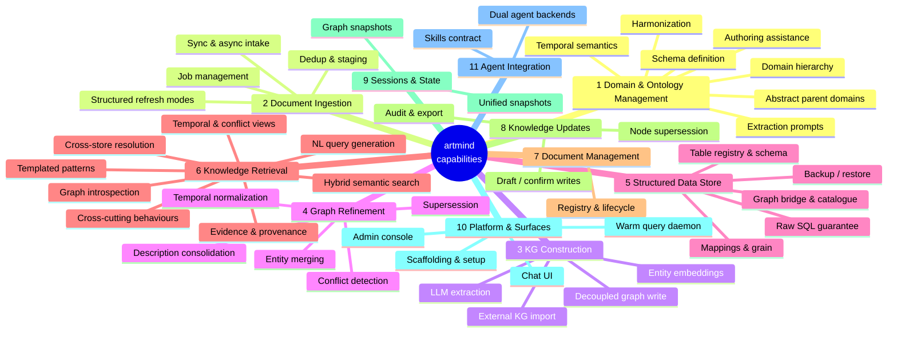

# artmind Capability Map

A feature baseline distilled from **artmind as the reference implementation**. Each leaf
feature is stated implementation-agnostically, with the artmind command (or module) that
anchors it. When evaluating another implementation, score every leaf on the scale below —
this doc is both the *input baseline* (what a knowledge system should offer) and the
*test checklist* (what to verify it actually does).

Every feature carries a stable hierarchical id (`4.5`, `6.2.3`) — reference rows by id
when reviewing or scoring.

**Scoring scale** (per leaf feature):

| Level | Meaning |
|---|---|
| **none** | The capability is absent. |
| **partial** | Present in reduced form — e.g. has vector search but no rank fusion, has snapshots but not unified ones. Note the gap. |
| **full** | Matches or exceeds the reference behaviour described in the feature statement. |

**The `✓` column** marks rows whose statement has been verified against the reference
implementation's source. A blank means the row is still first-draft, derived from command
surface rather than code. Each capability's **Grounding notes** carry what that
verification pass surfaced: why the feature exists in the shape it does, and what to
actually test when scoring another implementation.

## Overview

---

## 1. Domain & Ontology Management

The system's knowledge is organized into user-defined domains, each governed by a schema
(ontology) that drives extraction and querying.

| # | ✓ | Feature | Statement | Reference anchor |
|---|---|---|---|---|
| 1.1 | ✓ | Schema definition | A domain is defined by a single self-contained declarative artifact carrying its identity and routing description, entity-class list, extraction guidance, and temporal semantics; domains are added and removed at runtime by registering/removing the artifact. | `artmind domains add` / `delete` (YAML) |
| 1.2 | ✓ | Domain hierarchy | Domains form parent/child families through dotted naming alone — hierarchy is derived from the names themselves, with no separate registry to maintain; listings render the tree, nesting depth is unbounded, and a parent name used as a query filter rolls up all descendants (see 6.8.4). | `artmind domains list` (e.g. `banking.policy`) |
| 1.3 | ✓ | Schema-carried extraction prompts | The extraction prompts for entities, properties, and relationships are authored in the schema itself — the schema is the single artifact governing extraction — and are inspectable per domain. | `artmind domains entities-prompt` / `properties-prompt` / `relationships-prompt` |
| 1.4 |  | Schema harmonization | Child schemas can be synced against their parent non-destructively: missing entity/prompt blocks are materialized down by copy, child-specific extras are never removed; supports dry-run. Temporal blocks are instead inherited dynamically at load time (see 1.5). | `artmind domains harmonize --dry-run` |
| 1.5 | ✓ | Declarative temporal semantics | The schema declares how time is read from content: document-level fields supplying validity/version, per-entity-class date-property mappings (`valid_from` / `event_at`), a relative anchor, and defaults. A parent's temporal block deep-merges under the child's when the schema loads. | `temporal:` block, `temporal.py` (`load_schema`) |
| 1.6 | ✓ | Abstract parent domains | A parent domain can exist purely as a hierarchy root — no documents ingested under it — serving as the scope for cross-domain queries (`--domain <parent>`) and as the harmonization source for its children. | `banking_schema.yaml` |
| 1.7 |  | Schema authoring assistance | A new domain schema can be generated by an LLM from a domain name and example documents, producing entity classes, prompts, and guidance tuned to the content. | `artmind-create-schema` skill |

> **Scoring note:** the reference implementation validates only the schema's `name` field at
> registration; malformed content surfaces at extraction time. Validation depth is a
> comparison point when scoring implementations, not part of the baseline statement.

### Grounding notes

**1.1 Schema definition**
*Why it matters* — one file is the entire contract for a domain: identity and routing
description, the entity-class list, three full prose prompt blocks, and the temporal
block. Nothing about a domain lives in code, so a domain is a portable, reviewable,
diffable artifact. Schemas are read from disk at the point of use, which is what makes
runtime add/remove real — no reload, re-index, or restart step exists to forget.
*Test hint* — register a schema and confirm it is listed and immediately usable for
ingestion with no restart; then confirm removing it takes effect just as immediately.

**1.2 Domain hierarchy**
*Why it matters* — hierarchy costs nothing to maintain because it is inferred from names
rather than declared in a registry, so it cannot drift out of sync with the schemas that
exist. This is the mechanism 1.6 and 6.8.4 are built on: a parent filter expands to
`IN $domains OR STARTS WITH (parent + '.')`, and every retrieval path applies it —
including the LLM-to-Cypher path, so a generated query cannot widen its own scope.
*Test hint* — ingest into `p.child`, query with `--domain p`, and assert the child's
entities come back; then repeat the same assertion through the natural-language query
path to confirm scope enforcement survives LLM generation.

**1.3 Schema-carried extraction prompts**
*Why it matters* — extraction behaviour is tuned per domain by editing prose in the
schema, not by changing system code, so the people who understand a domain can shape how
it is read without touching the pipeline. The three `*-prompt` commands are a read-only
window onto exactly what will be sent to the LLM, which makes extraction auditable before
it runs rather than only diagnosable after.
*Test hint* — change a prompt in a schema, confirm the inspection command reflects it and
that extraction behaviour follows, with no code change or redeploy.

**1.5 Declarative temporal semantics**
*Why it matters* — time is declared per domain rather than hardcoded, so one normalization
engine serves every domain: each schema states which of *its own* property names carry
validity and event dates, and the engine maps them onto canonical fields. Load-time
inheritance means a family declares shared temporal defaults once at its root, and
children override only where they differ — the opposite trade-off from harmonization
(1.4), which materializes by copy.
*Test hint* — load a child domain's schema and confirm the parent's temporal defaults
appear merged beneath the child's own overrides, with the child's values winning.

**1.6 Abstract parent domains**
*Why it matters* — a family gets a queryable root without that root holding any content
of its own: cross-family questions get a single scope name, and harmonization gets a
single source of truth to push down. It makes the ontology's shape explicit — the parent
declares what the family shares — rather than leaving commonality implicit across siblings.
*Test hint* — confirm a parent-scoped query returns its children's content while the
parent itself has no documents ingested against it.

## 2. Document Ingestion

Intake of files and directories into the system, with lifecycle management of the work.

| # | ✓ | Feature | Statement | Reference anchor |
|---|---|---|---|---|
| 2.1 |  | Synchronous ingestion | A file or directory can be ingested in one blocking call. | `artmind ingest sync` |
| 2.2 |  | Asynchronous ingestion | Ingestion can be submitted as a background job that returns a job id immediately, processed by a worker. | `artmind ingest async`, `worker.py` |
| 2.3 |  | Job management | Jobs can be listed, filtered by status, inspected per-file, results retrieved, and failed jobs retried. | `artmind ingest jobs` / `job-status` / `job-results` / `retry-job` |
| 2.4 |  | Content deduplication | Identical already-registered content is skipped by default, with an explicit force override. | `--force` |
| 2.5 |  | Staged ingestion | Extraction can run without committing to the graph, leaving output staged for a later commit. | `--stage-only` |
| 2.6 |  | Domain assignment at intake | Every ingested document is assigned to a domain, via flag or interactive prompt. | `--domain` |
| 2.7 |  | Structured refresh modes | Tabular files (csv/xlsx) support replace-on-reingest or full SCD-2 temporal history keyed by business key, with an optional per-row effective-date column. | `--refreshMode temporal --businessKey --effectiveDateColumn` |

## 3. Knowledge Graph Construction

Turning ingested documents into a graph of entities, properties, and relationships.

| # | ✓ | Feature | Statement | Reference anchor |
|---|---|---|---|---|
| 3.1 |  | LLM extraction | Entities, properties, and relationships are extracted from document chunks by an LLM guided by the domain schema; extraction is resumable, skipping already-successful chunks. | `artmind ingest extract-kg`, `extraction.py` |
| 3.2 |  | Decoupled graph write | Extraction output is persisted as an intermediate artifact (KG JSON) that can be written to the graph independently — re-runnable after store failures. | `artmind ingest write-to-graph` |
| 3.3 |  | External KG import | Pre-extracted KG artifacts can be pulled from an external repository and committed locally. | `artmind ingest pull-kg` |
| 3.4 |  | Entity embeddings | Entities get vector embeddings to enable semantic entity search. | `artmind ingest embed-entities` |
| 3.5 |  | Provenance links | Every extracted entity and relationship stays linked to the source chunks it came from (evidence ids). | graph model: `doc_sources` / evidence ids |

## 4. Graph Refinement & Curation

Maintenance of the graph after construction — the difference between an extraction dump
and a curated knowledge base.

| # | ✓ | Feature | Statement | Reference anchor |
|---|---|---|---|---|
| 4.1 |  | Entity merging | Similar entity names are detected and aliases merged into canonical entities. | `artmind ingest refine-graph` |
| 4.2 |  | Refinement pipeline | All refinement steps run in dependency order in one command: time → supersession → merge → conflicts → consolidate → embed. | `artmind ingest refine-pipeline` |
| 4.3 |  | Description consolidation | Accumulated per-chunk entity descriptions are rewritten into clean prose from their source chunks. | `artmind ingest consolidate-descriptions` |
| 4.4 |  | Temporal normalization | Canonical validity fields (`valid_from` / `valid_to` / `event_at`) are backfilled from schema-declared temporal mappings. | `artmind ingest normalize-time` |
| 4.5 |  | Conflict detection | Contradictions between entities — including across domains — are detected and materialized non-destructively as first-class objects. | `artmind ingest detect-conflicts`, `conflicts.py` |
| 4.6 |  | Supersession (manual) | A human can assert one document supersedes another, closing the superseded document's validity. | `artmind ingest supersede` |
| 4.7 |  | Supersession (automatic) | Documents are scanned for supersession declarations, which are applied as typed edges. | `artmind ingest detect-supersession` |

## 5. Structured Data Store

A parallel SQL store for tabular data, joined to the graph rather than flattened into it.

| # | ✓ | Feature | Statement | Reference anchor |
|---|---|---|---|---|
| 5.1 |  | Table registry | Ingested tables are registered and listable, domain-scoped. | `artmind db list` |
| 5.2 |  | LLM-ready schema | Table schemas (columns, types, value profiles, mappings) are exposed in the form an LLM needs to write SQL. | `artmind db schema` |
| 5.3 |  | Independent-query guarantee | Raw read-only SQL runs against the store with no LLM in the loop. | `artmind db sql` |
| 5.4 |  | Semantic mappings | Columns are mapped to graph entity classes via a propose → confirm lifecycle (set / confirm / clear), with LLM-proposed candidates. | `artmind db mappings`, `db propose` |
| 5.5 |  | Table grain semantics | What a table's rows denote — instance, lookup, or normative — is proposed and confirmable. | `artmind db grain` |
| 5.6 |  | Structured↔graph bridge | The join model between store and graph (class scope, bridge columns, grain) is explicit and inspectable. | `artmind db bridge` |
| 5.7 |  | Graph catalogue | The store's structure is mirrored as a catalogue subgraph (Table / TableColumn / EntityClass) inside the graph itself. | `artmind db catalogue` |
| 5.8 |  | Source refresh | A table can be re-ingested from its recorded source file. | `artmind db refresh` |
| 5.9 |  | External adapters | A surface is reserved for connecting external SQL engines beyond the embedded one. | `artmind db connect` (stub, DuckDB-only v1) |
| 5.10 |  | Store backup/restore | The structured store snapshots to a single archive and restores from it (wipe + restore). | `artmind db backup` / `restore` |

## 6. Knowledge Retrieval

Answering questions over the accumulated knowledge — the consuming face of the system.

### 6.1 Graph introspection

| # | ✓ | Feature | Statement | Reference anchor |
|---|---|---|---|---|
| 6.1.1 |  | Schema metadata | The graph describes its own labels, properties, and relationship types. | `artmind query graph metadata` |
| 6.1.2 |  | Structural census | Focused counts and relationships for the core node types. | `artmind query graph structural-metadata` |
| 6.1.3 |  | Entity inventory | Entity names grouped by label/class. | `artmind query graph entity-listing` |
| 6.1.4 |  | Domain overview | Per-domain routing summary: document names/counts, entity counts, top classes. | `artmind query domains-overview` |

### 6.2 Templated graph retrieval (deterministic, no LLM)

| # | ✓ | Feature | Statement | Reference anchor |
|---|---|---|---|---|
| 6.2.1 |  | Class listing | List entities of a class. | `pattern1` |
| 6.2.2 |  | Entity detail | Info on one or more named entities. | `pattern2` |
| 6.2.3 |  | Relationship summary | Entity plus a lightweight relationship summary. | `pattern3` |
| 6.2.4 |  | Neighborhood expansion | Entity plus its full neighborhood. | `pattern4` |
| 6.2.5 |  | Pathfinding | Paths between two entities — shortest, or all within bounded depth. | `pattern5` |
| 6.2.6 |  | Direct relationships | Direct relationships between two named entities. | `pattern6` |
| 6.2.7 |  | Fragment search | Search entities by name or description fragment. | `pattern7` |
| 6.2.8 |  | Anchored class filter | Entities of class X connected to entity Y. | `pattern8` |
| 6.2.9 |  | Centrality ranking | Top-N entities of a class by connection count. | `pattern9` |
| 6.2.10 |  | Document chunks | All text chunks of a named document. | `pattern10` |

### 6.3 Hybrid semantic search

| # | ✓ | Feature | Statement | Reference anchor |
|---|---|---|---|---|
| 6.3.1 |  | Fused text search | Source text searched by vector embeddings and keyword match, fused via Reciprocal Rank Fusion. | `artmind query vector-text` |
| 6.3.2 |  | Entity resolution | A name fragment or description resolves to canonical graph entities (fulltext + vector, RRF). | `artmind query entity-resolve` |

### 6.4 Natural-language query generation

| # | ✓ | Feature | Statement | Reference anchor |
|---|---|---|---|---|
| 6.4.1 |  | NL → graph query | A natural-language question is compiled to a graph query (Cypher), executed, and results returned. | `artmind query graph text2cypher` |
| 6.4.2 |  | NL → SQL | A natural-language question is compiled to read-only SQL against the structured store and executed. | `artmind query text2sql` |

### 6.5 Evidence & provenance retrieval

| # | ✓ | Feature | Statement | Reference anchor |
|---|---|---|---|---|
| 6.5.1 |  | Evidence fetch | Chunk text is retrievable by the exact evidence ids other queries return. | `artmind query chunks` |
| 6.5.2 |  | Entity dossier | One call returns an entity's properties, one-hop relationships, and source chunk text. | `artmind query entity-context` |

### 6.6 Temporal & conflict views

| # | ✓ | Feature | Statement | Reference anchor |
|---|---|---|---|---|
| 6.6.1 |  | Entity timeline | Events, state changes, and supersessions for an entity, in time order. | `artmind query graph timeline` |
| 6.6.2 |  | Conflict listing | Materialized conflicts, scoped to given domains. | `artmind query graph conflicts` |

### 6.7 Cross-store resolution

| # | ✓ | Feature | Statement | Reference anchor |
|---|---|---|---|---|
| 6.7.1 |  | Key resolution | A free-text value resolves to a canonical column value and/or a graph entity — the join point between stores. | `artmind query resolve-key` |

### 6.8 Cross-cutting retrieval behaviours

| # | ✓ | Feature | Statement | Reference anchor |
|---|---|---|---|---|
| 6.8.1 |  | Domain scoping | Every query accepts repeatable, comma-splittable domain filters. | `--domain` on all query commands |
| 6.8.2 |  | Machine-readable output | Every query emits JSON, with a compact mode. | `--compact` |
| 6.8.3 |  | Warm serving | Queries are served by a long-lived daemon; the CLI transparently proxies to it for low latency. | `artmind serve`, `_entry.py` |
| 6.8.4 | ✓ | Hierarchical domain rollup | A parent-domain filter transparently includes every descendant domain at any depth, enforced uniformly across templated graph queries, hybrid search, LLM-generated queries, and the structured catalogue — the LLM cannot generate a query that escapes the requested scope. | `domain_predicate` (`graph_query.py`), `text2cypher.py`, `structured/catalogue.py` |

### Grounding notes

**6.8.4 Hierarchical domain rollup**
*Why it matters* — scope is enforced in one shared predicate that every retrieval path
composes into its query, rather than re-implemented per path. That single point of
enforcement is what lets the system expose an LLM-generated-query capability (6.4.1)
without also exposing a way to read outside the caller's requested domains — the
generated Cypher inherits the predicate it cannot see or remove.
*Test hint* — for each retrieval path in turn, request a parent scope and assert
descendant content returns; then, on the NL-generated path specifically, attempt a
question phrased to pull in an out-of-scope domain and assert it returns nothing.

## 7. Document & Corpus Management

| # | ✓ | Feature | Statement | Reference anchor |
|---|---|---|---|---|
| 7.1 |  | Document registry | Ingested documents are registered with originals and converted markdown preserved in a data directory. | registry DB, `$ARTMIND_DATA_DIR` |
| 7.2 |  | Clean deletion | A document can be removed everywhere at once: local storage, registry, and graph. | `artmind docs clean` |

## 8. Knowledge Updates

Direct, conversational writes to the graph — knowledge that arrives as statements, not documents.

| # | ✓ | Feature | Statement | Reference anchor |
|---|---|---|---|---|
| 8.1 |  | Two-phase NL writes | Facts stated in natural language are drafted (extracted + matched against graph candidates) and only written on explicit confirm. | `artmind update draft` / `confirm` |
| 8.2 |  | Ambiguity resolution | The draft phase surfaces candidate entities so ambiguous references are resolved before anything is written. | `update draft` output |
| 8.3 |  | Node supersession | One entity node can be marked as superseding another (node-level, distinct from document-level). | `artmind update supersede` |
| 8.4 |  | Update audit | Recent update sessions are listable — writes are traceable. | `artmind update history` |
| 8.5 |  | Knowledge export | User-contributed knowledge is exportable to plain files. | `artmind update export` |

## 9. Sessions & State

| # | ✓ | Feature | Statement | Reference anchor |
|---|---|---|---|---|
| 9.1 |  | Graph snapshots | The full graph exports to a compressed snapshot and restores from one (wipe + restore) — session close/initiate semantics. | `artmind session close` / `initiate` |
| 9.2 |  | Unified snapshots | All system state — graph, registry, structured store, KG artifacts — snapshots and restores as one unit. | `artmind snapshot create` / `restore` |

## 10. Platform & Surfaces

| # | ✓ | Feature | Statement | Reference anchor |
|---|---|---|---|---|
| 10.1 |  | Run-folder scaffolding | One command scaffolds the runtime home (config, skills, schemas, logs), overwriting package assets while preserving user data; runtime home and data dir are relocatable via env. | `artmind init`, `paths.py` |
| 10.2 |  | Idempotent store setup | Database tables, constraints, and indexes are created idempotently. | `artmind setup` |
| 10.3 |  | Warm query daemon | A long-lived server keeps the query layer hot; CLI calls proxy to it transparently, with an explicit escape hatch. | `artmind serve`, `ARTMIND_NO_PROXY` |
| 10.4 |  | Chat UI | An end-user conversational web UI over the knowledge system. | `artmind chat-ui` |
| 10.5 |  | Admin console | An operator web UI: agent console, ingest dashboard, CLI guide, and live schema reference. | `artmind admin-ui` |

## 11. Agent Integration

How AI agents consume the system — the NL interface contract.

| # | ✓ | Feature | Statement | Reference anchor |
|---|---|---|---|---|
| 11.1 |  | Skills contract | Packaged agent skills define the NL workflows (query, ingest guidance, refinement, updates, schema authoring) and ship with the system as the source of truth. | `artmind/skills/` |
| 11.2 |  | Dual agent backends | The web UIs run on either a first-party agent SDK or any ACP-speaking agent, selectable at runtime. | `webui/agent.py`, `--acp-cmd` |
| 11.3 |  | Skill seeding | Skills are seeded into the runtime home so the agent's working directory always has the current contract. | `artmind init` (`_seed_tree()`) |
| 11.4 |  | Agent persona packaging | A ready-made persona/config for an external agent runtime ships with the system. | `artmind/opencode/` |

---

## Comparison matrix template

When assessing another implementation, copy this structure and score each leaf by id:

| # | Feature | Score (none/partial/full) | Notes |
|---|---|---|---|
| 6.3.1 | Fused text search | partial | vector only, no keyword fusion |
| … | … | … | … |
