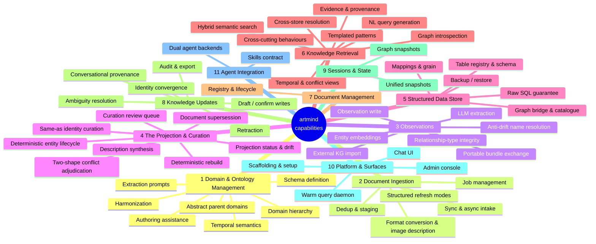

# artmind Capability Map

A feature baseline distilled from **artmind as the reference implementation**. Each leaf
feature is stated implementation-agnostically, with the artmind command (or module) that
anchors it. When evaluating another implementation, score every leaf on the scale below —
this doc is both the *input baseline* (what a knowledge system should offer) and the
*test checklist* (what to verify it actually does).

Every feature carries a stable hierarchical id (`4.5`, `6.2.3`) — reference rows by id
when reviewing or scoring.

**Scoring scale** (per leaf feature):

| Level | Meaning |
|---|---|
| **none** | The capability is absent. |
| **partial** | Present in reduced form — e.g. has vector search but no rank fusion, has snapshots but not unified ones. Note the gap. |
| **full** | Matches or exceeds the reference behaviour described in the feature statement. |

**The `✓` column** marks rows whose statement has been verified against the reference
implementation's source. A blank means the row is still first-draft, derived from command
surface rather than code. Each capability's **Grounding notes** carry what that
verification pass surfaced: why the feature exists in the shape it does, and what to
actually test when scoring another implementation.

## Overview

---

## 1. Domain & Ontology Management

The system's knowledge is organized into user-defined domains, each governed by a schema
(ontology) that drives extraction and querying.

| # | ✓ | Feature | Statement | Reference anchor |
|---|---|---|---|---|
| 1.1 | ✓ | Schema definition | A domain is defined by a single self-contained declarative artifact carrying its identity and routing description, entity-class list, extraction guidance, and temporal semantics; domains are added and removed at runtime by registering/removing the artifact. | `artmind domains add` / `delete` (YAML) |
| 1.2 | ✓ | Domain hierarchy | Domains form parent/child families through dotted naming alone — hierarchy is derived from the names themselves, with no separate registry to maintain; listings render the tree, nesting depth is unbounded, and a parent name used as a query filter rolls up all descendants (see 6.8.4). | `artmind domains list` (e.g. `banking.policy`) |
| 1.3 | ✓ | Structured extraction declarations, assembled at runtime | Entity classes, their properties, and their relations are declared in the schema as structured data (`entity_types`, a map); the three extraction prompts (entities/properties/relationships) are assembled from that declaration plus shared boilerplate at request time, never authored by hand, and are inspectable per domain. | `artmind domains entities-prompt` / `properties-prompt` / `relationships-prompt`, `prompt_builder.py`, `domains/meta.yaml` |
| 1.4 | ✓ | Schema harmonization | Child schemas can be synced against their parent non-destructively: an entity class entirely missing from the child is copied down whole (kind, description, properties, relates_to, guidance); child-specific extras and any class the child already declares are never touched. Supports dry-run. Temporal blocks are instead inherited dynamically at load time (see 1.5). | `artmind domains harmonize --dry-run`, `harmonizer.py` |
| 1.5 | ✓ | Declarative temporal semantics | The schema declares how time is read from content: document-level fields supplying validity/version, a per-property `temporal: valid_from`/`valid_to` tag on the one or two properties that carry an entity's own date, a relative anchor, and defaults. A parent's temporal block deep-merges under the child's when the schema loads, independent of harmonization. | `temporal:` block, per-property `temporal:` key, `temporal.py` (`load_schema`, `_entity_temporal_mapping`) |
| 1.6 | ✓ | Abstract parent domains | A parent domain can exist purely as a hierarchy root — no documents ingested under it — serving as the scope for cross-domain queries (`--domain <parent>`) and as the harmonization source for its children. | `banking_schema.yaml` |
| 1.7 | ✓ | Schema authoring assistance | A new domain schema can be generated by an LLM from a domain name and example documents, producing entity classes (each with a mandatory `kind: recurrent`/`occurrent`), properties, relations, and guidance tuned to the content — validated against the meta-schema contract before it's considered done. | `artmind-create-schema` skill, `artmind domains validate` |

> **Scoring note:** the reference implementation validates only the schema's `name` field at
> registration; malformed content surfaces at extraction time. Validation depth is a
> comparison point when scoring implementations, not part of the baseline statement.

> **Scoring note:** the reference implementation's harmonize step is a whole-class diff, not
> a field-level one: it determines "missing" by comparing `entity_types` dict *keys*, so a
> class present in both parent and child is left entirely alone even if the parent later
> adds a property or relation the child doesn't have. Re-running harmonize is idempotent by
> construction (a present class is never touched), but it also never reaches into an
> existing shared class to sync a later parent edit — that still needs a manual copy or a
> full re-author of the child's declaration. Not part of the baseline statement, but worth
> checking whether another implementation's "non-destructive sync" reaches inside an
> already-shared class or only ever adds whole missing ones.

### Grounding notes

**1.1 Schema definition**
*Why it matters* — one file is the entire contract for a domain: identity and routing
description, the entity-class list, three full prose prompt blocks, and the temporal
block. Nothing about a domain lives in code, so a domain is a portable, reviewable,
diffable artifact. Schemas are read from disk at the point of use, which is what makes
runtime add/remove real — no reload, re-index, or restart step exists to forget.
*Test hint* — register a schema and confirm it is listed and immediately usable for
ingestion with no restart; then confirm removing it takes effect just as immediately.

**1.2 Domain hierarchy**
*Why it matters* — hierarchy costs nothing to maintain because it is inferred from names
rather than declared in a registry, so it cannot drift out of sync with the schemas that
exist. This is the mechanism 1.6 and 6.8.4 are built on: a parent filter expands to
`IN $domains OR STARTS WITH (parent + '.')`, and every retrieval path applies it —
including the LLM-to-Cypher path, so a generated query cannot widen its own scope.
*Test hint* — ingest into `p.child`, query with `--domain p`, and assert the child's
entities come back; then repeat the same assertion through the natural-language query
path to confirm scope enforcement survives LLM generation.

**1.3 Structured extraction declarations, assembled at runtime**
*Why it matters* — a schema author declares content (which classes, what properties, what
relations, and a class's `kind`), never prose; `prompt_builder.py` renders that declaration
into the same shape of prompt text extraction has always consumed, filling in the shared
boilerplate (banners, output format, universal rules) from `domains/meta.yaml`. This closes
a real, previously-live bug class: before this shape existed, three independent
representations of the same content (the prose prompt, `harmonizer.py`'s block-surgery
sync, `schema_reference.py`'s regex parse-back) had to be kept in lockstep by hand, and a
per-domain relationship-prompt formatting bug went undetected in roughly a fifth of
extracted edges because nothing could check the rendered prose against the declared data.
The three `*-prompt` commands remain a read-only window onto exactly what the LLM will
receive, now generated rather than typed.
*Test hint* — change a class's `kind`, a property's `hint`, or a `relates_to` list in the
schema, confirm the relevant `*-prompt` command's output changes accordingly with no other
edit, and confirm `artmind domains validate` fails loudly if the class is missing `kind`
entirely rather than silently extracting with an assumed default.

**1.4 Schema harmonization**
*Why it matters* — harmonization is a dict merge now, not prose surgery: a class entirely
absent from the child is copied whole (its `kind`, `description`, `properties`,
`relates_to`, `guidance` together, as one unit) so the child stays a self-contained
superset of the parent. This is safer than the old regex-block substitution it replaced —
there is no shared prose to keep in lockstep — but narrower in what it reaches, see the
scoring note above.
*Test hint* — remove a class entirely from a child schema, harmonize, and confirm it's
copied back from the parent unchanged; separately, edit a property that exists on a class
*shared* by both parent and child, harmonize, and confirm the child's copy is untouched —
only a wholly missing class is materialized.

**1.5 Declarative temporal semantics**
*Why it matters* — a fact's own date lives right next to the property that carries it
(`effective_date: {hint: ..., temporal: valid_from}`) rather than in a separate
`temporal.entities` block that has to be kept in sync with the properties it references by
name — the redesign folded the two together specifically to remove that indirection.
`temporal` accepts exactly `valid_from`/`valid_to`; there is no separate `event_at` axis any
more, because for a completed (`occurrent`) entity, `valid_from` already **is** the event
date, and tagging a property anything else is silently ignored rather than raising an
error. Load-time inheritance (the schema-level `temporal:` block, not the per-property tag)
is unrelated and still deep-merges from parent to child independent of harmonization (1.4).
*Test hint* — tag a property `temporal: valid_from` on an `occurrent` class and confirm an
observation asserting that property lifts it as the fact's own date; then tag one
`temporal: event_at` by mistake and confirm it is silently absent from the fact's valid-time
window rather than erroring — this is the failure mode to catch in review, since nothing
flags it automatically.

**1.6 Abstract parent domains**
*Why it matters* — a family gets a queryable root without that root holding any content
of its own: cross-family questions get a single scope name, and harmonization gets a
single source of truth to push down. It makes the ontology's shape explicit — the parent
declares what the family shares — rather than leaving commonality implicit across siblings.
*Test hint* — confirm a parent-scoped query returns its children's content while the
parent itself has no documents ingested against it.

**1.7 Schema authoring assistance**
*Why it matters* — the same one-file, structured-declaration contract (1.1/1.3) that makes
a domain portable also makes it agent-authorable: the skill's output is exactly what
`domains add` consumes, so a new domain requires no code and no bespoke schema-writing
knowledge beyond sample documents. Assigning `kind` correctly is the single biggest lever
on extraction quality this skill teaches: a `recurrent` class whose name embeds a
measurement or a date can never be recognised as the same thing again in a later document,
which is what the aggregate key (4.1) depends on. It's scoped to the operator surface only
— the Claude SDK backend enforces this via a hard skill allowlist (`profiles.py`'s
`ADMIN_PROFILE`), not merely a persona's prose.
*Test hint* — confirm the skill's worked examples are real, currently-validating schemas
(not illustrative fakes that can silently drift from what the meta-schema actually
enforces), and that its guidance never tells an author to tag a property `temporal:
event_at` — that value is a documented, silent no-op post-redesign (see 1.5).

## 2. Document Ingestion

Intake of files and directories into the system, with lifecycle management of the work.

| # | ✓ | Feature | Statement | Reference anchor |
|---|---|---|---|---|
| 2.1 | ✓ | Synchronous ingestion | A file or directory can be ingested in one blocking call; when a directory is given, one file's failure is isolated and does not abort the rest of the batch. | `artmind ingest sync` |
| 2.2 | ✓ | Asynchronous ingestion | Ingestion can be submitted as a background job that returns a job id immediately, processed by a worker; one file's failure is isolated and does not abort the rest of the job. | `artmind ingest async`, `worker.py`, admin console ingest dashboard |
| 2.3 | ✓ | Job management | Jobs can be listed (in bulk, or filtered to active/completed), filtered by status, inspected per-file, results retrieved, and failed jobs retried. | `artmind ingest jobs` / `jobs-active` / `jobs-completed` / `job-status` / `job-results` / `retry-job` |
| 2.4 | ✓ | Content deduplication | Identical already-registered content is skipped by default, with an explicit force override. | `--force` |
| 2.5 | ✓ | Staged ingestion | Extraction can run without committing to the graph, leaving output staged for a later commit. | `--stage-only` |
| 2.6 | ✓ | Domain assignment at intake | Every ingested document is assigned to a domain, via flag or interactive prompt; an unrecognized domain is rejected up front, before any ingestion work begins. | `--domain`, `_get_available_domains()` |
| 2.7 | ✓ | Structured refresh modes | Tabular files (csv/xlsx) support replace-on-reingest or full SCD-2 temporal history keyed by business key, with an optional per-row effective-date column; captured history is queryable as of any past date, not just in its current state. | `--refreshMode temporal --businessKey --effectiveDateColumn`, `artmind db timeline --asOf` |
| 2.8 | ✓ | Format-agnostic intake | Documents in heterogeneous source formats are normalized to a common text representation before extraction; the original file is preserved alongside the conversion. | `docling`, `ingest_file()` (`ingest.py`) |
| 2.9 | ✓ | Multimodal image description | Images embedded in an ingested document are captioned by a vision-capable model, and the caption is woven into the document's text in place of the image, making image content visible to text-only downstream extraction. | `_describe_image()`, `ARTMIND_IMAGE_MODEL` |
| 2.10 | ✓ | Chunk-level extraction visibility | For a document mid-extraction or failed, per-chunk status can be inspected individually for each extraction step (entities/properties/relationships), not just as an aggregate progress count. | `artmind ingest job-chunks`, `_fetch_chunks()` (`jobs.py`) |

> **Scoring note:** the reference implementation has no job-cancellation mechanism — a
> queued or processing job runs to completion or failure; nothing can abort it mid-flight.
> Not part of the baseline statement, but worth checking when scoring another
> implementation's job management.

### Grounding notes

**2.1 Synchronous ingestion**
*Why it matters* — a single blocking call gives the caller the true end-to-end result
(registered, converted, chunked, extracted, committed) in the same process, with no
polling or job-id bookkeeping — the right shape for a one-off file or a scripted batch
that wants a hard failure signal inline. Per-file isolation is part of the same
contract: a directory batch is a collection of independent units of work, so one
unreadable or oversized file shouldn't cost the rest of the batch. Internal chunk-level
parallelism (a bounded thread pool during extraction) is entirely contained within the
call — the SDK-level concurrency never turns the CLI invocation itself into something
async.
*Test hint* — ingest a directory containing one corrupt/unreadable file alongside valid
ones and confirm the batch completes with a per-file failure count rather than aborting;
separately, ingest a directory containing dotfiles or a dot-directory (`.DS_Store`, a
nested `.git/`) and confirm they're skipped rather than wastefully attempted — every
intake surface (sync, async, and any UI-driven submission) must agree on this, which is
easy to lose if directory discovery isn't centralized in one place.

**2.2 Asynchronous ingestion**
*Why it matters* — the worker is self-terminating rather than a standing daemon: it
drains whatever's queued and exits, so a submission after an idle period always spawns a
process that re-imports current code from disk, sidestepping the stale-code trap a
long-lived server would have (contrast `artmind serve`, 6.8.3/10.3). The queue-and-worker
primitive is shared infrastructure — both the CLI (`ingest async`) and the admin
console's ingest dashboard submit into the same `ingestion_jobs` table and the same
on-demand worker, so job management (2.3) works identically regardless of which surface
queued the job.
*Test hint* — submit a job, kill the worker mid-batch, and confirm a later submission
resumes draining the queue rather than losing the still-queued files; separately, submit
a directory through both the CLI and the dashboard's ingest form and confirm they select
the same files (directory discovery is centralized in `collect_ingest_files()` for
exactly this reason).

**2.3 Job management**
*Why it matters* — retrying a failed file isn't a blunt restart: it deletes the file's
row from the document registry (so the dedup/rename gate that blocks re-ingesting a
known filename doesn't fire) and resets the job/file bookkeeping, but deliberately
leaves per-chunk extraction state untouched. Since a file's content hash is stable, the
next extraction pass reuses whatever chunks already succeeded and only reruns what
failed — retry composes with resumable extraction (3.1) rather than duplicating it.
Every read operation here (list, status, results) works identically whether the job was
queued from the CLI or the admin console's ingest dashboard, because both surfaces call
the same `jobs.py` functions rather than one wrapping the other.
*Test hint* — fail a job partway through extraction (e.g. one chunk's entities step
errors), retry it, and confirm the already-successful chunks/steps are not
re-extracted — only the failed step reruns. Separately, confirm every job-management
read (list/status/results) returns the same data regardless of which surface (CLI or
admin console) is used to query it.

**2.4 Content deduplication**
*Why it matters* — the two ingestion pipelines solve the same problem differently
because they're deduping different things: a document is an immutable artifact (either
this exact file is already registered, or it isn't — a flat, domain-agnostic identity),
while a table is a mutable, versioned resource scoped to where it's used. Forcing a
document duplicate creates an independent extraction identity (randomized doc/chunk
identity, renamed original) so it never collides with the original in the graph; forcing
a table re-ingest instead versions the same row in place — the same flag name, two
intentionally different mechanics.
*Test hint* — ingest the same file into two different domains without `--force`: for a
KG document, confirm the second ingestion is skipped as a duplicate (global scope); for a
structured file producing a same-named table, confirm both domains keep independent rows
(domain-scoped) — this asymmetry is deliberate and tested
(`test_ingest_structured_file_same_table_name_two_domains_no_overwrite`), not a bug to
expect fixed.

**2.5 Staged ingestion**
*Why it matters* — what's deferred is the full commit — fact-level date lifting, the
observation write, and the projection rebuild, all inside one transaction (3.3) — not just
a raw write. The observation write is the single convergence point every ingestion source
(this one, external KG import (3.4), bundle import (3.8)) and every surface (CLI, admin
console) reach at commit time, so a staged document gets identical treatment whenever it's
eventually committed, regardless of how it got staged. This is the same underlying
mechanism as 3.3's KG-JSON artifact — 2.5 is the opt-in at ingest time, 3.3 is what the
resulting artifact is and how it's later consumed.
*Test hint* — stage a document, confirm nothing appears in the graph yet but
`KG_DIR/<domain>/<doc>/document.json` exists, then commit it later and confirm the graph
now reflects it with its projection already rebuilt (not just bare observation nodes with
no Entity to show for them). Separately — a real gap to probe in any implementation —
ingest a directory mixing documents and tabular files with staging requested, and check
whether the tabular files were staged too or silently committed anyway (the reference
implementation commits them immediately regardless of the flag).

**2.6 Domain assignment at intake**
*Why it matters* — validation is uniform across both file types (KG documents and
structured tables), and deliberately so: a domain's structured-table metadata isn't just
a scoping label, it's what the structured↔graph bridge (5.4/5.6/6.7.1) matches against.
Column-to-entity-class mapping proposals work by fetching that domain's *actual graph
entities* and fuzzy-matching structured column values against them — a domain with no
schema can never have graph entities (extraction requires the schema to run at all), so
a structured table silently registered under a schema-less domain would be permanently
unable to receive mapping proposals with no error ever surfacing. Rejecting the domain
up front, before any file is even read, avoids paying for a document's costly conversion
step only to fail deep inside extraction, and avoids a structured table being registered
under a typo that quietly breaks bridging forever.
*Test hint* — ingest with a nonexistent domain via the non-interactive path (flag or
API) for both a KG document and a structured file, and confirm both are rejected
immediately with a message naming the bad domain — not accepted, and not failed later
with a generic, hard-to-diagnose error.

**2.7 Structured refresh modes**
*Why it matters* — the two modes solve genuinely different problems: replace is a
cheap, disposable snapshot (old data simply doesn't matter once refreshed), while
temporal treats history as data worth keeping correct — it closes rows whose business
key vanished from a batch rather than ignoring the deletion, and never rewrites a row
whose content is unchanged, so a no-op refresh is a true no-op at the storage level, not
just skipped at the file level. Captured history is only as valuable as it is queryable:
`db timeline`'s point-in-time read mirrors the graph store's own `--asOf` convention
(used across every `query graph` command), so a temporal table's history and an entity's
valid-time history are queried the same way — one mental model for "what did this look
like on date X," whether the answer lives in the graph or the structured store.
*Test hint* — refresh a temporal table three times: once with a changed row, once with
a row removed, once with nothing changed — confirm the middle refresh closes exactly the
removed key's row rather than silently dropping it, and the last refresh writes zero new
rows. Then query the table `--asOf` a date preceding the second refresh and confirm it
returns the pre-refresh state, not the current one.

**2.8 Format-agnostic intake**
*Why it matters* — extraction downstream only ever reasons over normalized text, so
supporting a new source format is a conversion-layer concern, not an extraction-layer
one; the pipeline's quality is decoupled from the format the source document happened to
arrive in. This applies uniformly to both intake paths (sync and async both call the
same `ingest_file()`), not just one of them.
*Test hint* — ingest documents in at least two structurally different formats (e.g. a
PDF and a plain markdown file) into the same domain and confirm both extract with
comparable fidelity, and that the original file is retrievable independently of its
converted form.

**2.9 Multimodal image description**
*Why it matters* — the KG extraction LLM only ever sees text, so without this step any
information conveyed purely through an embedded image (a diagram, a photo, a chart)
would be invisible to extraction; captioning turns that visual content into text the
same schema-guided prompts can reason over, before extraction ever runs.
*Test hint* — ingest a document with an embedded image carrying information not
restated in the surrounding prose, then confirm an entity or property derived from the
image's content appears in the extracted graph.

**2.10 Chunk-level extraction visibility**
*Why it matters* — `job-status`'s `chunk_progress` only ever gives a count ("4 of 6
chunks done"), which can't distinguish a job that's genuinely still working through
chunks from one that's silently stuck on a specific chunk's specific step; per-chunk
visibility turns "extraction seems stuck" into "chunk 3's relationships step is the one
still pending," which is what you'd actually act on.
*Test hint* — while a job is mid-extraction, inspect its chunk grid and confirm it shows
independent entities/properties/relationships status per chunk rather than one combined
per-chunk status.

## 3. Observations — Turning Documents into Immutable Facts

What extraction actually writes: not a graph of entities directly, but the immutable,
per-chunk record everything else is computed from. See
[projection-pipeline.md](./projection-pipeline.md) for the mechanism this section
summarizes as capabilities.

| # | ✓ | Feature | Statement | Reference anchor |
|---|---|---|---|---|
| 3.1 | ✓ | LLM extraction | Entities, properties, and relationships are extracted from document chunks by an LLM guided by the domain schema; extraction is resumable at the step level, skipping already-successful entities/properties/relationships steps within each chunk rather than re-running whole chunks. | `artmind ingest extract-kg`, `ingest.py:extract_kg`, `extraction.py` (prompt builders) |
| 3.2 | ✓ | Anti-drift name resolution | Before extraction, chunks are shown a retrieved sample of names already in use for recurrent classes (an ANN over entity embeddings) so a new document reuses an existing name rather than coining a fresh one. After every chunk extracts — once per document, never per chunk, since chunks run in parallel and cannot see each other — a single reconciliation pass maps every extracted name onto one canonical spelling. | `artmind.canonicalize` (`retrieve_vocabulary`, per-document canonicalization pass) |
| 3.3 | ✓ | Observation write | Extraction output is persisted as an intermediate artifact (KG JSON) that can be written to the graph independently of extraction — re-runnable after store failures — converging on one commit function for every ingestion source. The write is an immutable per-(chunk, entity-identity) `:Observation`, never a merge into an existing node: a document's own fact-level dates are lifted before the write, and the projection rebuild (§4) runs inside the same transaction, not as a follow-up hook. | `artmind ingest write-to-graph`, `_commit_document_tx()` (`ingest.py`) |
| 3.4 | ✓ | External KG import | Pre-extracted KG artifacts can be pulled from an external repository into local staging, conflict-checked against existing local documents, and committed via the same graph-write step as any other staged extraction. | `artmind ingest pull-kg`, `kg_pull.py:pull_kg` |
| 3.5 | ✓ | Entity embeddings | Entities get vector embeddings to enable semantic entity search; an embedding is never nulled, only marked stale, so a service outage cannot make an entity invisible to search. | `artmind ingest embed-entities`, the embed sweep (`ingest.py`) |
| 3.6 | ✓ | Provenance links | Every observation stays linked to the chunk it came from; relationships have a raw, chunk-scoped provenance record of their own — a real change from the pre-redesign model, where only entities carried a source link. | `(:Observation)-[:EXTRACTED_FROM]->(:DocChunk)`, `(:Observation)-[:ASSERTS_RELATION]->(:Observation)` |
| 3.7 | ✓ | Reserved relationship-type enforcement | System-managed relationship types (supersession, extraction-provenance, and the projection's own aggregation edges) cannot be created by LLM-driven extraction — an extracted relationship that would collide with a reserved type is rejected at write time, not merely by prompt convention. | `RESERVED_REL_TYPES` (`ingest.py`) |
| 3.8 | ✓ | Portable bundle exchange | A staged extraction artifact for one document can be exported as a single portable file and re-imported elsewhere, entering the graph through the same commit path as any other staged extraction — a third route to that convergence point alongside direct extraction and external repository pull (3.4), needing no git/ssh transport at all. | admin console `/api/artifacts/{domain}/{doc}/bundle`, `/api/artifacts/import` |

> **Scoring note:** there is no accretive property merge at write time any more — writing
> the same entity again (from a later chunk, or a different document) never touches an
> existing node. Reconciling what multiple observations assert about one real-world thing
> is entirely §4's job, not this section's. Compare another implementation's write path on
> this exact question: does it merge/overwrite at extraction time, or defer reconciliation
> to a separate, rebuildable layer?

### Grounding notes

**3.1 LLM extraction**
*Why it matters* — resumability is granular at the step level, not the chunk level: each
chunk persists independent entities/properties/relationships status, so a resume after a
partial failure re-runs only the step that failed, not the whole chunk's three LLM calls.
This is also not a separate pipeline from ingestion (section 2) — `ingest sync`/`async`
call this exact function inline via `ingest_to_kg()`; the standalone `extract-kg` command
is a re-entry point into the same code for resume/retry, not an alternate implementation.
Relationships can additionally be marked bidirectional by the LLM, in which case the write
layer creates edges in both directions.
*Test hint* — extract a document, force one chunk's relationships step to fail, re-run
extraction, and confirm only that chunk's relationships step re-executes — its
already-`ok` entities/properties steps and every other chunk are left untouched.

**3.2 Anti-drift name resolution**
*Why it matters* — the two steps attack different problems and neither alone is enough.
Retrieved vocabulary stops a *new document* inventing a fresh name for something already
in the graph — it only ever shows names from `kind: recurrent` classes (an occurrent
class's name is expected to be unique per occurrence, so there is nothing to reuse). The
per-document canonicalization pass stops *one document* producing several names for one
thing — chunks extract in parallel and share no state, so nine chunks of one long document
can independently name the same policy nine slightly different ways; only a pass that sees
the whole document's output afterward can catch that. Neither step overwrites what a chunk
actually said: the verbatim extracted name always survives as the observation's `name` and
folds into the eventual entity's `aliases` — canonicalization only decides what feeds the
aggregate key (§4.1).
*Test hint* — ingest a document whose Tier 2 rate is named three different ways across its
own chunks, and confirm they collapse to one entity only when canonicalization runs — with
the key function alone (no canonicalization), confirm they'd stay separate. Separately,
ingest a second document naming the same recurrent entity yet another way and confirm the
retrieved-vocabulary step steers the extractor back to the name already in use.

**3.3 Observation write**
*Why it matters* — the write is the single convergence point for every ingestion source
(direct extraction, external pull, bundle import), and it does more than persist rows: a
document's own fact-level `valid_from`/`valid_to` are lifted from its schema-declared date
properties *before* any observation is built (this is a hard dependency of the commit, not
a best-effort afterthought — the pre-redesign version ran this as an after-the-fact hook
that silently swallowed its own failures), and the projection rebuild for every key the
commit touches runs inside the *same* transaction, so a rebuild failure fails the whole
commit rather than leaving observations written with no projection to show for them.
*Test hint* — commit a staged document and confirm, in the one call: observations written,
each carrying `_valid_from` lifted from its own properties where declared, and the
projection already reflecting them with no separate rebuild step. Then force the rebuild
step to raise and confirm the whole transaction rolls back — no partial observation write
survives a projection failure.

**3.4 External KG import**
*Why it matters* — pulling is a staging operation, not a commit: `pull_kg()` sparse-clones
only the requested sub-path (validated against traversal and restricted to
`https`/`ssh`/`git` transports), aborts entirely if any incoming document folder name
collides with one already on disk, and then only copies files into local KG storage.
Nothing reaches Neo4j until a separate graph-write step runs — pulled documents are staged
exactly like a `--stage-only` extraction (2.5), reusing the same observation-write
convergence point (3.3) rather than having their own write logic.
*Test hint* — pull from a repo into a domain and confirm nothing appears in the graph yet;
then run the write step and confirm it now does. Separately, pull the same document name
twice and confirm the second pull aborts on conflict rather than overwriting the first.

**3.5 Entity embeddings**
*Why it matters* — the standalone command's real job is catching up entities that missed
embedding — e.g. a service that was down at write time — because the sweep already runs
automatically, scoped to whatever keys a commit, retire, restore, or same-as approval just
touched, matching `embedding IS NULL OR embedding_stale`. The never-null invariant is
load-bearing: a rebuild cannot call the embed service (it runs inside a Neo4j transaction),
so it leaves the old embedding in place and sets `embedding_stale = true` rather than
clearing it — a stale embedding still finds the entity in semantic search, a null one makes
it invisible. Only `projection synthesize` (4.5) computes a genuinely new embedding, and it
does so *before* writing, so there is no window where an entity has none.
*Test hint* — write an entity, confirm it has an embedding with no explicit backfill call;
then force a rebuild that changes its description and confirm the entity keeps its *old*
embedding with `embedding_stale: true` set, rather than a null — and confirm a subsequent
sweep clears the flag and installs a fresh embedding.

**3.6 Provenance links**
*Why it matters* — this inverts the pre-redesign asymmetry, where only entities carried a
source link and a relationship's evidence had to be inferred from its endpoints. Now the
raw layer records exactly which chunk asserted which relationship
(`(:Observation)-[:ASSERTS_RELATION {rel_type, doc_id, chunk_id}]->(:Observation)`), and the
aggregate `RELATES_TO` edge the query layer reads carries `chunk_ids`/`doc_ids` rolled up
from every contributing observation — a relationship's evidence is a first-class, directly
queryable fact now, not something to reconstruct.
*Test hint* — extract a document, inspect the graph, and confirm every observation has an
`EXTRACTED_FROM` edge to a `DocChunk`, and every extracted relationship has a matching
`ASSERTS_RELATION` edge naming the same chunk — not just the aggregate `RELATES_TO` edge on
the projected entities.

**3.7 Reserved relationship-type enforcement**
*Why it matters* — the reserved set grew with the redesign: `RELATES_TO`, `ASSERTS_RELATION`,
and `AGGREGATES` joined `SUPERSEDES`/`EXTRACTED_FROM`/`PRIOR_STATE` because they are now the
system's own aggregation machinery, and an extractor claiming one as its own `rel_type`
would be indistinguishable from a real one. The guard is enforced at the point relationships
are written — after type names are normalized (uppercased, non-alphanumeric replaced) — so
it's a hard backstop, not just a prompt instruction. `PART_OF` stays deliberately
unreserved: several shipped domain schemas legitimately extract `part_of` between entities
(e.g. branch/region), and the one structural `PART_OF` edge (`DocChunk→Document`) is a
different code path entirely.
*Test hint* — get an LLM extraction to emit a relationship typed `RELATES_TO` or
`ASSERTS_RELATION` (or something that normalizes to one), write it to the graph, and confirm
it's rejected with a logged warning; separately confirm a legitimate `part_of` relationship
between two entities is *not* blocked.

**3.8 Portable bundle exchange**
*Why it matters* — this complements 3.4 with a transport that needs nothing beyond a file:
no git remote, no `https`/`ssh`/`git` restriction to enforce, just a zip. It still converges
on the same observation-write path as every other ingestion source. Import validates every
zip member resolves to a path under the destination directory before extracting anything —
a zip-slip guard, the same family of containment check as 3.4's transport restriction.
*Test hint* — export a staged document's bundle, import it into a different domain/doc slot,
and confirm it stages then commits identically to a CLI `write-to-graph` call; separately,
craft a zip containing a `../`-traversal entry and confirm import rejects it with no file
written, rather than extracting outside the destination directory.

## 4. The Projection & Curation

The projection is the one layer ordinary queries touch: a deterministic, rebuildable view
computed from every observation, plus the human judgment (same-as identity, conflict
adjudication, description synthesis) that can't be computed and is reviewed rather than
applied blind. See [projection-pipeline.md](./projection-pipeline.md) §2–3 for the
mechanism.

| # | ✓ | Feature | Statement | Reference anchor |
|---|---|---|---|---|
| 4.1 | ✓ | Deterministic rebuild | Entities are recomputed from observations, never authored directly: one `:Entity` per aggregate key (a normalized name, its class, and its domain), with scalar properties resolved by the observation with the latest document date, list properties unioned, and a same-instant disagreement raised as a `:Conflict` rather than silently picked. Dropping the whole projection and rebuilding it from observations reproduces byte-identical entity ids. | `artmind projection rebuild`, `projection.py` (`rebuild_key`, `merge_observations`) |
| 4.2 | ✓ | Same-as identity curation | A human can declare a curated group of aggregate keys as one real-world thing, naming one member canonical; keys sharing a class and domain merge into one Entity, keys spanning a class or domain boundary link via a `SAME_AS` edge instead. The group is a plain file, and removing it and rebuilding un-merges just as cleanly as adding it merged — there is no destructive graph surgery. | `same_as.yaml`, `projection.py` (`_plan_groups`) |
| 4.3 | ✓ | Two-shape conflict adjudication | Disagreement is detected two ways feeding two different shapes of the same `:Conflict` label: the rebuild itself raises one when one entity's own property is disputed within a single instant (automatic, never orphaned, no detection pass to run); a separate cross-entity adjudicator raises the other when two candidate-matching entities across a domain or class boundary turn out to be making incompatible claims rather than describing one thing. Either shape can be explicitly closed as resolved or dismissed; closure is never automatic. | `:Conflict {_source}` (`projection.py`, `conflicts.py`), `artmind query graph conflicts`, `artmind ingest resolve-conflict` |
| 4.4 | ✓ | Curation review queue | Same-as candidates from two independent proposers — a cross-domain embedding adjudicator and an intra-class name-similarity clusterer — land in one review queue with one shape (a canonical plus its members), listable and filterable by status, approved or rejected explicitly. Nothing in either proposer touches the graph; only approval does. | `artmind sameas propose` / `list` / `approve` / `reject`, `artmind ingest refine-graph` |
| 4.5 | ✓ | Description synthesis | An entity's description can be rewritten as one coherent passage drawn from every one of its observations, rather than showing one observation's wording — the only step in the pipeline that spends language-model budget without being asked to, so it is always an explicit, separate call, never automatic and never per-document. The new embedding is computed before anything is written, so there is no window where the entity has none. | `artmind projection synthesize`, `synthesize.py` |
| 4.6 | ✓ | Document supersession | A human can assert one document supersedes another (or it can be detected from the document's own declared notice), retiring the older document — moving everything it asserted out of the index — and recording the lineage as a typed edge. All three routes (manual, automatic, conflict-adjudicated) converge on one primitive. | `artmind ingest supersede` / `detect-supersession`, `conflicts.py` (verdict `"superseded"`) |
| 4.7 | ✓ | Deterministic entity lifecycle | An entity's identity is never assigned or destroyed by a separate lifecycle operation: a key with at least one current observation projects an Entity; a key with none is removed by the next rebuild, arithmetically, not by a heuristic guess. Nothing needs a separate "retirement" step, and nothing needs a separate history snapshot — every value any document ever asserted stays on its own immutable observation regardless of what a later document says. | `projection.py` (affected-key GC), `artmind query entity-history` |
| 4.8 | ✓ | Projection status & drift detection | The projection reports whether it has caught up with the two things that can change out from under it with no natural commit to trigger a rebuild — a hand-edited same-as file and a changed schema set — by comparing recorded content hashes against current ones. It only ever reports; queries run read-only and cannot self-heal, so closing drift is always an explicit rebuild. | `artmind projection status`, `:ProjectionState` |

> **Scoring note:** description synthesis (4.5) and same-as approval (4.4) leave a
> deliberate gap: approving a group runs a rebuild scoped to only the domain families it
> touches, not a global one, so `projection status` (4.8) keeps reporting drift against the
> curation file's hash until a separate, unscoped `projection rebuild` runs. This is a
> two-step workflow by design (a partial rebuild can't honestly clear a global signal), not
> an oversight — worth checking whether another implementation's equivalent curation step
> makes the same distinction or conflates "rebuilt what I touched" with "caught up."

> **Scoring note:** the reference implementation's precondition for cross-domain conflict
> detection (a prior same-as review on each target domain) is enforced only as a logged
> warning, not a hard block — a caller can skip it and pairing will simply operate on
> unmerged aliases. Not part of the baseline statement, but worth checking when scoring
> another implementation's "candidate pairing operates on clean entities" claim.

### Grounding notes

**4.1 Deterministic rebuild**
*Why it matters* — "varies over time" and "conflicts" are independent facts about the same
property, decided on different axes: a `kind: recurrent` class's property lands in
`_temporal_props` when its winning value differs across *instants*, and raises a `:Conflict`
when more than one value is asserted *within* one instant — a property can be both at once
(three observations across three months, one of which is itself internally disputed), and
treating the two as mutually exclusive is precisely the bug this design avoids: one bad
extraction inside one document would otherwise erase a property's entire recorded history.
An `occurrent` class's disagreement is always the latter — a completed event's attributes
don't drift, so any two differing observations are a conflict, never a variation.
*Test hint* — feed a recurrent entity three observations at three different dates, two of
which additionally disagree with each other at the *same* date, and confirm the rebuild
reports the property under `_temporal_props` **and** raises a `:Conflict` — not one or the
other. Then delete the whole projection and rebuild from the same observations, and confirm
every entity id is byte-identical to before.

**4.2 Same-as identity curation**
*Why it matters* — this is the inversion the redesign is most consequential for: the old
merge mechanism deleted alias nodes via `apoc.refactor.mergeNodes` with no built-in undo, so
every review had to be conservative about approving. Now a group is a bounded, declarative
file edit — approving costs one edit and one rebuild, and so does reversing it, so the right
default is to review generously rather than defensively. Splitting by member relative to the
group's own canonical (never member-to-member) is what keeps a "mixed" group — some members
sharing the canonical's class and domain, one crossing a boundary — resolvable without
chasing transitive closure, which is exactly the mechanism pairwise merge rules avalanche
through when two unrelated things share one category.
*Test hint* — approve a group merging two same-class, same-domain keys and confirm one
Entity results, keyed on the canonical; remove the group from the file, rebuild, and confirm
the original two entities return under their original deterministic ids. Separately, approve
a group whose members span two domains and confirm a `SAME_AS` edge appears rather than a
merge.

**4.3 Two-shape conflict adjudication**
*Why it matters* — the two shapes solve genuinely different problems and neither can stand
in for the other. The rebuild's own shape needs no detection pass and cannot go stale — it's
recomputed from scratch every time, so it can never point at evidence that's since been
deleted. The adjudicator's shape is the only one that can compare two entities nobody has
already merged, which is what makes it the source that also feeds same-as identity (4.2) —
a "same entity" verdict and a "conflicting claims" verdict are two outcomes of one
judgment, not two separate passes.
*Test hint* — construct one entity whose own property is disputed within a single document
and confirm a `:Conflict` appears with no detection command ever run, tagged
`_source: 'projection'`; separately, run cross-domain adjudication over two entities making
incompatible claims and confirm a `:Conflict` tagged `_source: 'adjudicator'` appears
instead, with a `CONFLICTS_WITH` edge between them that the first shape never gets.

**4.4 Curation review queue**
*Why it matters* — one queue for two proposers means a reviewer never has to remember which
mechanism found which candidate; `sameas list` renders it directly, with no intermediate
report file that could drift from the command's own shape. The clustering proposer groups a
whole cluster of aliases into one canonical-plus-members proposal rather than N separate
pairs, matching the same-as group shape a human would want to review — reviewing "these five
names are one thing" once, not five pairwise merge decisions that happen to agree.
*Test hint* — run both proposers against the same domain and confirm their outputs land in
one queue, distinguishable by `source`; approve one and reject the other, and confirm
`sameas list --status open` reflects exactly the remaining, undecided ones.

**4.5 Description synthesis**
*Why it matters* — the naming (`rebuild` vs `synthesize`) is deliberate: one is
deterministic and automatic, the other spends a language-model call and is always asked
for. A synthesis lives in a sibling store keyed by the entity's own deterministic id, so a
rebuild's `MERGE`+`SET` never touches it — dropping every synthesis degrades the system to
winner-descriptions with nothing broken, which is what makes it safe to treat as optional
rather than load-bearing. It is skipped for an entity with an open *projection* conflict
(synthesizing prose over a disputed property would force the model to silently pick a side)
and for one whose observation set hasn't changed since the last synthesis, unless forced.
*Test hint* — synthesize an entity, confirm its description and embedding update together in
one write, then run a plain `projection rebuild` and confirm the synthesized description
survives — proving the synthesis store is a real input, not a side effect the next rebuild
would discard. Separately, mark the entity with an open conflict and confirm a synthesis run
skips it.

**4.6 Document supersession**
*Why it matters* — this is the convergence point all three supersession routes share, and
what changed is what happens once a document is superseded: the older document is retired
(its observations relabelled out of the index, see 4.7), not walked node-by-node stamping
`valid_to`. A document that declares its own supersession in a `## Supersession Notice`
section gets identical treatment to one a human asserts by hand or one an adjudicator infers
from two entities being the same authority at different versions.
*Test hint* — supersede two documents and confirm the older one's observations move to
history in the same call (`entity-history` on an entity solely sourced from it now shows
only history-status facts); separately, ingest a document with a genuine Supersession Notice
and confirm the edge and the retirement both apply automatically with no separate command.

**4.7 Deterministic entity lifecycle**
*Why it matters* — this replaces three separate pre-redesign mechanisms (an orphan-entity
sweep, a `size(docIds)=1` heuristic, and a scoped entity GC) with one rule: any key in the
affected set with zero `latest` observations has its Entity deleted, full stop. Nothing
needs deciding case by case, and nothing needs a superseded-value snapshot, because a value
a document asserted is never overwritten in the first place — it stays on its own
observation, reachable by `entity-history` (6.6.3), whether or not the entity that
aggregates it is still current.
*Test hint* — retire the only document behind an entity and confirm the entity disappears
from the projection on the next rebuild; restore the document and confirm the entity returns
under the identical deterministic id. Then call `entity-history` on it while retired and
confirm its facts are still readable, spanning the now-history observations.

**4.8 Projection status & drift detection**
*Why it matters* — same-as approval (4.2) and a bare document commit both rebuild, but only
a scoped subset — neither can honestly claim the *whole* projection has caught up with a
*global* file like `same_as.yaml` or the schema set. `record_rebuild()` is therefore called
only from a domain-unscoped full rebuild, and `projection status`'s own queries stay
read-access, matching the system's stance that a query must never silently repair state on
someone's behalf.
*Test hint* — hand-edit `same_as.yaml` and confirm `projection status` reports
`same_as_drift: true` immediately, with no rebuild having run yet; run a domain-scoped
`sameas approve` and confirm the flag is still set afterward; then run a bare
`projection rebuild` with no domain and confirm it clears.

## 5. Structured Data Store

A parallel SQL store for tabular data, joined to the graph rather than flattened into it.

### The three table classifications

Every registered table carries three independent semantic judgments (5.4/5.5/5.6), each
proposed then confirmed on its own. Two of them describe *columns* and are easily
conflated, so the distinction is worth stating plainly: **`bridge` asks whether a document
would discuss a column's values; `mapping` asks what class those values are instances of.**
Those are orthogonal questions — a column can be either, both, or neither.

| | `grain` | `bridge` column | column `mapping` |
|---|---|---|---|
| **Unit** | the whole table | one column | one (column, entity_class) pair |
| **Cardinality** | exactly one per table | at most one role per column | many per column — a column may denote several classes |
| **Question** | what do these rows denote? | would a document discuss these values? | what class are these values instances of? |
| **Answer** | `instance` / `lookup` / `normative` | yes (`term`) | `CUSTOMER`, `PRODUCT`, … — drawn from the domain schema |
| **Evidence used** | table metadata + column profiles | the column's sampled values | sampled values + the schema's class descriptions |
| **What consumes it** | answer synthesis: only `normative` changes behaviour, quarantining the table against the documents that also assert its content | fusion: feed the cell's value to `query vector-text` / `entity-resolve` to pull related graph content | routing: "which tables are about `CUSTOMER`?" (`db bridge --entityClass`) |
| **Confirm with** | `db grain --set` | `db bridge confirm` | `db mappings … confirm` |

Worked example — four columns of one `complaints` table, showing all four combinations:

| column | sampled values | bridge | mapping | why |
|---|---|---|---|---|
| `customer_id` | `CUST-0003`, `CUST-0016` | — | `CUSTOMER` | opaque keys mean nothing to a document, yet they plainly denote customers |
| `status` | `Resolved`, `Upheld` | ✓ | — | complaint-handling vocabulary a policy discusses, but not a thing the graph models as an entity |
| `category` | `Fee Dispute`, `Fraud/Unauthorized Transaction` | ✓ | `PROCESS_STEP` | both: a searchable term *and* a typed thing |
| `compensation_gbp` | (numeric) | — | — | a measure: neither searchable vocabulary nor an entity |

`customer_id` is the case that most clearly separates the two: no string search of the
documents will ever surface `CUST-0003`, so it is useless as a bridge, while it is exactly
the column that tells the router this table is about `CUSTOMER`.

| # | ✓ | Feature | Statement | Reference anchor |
|---|---|---|---|---|
| 5.1 | ✓ | Table registry | Ingested tables are registered and listable, domain-scoped — resolution is symmetric across the domain hierarchy: a query at a child domain also reaches tables registered at an ancestor, and a query at a parent reaches every descendant's tables. | `artmind db list` |
| 5.2 | ✓ | LLM-ready schema | Table schemas (columns, types, value profiles, mappings) are exposed in the form an LLM needs to write SQL. | `artmind db schema`, `text2sql.py` (`_schema_summary_sql`) |
| 5.3 | ✓ | Independent-query guarantee | Raw read-only SQL runs against the store with no LLM in the loop. | `artmind db sql`, `text2sql.validate_read_only_sql` |
| 5.4 | ✓ | Semantic mappings | Columns are mapped to graph entity classes via a propose → confirm lifecycle (set / confirm / clear). Candidates are LLM-proposed against the domain **schema's** class descriptions, so a table is classifiable the moment it lands — with no dependency on the domain having any ingested documents or extracted entities. | `artmind db mappings`, `db propose` (`semantics.py:propose_mapping`) |
| 5.5 | ✓ | Table grain semantics | What a table's rows denote — instance, lookup, or normative — is proposed and confirmable. | `artmind db grain`, `db propose` (`semantics.py:propose_semantics`) |
| 5.6 | ✓ | Structured↔graph bridge | The join model between store and graph (class scope, bridge columns, grain) is explicit, inspectable, and reviewable: every proposed part of it carries a confirm → reject lifecycle, and one command lists whatever is still unadjudicated. | `artmind db bridge` (+ `bridge confirm`/`clear`), `artmind db review` |
| 5.7 | ✓ | Graph catalogue | The store's structure is mirrored as a catalogue subgraph (Table / TableColumn / EntityClass) inside the graph itself. | `artmind db catalogue` |
| 5.8 | ✓ | Source refresh | A table can be re-ingested from its recorded source file. | `artmind db refresh` |
| 5.9 | ✓ | External adapters | A surface is reserved for connecting external SQL engines beyond the embedded one. | `artmind db connect` (stub, DuckDB-only v1) |
| 5.10 | ✓ | Store backup/restore | The structured store snapshots to a single archive and restores from it (wipe + restore). | `artmind db backup` / `restore` |
| 5.11 | ✓ | Bulk classification | Every table in a domain can be (re-)classified in one call, skipping tables whose classification already succeeded unless a full redo is requested, with progress reported as the run proceeds. | admin console structured tab (`POST /api/structured/propose-all`) |

> **Scoring note:** the reference implementation's cross-store fusion runs on raw value
> strings only — there is no persisted `RESOLVES_AGAINST` anchor linking a table's rows to
> specific graph entities, and no persisted "which classes govern this table" relation.
> Unscoped value-driven semantic search (`query vector-text`) stands in for both, per
> measurement in `docs/superpowers/specs/2026-07-25-cross-store-join-model-design.md`. Not
> part of the baseline statement, but worth checking whether another implementation's
> "bridge" claim is backed by a real stored join or the same string-fusion approach.

> **Scoring note:** `db sql` (5.3) is deliberately exempt from the scoping and quarantine
> conventions that apply elsewhere in the system — it is domain-unscoped (one connection
> sees every domain's tables at once) and blind to the `grain=normative` quarantine rule
> (5.5/5.6), unlike `text2sql`, which honors both. This is a documented, intentional
> asymmetry — an operator-facing raw-SQL escape hatch, not an agent-facing retrieval path —
> not a gap to expect closed in another implementation.

### Grounding notes

**5.1 Table registry**
*Why it matters* — hierarchical domain matching is symmetric by design, not an oversight:
documents carry a genre-scoped domain (`banking.cases`, `banking.policy`) because that's
the level an extraction schema lives at, but tables carry the corpus root because a table
has no genre. Without the ancestor half, the documented routing workflow (take the domains
from `domains-overview`, ask `db list --domain <d>` per one) returns empty for every one of
them while populated tables sit at the parent — the exact defect
`docs/superpowers/specs/2026-07-25-cross-store-join-model-design.md` measured and fixed.
*Test hint* — register a table under a bare parent domain (e.g. `banking`), then list it via
a child scope (`db list --domain banking.cases`) and confirm it's returned; separately
confirm a table registered at a child is still returned by a parent-scoped list (the
pre-existing descendant direction).

**5.2 LLM-ready schema**
*Why it matters* — `db schema`'s CLI output (columns, dtypes, profiles, confirmed mappings)
is the operator-facing view; the fuller form actually handed to the text2sql LLM
additionally carries `[bridge]` annotations and a grain-based quarantine note
(`text2sql._schema_summary_sql`). The two are close but not identical — an operator
debugging a bad generated query by eyeballing `db schema` won't see everything the LLM saw.
*Test hint* — confirm a table with a confirmed bridge column shows `[bridge]` in the
text2sql prompt (inspect via `text2sql --dry-run`) even though `db schema`'s own JSON output
has no equivalent field.

**5.3 Independent-query guarantee**
*Why it matters* — the read-only check is one shared function (`validate_read_only_sql`)
reused verbatim by `db sql`, the admin-UI's SQL route, and text2sql's own generated
queries, so the write-verb blocklist can't drift between surfaces. Unlike every other query
path in the system, `db sql` carries no domain filter and no grain-quarantine awareness —
it's a deliberate operator escape hatch, not a scoped retrieval path (see scoring note
above).
*Test hint* — confirm a write-verb keyword embedded past a semicolon or inside a CTE is
still rejected; separately, ingest tables under two different domains and confirm a single
`db sql` call can query both in one statement (no scoping error).

**5.4 Semantic mappings**
*Why it matters* — the question "does this column denote instances of this class" is
semantic, not lexical, and the distinction is load-bearing. An earlier implementation matched
sampled column values against the domain's *already-extracted* graph entity names (exact,
then `difflib` fuzzy). That can only ever recognise a class whose members have already been
written to the graph verbatim, which produced two failures worth naming: a `customer_id`
column full of opaque keys like `CUST-0019` matches no entity name and stayed unmapped even
though it plainly denotes `CUSTOMER`; and a domain with tables but no ingested documents got
zero proposals forever, since there were no names to match against — a chicken-and-egg
dependency that grain and bridge (which read only the table) never had. Reading the domain
schema's class descriptions instead (`schema_reference.parse_entities`, the same parser the
admin-ui's Schemas tab uses) removes the graph from the loop entirely. Note the cost: the
schema is now load-bearing for mapping, so a domain whose schema is missing or unharmonized
fails this step with a clear error rather than silently proposing nothing — deliberately
distinguished in code from "schema exists but declares no classes", which is a legitimate
empty result.
*Test hint* — the decisive check is a domain that has a schema and tables but **zero**
extracted entities (`query graph entity-listing --domain <d>` returns nothing): `db propose
<table> --domain <d>` must still persist mappings. The retired matcher short-circuited to
`[]` in exactly that case, so a non-empty result cannot be produced by string matching.
Separately, confirm a proposal for an opaque-identifier column whose values appear nowhere in
the graph, and confirm a `(column, entity_class)` pair already marked `confirmed` survives
`db propose <table> --step mapping --redo` untouched.

**5.5 Table grain semantics**
*Why it matters* — grain and bridge-column proposal share a single LLM call
(`semantics.propose_semantics`), because there is no way to ask the model just one of the two
questions; the orchestrator therefore gates whether grain is *persisted* on whether that step
was actually requested. Grain is proposed at first registration and never re-proposed by a
refresh, because what a table means does not change when rows arrive. Confirming `normative`
requires `refresh_mode=temporal` — enforced in `registry.set_grain` itself, not just the CLI —
because a fact that gets superseded needs history to stay reconstructable via `--asOf`.
All three steps (grain, bridge, mapping) carry their own run status on the table row
(`grain_status`/`bridge_status`/`mapping_status`, each `pending|ok|failed`), mirroring
`kg_chunk_status`'s per-chunk entities/properties/relationships model: a step that fails is
recorded and logged rather than raised, so `db propose` resumes exactly what is broken and
leaves succeeded steps alone. Failures store no error text, matching the codebase's
best-effort-hook convention — diagnosis is via the ingestion log.
*Test hint* — confirm a fresh table's grain is proposed automatically on first ingest with
no separate command; then attempt `db grain <table> --set normative` on a `replace`-mode
table and confirm it's rejected before any write. For the step model: set one step to
`failed`, run `db propose <table>` with no flags, and confirm only that step re-runs (an
already-`ok` step must cost no LLM call) — and that `--redo` is the only way to re-run one.

**5.6 Structured↔graph bridge**
*Why it matters* — `entity_class`, not `domain`, is the actual routing key: it's
many-to-many with tables in a way a single dotted domain string never could be (one
`complaints` table can map to `CUSTOMER`, `EMPLOYEE`, and `PRODUCT` at once). `db bridge`'s
output composes the same `list_tables` domain resolution as 5.1, so it inherits the same
ancestor/descendant symmetry.
The review loop closes over all three parts of the join model, not just mappings: grain
(`db grain --set`), mappings (`db mappings ... confirm`) and bridge columns (`db bridge
confirm`) are each confirmable, and `db review` is the cross-table inbox — it lists only
tables with something still unconfirmed, so a table disappears from it once fully
adjudicated and an empty result means the domain is done. Note what confirming does and
does not do: unconfirmed proposals already route (they reach the catalogue carrying
`confirmed: false`, deliberately, so a fresh table isn't invisible until reviewed), and
nothing reads `column_roles.confirmed` at all today — confirming raises trust and stops a
column being re-litigated, rather than switching anything on.
*Test hint* — confirm `db bridge --entityClass CUSTOMER` returns only tables whose
confirmed-or-proposed mappings include that class, from across every table regardless of
which domain in the hierarchy it's registered at. For the review loop: take a table with
one unconfirmed bridge column and an unconfirmed grain, confirm both, and assert it drops
out of `db review` (`pending_count` decrements) — then assert `db bridge confirm` on a
column with no bridge role fails loudly rather than silently no-opping.

**5.7 Graph catalogue**
*Why it matters* — this subgraph is the *only* routing surface on a query-only host (no
`$ARTMIND_DATA_DIR`, so no registry DB), which is why unconfirmed mappings are projected too
(carrying `confirmed: false` on the edge) rather than dropped — dropping them would leave a
freshly ingested table invisible to routing until a human reviewed it. The wipe-then-rebuild
scope is deliberately descendant-only (`include_ancestors=False`), unlike 5.1/5.6's symmetric
read path, so a rebuild never orphans an ancestor-registered table it doesn't also re-write.
*Test hint* — confirm an unconfirmed mapping still appears in the catalogue subgraph with
`confirmed: false`; separately, rebuild the catalogue for a child domain and confirm a table
registered at the parent is untouched (neither wiped nor re-projected) by that call.

**5.8 Source refresh**
*Why it matters* — `register_table`'s update path deliberately leaves `grain` untouched on
every re-ingest (only `set_grain` changes it), so an operator's confirmed grain survives a
refresh the same way confirmed mappings do. The catalogue is re-projected after every
refresh, which is how a mapping confirmed after the fact (`db mappings ... confirm`) reaches
Neo4j without a re-ingest.
*Test hint* — confirm a table with a manually confirmed `normative` grain keeps that grain
after `db refresh`; separately, confirm the Neo4j catalogue reflects a refresh's new row
count without a separate `db catalogue` call.

**5.9 External adapters**
*Why it matters* — this is a reserved surface, not a partial implementation: `db connect`
raises unconditionally regardless of the DSN given, so there's no half-working adapter path
to accidentally rely on. The surface already has a shape, though: `connector.py`'s
`Datasource` Protocol (`introspect_schema`/`profile_columns`/`run_sql`/`load_table`) is what
`DuckDBDatasource` structurally satisfies today, and what a future non-DuckDB adapter would
need to implement — nothing enforces it via `isinstance` or a declared base class yet, it's a
documented contract, not wiring.
*Test hint* — confirm `db connect` fails identically for both a plausible and an obviously
malformed DSN — the rejection is unconditional, not DSN-shape validation.

**5.10 Store backup/restore**
*Why it matters* — `registry.restore_all` reinserts every row with its original primary key,
which is what keeps `columns.table_id` / `column_mappings.table_id` / `column_roles.table_id`
valid after a wipe-and-restore — a naive re-insert (letting SQLite reassign ids) would
silently orphan every dependent row.
*Test hint* — back up, mutate a table's mappings, restore, and confirm the mappings are back
to the backed-up state with the same `table_id` linkage (not just the same data floating
with new ids).

**5.11 Bulk classification**
*Why it matters* — the admin console's "classify all" action is not a separate
implementation: it iterates a domain's tables through the exact same
`propose_table_semantics` orchestrator `db propose` calls per-table (5.4/5.5/5.6), so a
bulk run inherits the same skip-if-`ok`, `--redo`, and never-overwrite-confirmed guarantees
without re-implementing them. Progress is deliberately non-persisted — an in-memory counter
keyed by domain — because a restart mid-run loses only the counter; each table's actual
classification state is already durable in the registry the moment its own call finishes.
*Test hint* — start a bulk run on a domain where some tables already have `grain_status` /
`bridge_status` / `mapping_status` all `ok`, and confirm those tables are skipped (no LLM
call) unless the run is started with redo; separately, poll the progress endpoint mid-run
and confirm `done`/`total` advance and the entry disappears once the run finishes.

## 6. Knowledge Retrieval

Answering questions over the accumulated knowledge — the consuming face of the system.

### 6.1 Graph introspection

| # | ✓ | Feature | Statement | Reference anchor |
|---|---|---|---|---|
| 6.1.1 | ✓ | Schema metadata | The graph describes its own labels, properties, and relationship types. | `artmind query graph metadata` |
| 6.1.2 | ✓ | Structural census | Focused counts and relationships for the core node types — Document, DocChunk, UserChat, Observation, and the Entity projection. | `artmind query graph structural-metadata` |
| 6.1.3 | ✓ | Entity inventory | Entity names grouped by label/class. | `artmind query graph entity-listing` |
| 6.1.4 | ✓ | Domain overview | Per-domain routing summary: document names/counts, entity counts, top classes. | `artmind query domains-overview` |

### 6.2 Templated graph retrieval (deterministic, no LLM)

| # | ✓ | Feature | Statement | Reference anchor |
|---|---|---|---|---|
| 6.2.1 | ✓ | Class listing | List entities of a class. | `pattern1` |
| 6.2.2 | ✓ | Entity detail | Info on one or more named entities. | `pattern2` |
| 6.2.3 | ✓ | Relationship summary | Entity plus a lightweight relationship summary. | `pattern3` |
| 6.2.4 | ✓ | Neighborhood expansion | Entity plus its full neighborhood. | `pattern4` |
| 6.2.5 | ✓ | Pathfinding | Paths between two entities — shortest, or all within bounded depth. | `pattern5` |
| 6.2.6 | ✓ | Direct relationships | Direct relationships between two named entities. | `pattern6` |
| 6.2.7 | ✓ | Fragment search | Search entities by name or description fragment. | `pattern7` |
| 6.2.8 | ✓ | Anchored class filter | Entities of class X connected to entity Y. | `pattern8` |
| 6.2.9 | ✓ | Centrality ranking | Top-N entities of a class by connection count. | `pattern9` |
| 6.2.10 | ✓ | Document chunks | All text chunks of a named document. | `pattern10` |

### 6.3 Hybrid semantic search

| # | ✓ | Feature | Statement | Reference anchor |
|---|---|---|---|---|
| 6.3.1 | ✓ | Fused text search | Source text searched by vector embeddings and keyword match, fused via Reciprocal Rank Fusion. | `artmind query vector-text` |
| 6.3.2 | ✓ | Entity resolution | A name fragment or description resolves to canonical graph entities (fulltext + vector, RRF). | `artmind query entity-resolve` |

### 6.4 Natural-language query generation

| # | ✓ | Feature | Statement | Reference anchor |
|---|---|---|---|---|
| 6.4.1 | ✓ | NL → graph query | A natural-language question is compiled to a graph query (Cypher), executed, and results returned. | `artmind query graph text2cypher` |
| 6.4.2 | ✓ | NL → SQL | A natural-language question is compiled to read-only SQL against the structured store and executed. | `artmind query text2sql` |

### 6.5 Evidence & provenance retrieval

| # | ✓ | Feature | Statement | Reference anchor |
|---|---|---|---|---|
| 6.5.1 | ✓ | Evidence fetch | Chunk text is retrievable by the exact evidence ids other queries return. | `artmind query chunks` |
| 6.5.2 | ✓ | Entity dossier | One call returns an entity's properties, one-hop relationships, and source chunk text. | `artmind query entity-context` |

### 6.6 Temporal & conflict views

| # | ✓ | Feature | Statement | Reference anchor |
|---|---|---|---|---|
| 6.6.1 | ✓ | Domain timeline | Every entity of a completed-event class in a domain, ordered by when it happened — a "what happened here, in order" view, not one entity's own history. | `artmind query graph timeline` |
| 6.6.2 | ✓ | Conflict listing | Materialized, cross-entity conflicts, scoped to given domains — one of two conflict shapes; see 4.3. | `artmind query graph conflicts` |
| 6.6.3 | ✓ | Entity fact history | Every fact ever asserted about one entity is retrievable in fact-level time order, spanning both current and retired sources, since nothing is ever overwritten in place — as the full chain, or narrowed to one property's value at each point. | `artmind query entity-history` |

### 6.7 Cross-store resolution

| # | ✓ | Feature | Statement | Reference anchor |
|---|---|---|---|---|
| 6.7.1 | ✓ | Key resolution | A free-text value resolves to a canonical column value and/or a graph entity — the join point between stores. | `artmind query resolve-key` |

### 6.8 Cross-cutting retrieval behaviours

| # | ✓ | Feature | Statement | Reference anchor |
|---|---|---|---|---|
| 6.8.1 | ✓ | Domain scoping | Every query accepts repeatable, comma-splittable domain filters. | `--domain` on all query commands |
| 6.8.2 | ✓ | Machine-readable output | Every query emits JSON, with a compact mode. | `--compact` |
| 6.8.3 | ✓ | Warm serving | Queries are served by a long-lived daemon; the CLI transparently proxies to it for low latency. | `artmind serve`, `_entry.py` |
| 6.8.4 | ✓ | Hierarchical domain rollup | A parent-domain filter transparently includes every descendant domain at any depth. Templated graph queries, hybrid search, and the structured store enforce this server-side — the caller cannot influence the predicate or the set of tables/views exposed. LLM-generated Cypher is instead guarded at generation time: a query that never references the domain parameter is rejected before execution, though nothing verifies the predicate was actually applied to every matched node. | `domain_predicate` (`graph_query.py`), `structured/registry.py::list_tables`, `text2sql.py::execute_text2sql`, `text2cypher.py::validate_domain_scoped` |

> **Scoring note:** `domains-overview` (6.1.4) is the one query command with no `--domain`
> option at all — it is the cross-domain discovery entry point that domain filtering would
> be circular for (it exists precisely so a caller can learn what domains are available
> before scoping to one). 6.8.1's "every query accepts a domain filter" should be read with
> that one documented exception, the same way section 5 exempts `db sql`. Not part of the
> baseline statement, but worth checking whether another implementation's routing-discovery
> entry point has the same, necessary exception.

> **Scoring note:** the reference implementation's two NL-to-query paths (6.4.1/6.4.2)
> enforce domain scope by different means and to different strength, and the gap was real
> until this pass: `text2sql` builds its execution connection from only the tables
> `structured_registry.list_tables(domains)` returns, so an out-of-scope table cannot be
> queried regardless of what SQL the LLM writes — a structural guarantee independent of the
> LLM's compliance. `text2cypher` has no equivalent structural guarantee available (there is
> one shared graph, not one connection per domain); it now relies on a generation-time check
> (`validate_domain_scoped`) that the returned Cypher references the domain parameter at
> all, added specifically because the prior implementation had no check whatsoever — a
> generated query that omitted domain scoping entirely executed unscoped against the full
> graph. Even with the check, a query that mentions `$domains` without applying it to every
> matched node still passes; only the "forgot scoping entirely" failure mode is closed. Worth
> checking whether another implementation's NL-to-graph-query path has an equivalent guard,
> and whether it is structural (like the SQL path) or a heuristic backstop (like this one).

### Grounding notes

**6.1.1 Schema metadata**
*Why it matters* — `graph_metadata` is not a fixed schema description read from a config
file; it introspects live labels, relationship types, and property keys from whatever is
actually in the graph, domain-scoped like every other retrieval path. This is also the raw
input `text2cypher` compresses into its prompt's schema section (6.4.1) — the two share one
source of truth for "what does this domain's graph look like."
*Test hint* — ingest a document that introduces a new entity class or relationship type,
call `metadata` immediately after, and confirm the new label/type appears with no schema
re-registration step.

**6.1.2 Structural census**
*Why it matters* — this exists as a cheaper, fixed-shape sibling to 6.1.1: rather than the
full label/property enumeration, it returns counts and named lists for exactly the five
structural node types (Document, DocChunk, UserChat, Observation, Entity) plus the fixed
relationships between them — `PART_OF`, `EXTRACTED_FROM`, `AGGREGATES`, `RELATES_TO` — compact
enough for an agent or `text2cypher` to sanity-check corpus size without parsing the larger
metadata payload. Counting `Observation` separately from `Entity` is deliberate: the two
populations can have very different counts (many observations aggregating into few
entities), and conflating them would hide exactly the ratio that signals how much a domain's
extraction is fragmenting one real-world thing into many names.
*Test hint* — confirm the returned `Document` row's `names` list matches what `pattern10`/
`domains-overview` independently report for the same domain; separately, confirm
`Observation` and `Entity` counts are reported as two distinct rows, not folded together.

**6.1.3 Entity inventory**
*Why it matters* — grouping is by label (the entity class), not by domain, and every group
carries the raw name list an LLM can pattern-match against — this is the exact payload
`text2cypher` compresses into its prompt's entity-listing section, so the two must stay
literally the same function call, not two independent implementations that could drift.
*Test hint* — confirm `entity-listing --nameFilter <fragment>` and `text2cypher`'s prompt
(via `--dry-run`) agree on which entities exist for a fragment that matches only one class.

**6.1.4 Domain overview**
*Why it matters* — this is the one query command with no `--domain` filter (see the scoring
note above) precisely because it *is* the domain discovery step every other command's
`--domain` depends on. It aggregates Document/Entity counts from the graph and unions in
structured-store domains from the registry in a separate, independently-failing step —
wrapped in a bare `except`, so a query-only host with no registry DB still gets the graph
half of the overview rather than erroring the whole call.
*Test hint* — on a corpus where tables are registered at a coarser domain root than
documents (e.g. documents at `banking.cases`/`banking.policy`, tables at bare `banking`),
confirm `domains-overview` surfaces all three domains, not just the two holding documents.

**6.2.1–6.2.10 Templated patterns**
*Why it matters* — every pattern shares the same entity-selection convention: an exact
`--entityId`/`--entityIdList` always wins over fuzzy `--entityName`/`--entityNameList`
CONTAINS matching when both are given, which is what makes the documented Resolve-then-
Retrieve workflow (resolve a name once, reuse the id everywhere) actually safe from
name-collision fan-out. `--asOf` inverted here: it used to be a mandatory-by-convention
currency filter on every pattern, with an `asOf_ignored` escape hatch on the two that
couldn't honor it; now none of patterns 1–4 or 6–9 accept it at all, because the projection
they read is current by construction — there is nothing stale left to filter out, and the
option (and `asOf_ignored`) were removed rather than kept as dead weight. Pattern5 never
had a single filterable node to apply it to in the first place (paths traverse unbound
intermediate entities). Pattern10 is the one exception that *kept* `--asOf`, with a changed
meaning: chunks carry no date of their own, so passing it is a presence flag that
additionally reaches into `:DocumentHistory`/`:DocChunkHistory` for that document, not a
point-in-time filter. pattern9's "connection count" is actually three selectable degree
modes (`relations`, `mentions`, `all`), and pattern7's fragment search runs against an index
built over both entity name *and* description, matching the stated "name or description
fragment."
*Test hint* — confirm none of patterns 1–4/6–9 accept `--asOf` at all (and that none return
an `asOf_ignored` key, which no longer exists); confirm pattern10 without `--asOf` returns
only current chunks, and with it (any value) also surfaces a retired document's chunks.

**6.3.1 Fused text search / 6.3.2 Entity resolution**
*Why it matters* — both commands run two independently-ranked queries (Lucene fulltext and
cosine-similarity vector search) and combine them with the same `_rrf_combine` function
(`score = Σ 1/(k+rank)` per ranking list, `k=60`), so the fusion math can't drift between
the two call sites. `vector-text` additionally searches `UserChat` nodes alongside
`DocChunk` text (broader than "source text" alone suggests), and both commands degrade
gracefully — a missing vector index (e.g. an ungrounded pre-embedding corpus) is caught and
treated as an empty vector leg rather than failing the whole call.
*Test hint* — for a question whose answer is a name fragment (fulltext wins) and one that's
purely descriptive with no shared words (vector wins), confirm both surface the right
result through the same command; separately, null out the vector index and confirm the
command still returns fulltext-only results rather than erroring.

**6.4.1 NL → graph query**
*Why it matters* — domain enforcement here is **not** structural the way the templated
patterns are (see the scoring note above): the prompt instructs the LLM to add a
`$domains`-based `WHERE` clause to every unbound node, but prior to this pass nothing
checked that it actually did. `validate_domain_scoped` now rejects any generated Cypher
that never references `$domains` at all, alongside the pre-existing `validate_read_only`
write-keyword blocklist — both are regex/substring heuristics in the same style, not a
Cypher parser, so a query that references `$domains` without applying it to every matched
node still passes.
*Test hint* — force the LLM mock to return a query with no domain reference and confirm
`generate_cypher` raises before `_run_read_query` is ever called; separately, confirm a
normal domain-scoped query still executes and returns rows.

**6.4.2 NL → SQL**
*Why it matters* — unlike 6.4.1, this path's domain scope is enforced by construction, not
convention: `execute_text2sql` builds a fresh in-memory DuckDB connection and registers
views only for `structured_registry.list_tables(domains)` — not the shared persistent
catalog, which carries a permanent view for every table ever ingested across every domain.
An out-of-scope table is not merely filtered out of the prompt; it does not exist as a
queryable object in that connection, so no SQL the LLM could write can reach it.
*Test hint* — register tables in two different domains, generate SQL scoped to one, and
confirm a query that names the other domain's table by name fails with an unknown-table
error rather than returning data — the LLM cannot get around the view boundary by knowing
the table name.

**6.5.1 Evidence fetch**
*Why it matters* — this is the deterministic grounding step every chunk-id-returning
surface converges on (patterns 2/3/4's `doc_sources`, conflicts' `evidence`) — callers
never re-search for text they already have an id for. `--expand N` computes a same-document
neighbor window from the zero-padded `{doc_id}_{seq:03d}` chunk-id encoding, not from a
chunk's `name` field (which reads like "Chunk 16/38" and does not sort correctly).
*Test hint* — fetch a chunk with `--expand 1` and confirm the returned neighbors are the
lexically-adjacent chunk ids of the same document, not adjacent by `name` string.

**6.5.2 Entity dossier**
*Why it matters* — this collapses the pattern4-plus-chunk-fetch sequence into one call, and
orders returned chunks current-first (`valid_to IS NULL DESC`) before truncating to
`--includeChunks` — so the chunks with full text are preferentially the ones still valid,
and the overflow `more_chunks` (ids only) is exactly what `query chunks` expects next. It
takes no `--asOf`: the entity and its projected source chunks are current by construction,
the same reasoning behind every entity command's `--asOf` removal (6.2's grounding note).
*Test hint* — set `--includeChunks 1` on an entity with more than one source chunk and
confirm the first is full text while the rest appear only in `more_chunks` as fetchable ids.

**6.6.1 Entity timeline**
*Why it matters* — this is domain-scoped, not entity-scoped — a real re-specification, not
a rename: it lists every entity of a `kind: occurrent` class in a domain, ordered by
`valid_from`, for "what happened here, in order." There is no `--entityId` any more. The
old per-entity relationship-history shape is gone along with the `event_at` axis it read
(6.6.3 now covers one entity's own fact history, on the correct axis).
*Test hint* — call `timeline` on a domain with several occurrent-class entities spanning a
date range and confirm it returns one ordered list across classes, not per-entity; confirm
it rejects (or ignores) an `--entityId` — none is defined for this command any more.

**6.6.2 Conflict listing**
*Why it matters* — this matches the `CONFLICTS_WITH` edge directly and reaches only one of
`:Conflict`'s two shapes (see 4.3) — the cross-entity, adjudicator-produced kind. It cannot
see the other shape (one entity's own property disputed within an instant, raised
automatically by the rebuild) at all, because that shape has no `CONFLICTS_WITH` edge to
match — a real gap, not yet closed by a dedicated command; the current way to notice one is
reading `entity-history` (6.6.3) for two facts sharing a date with different values.
`status='all'` is required to see resolved/dismissed conflicts (4.3); the default only
returns `open`.
*Test hint* — resolve an adjudicator-shape conflict, confirm the default `--status open`
call no longer returns it and `--status all` does; separately, construct a projection-shape
conflict (one entity, one disputed property, same instant) and confirm this command returns
nothing for it regardless of `--status`.

**6.6.3 Entity fact history**
*Why it matters* — this replaced `entity-versions` and its snapshot-on-supersede mechanism,
which belonged to the pre-redesign model where a document commit overwrote a property in
place and had to snapshot the old value first. Under the observation model nothing is ever
overwritten, so there is nothing to snapshot: every value a document ever asserted stays on
its own immutable observation, reachable here whether or not a later document disagreed or
the source document is now retired. It orders by the **fact-level** valid-time axis
(`_valid_from`/`_valid_to` on the observation itself), not the document's own date — the two
can differ when a fact carries its own dated property (see 4.1). Without `--asOf` it returns
the
full chain oldest-first, spanning both current and retired sources; with `--asOf` and
`--property` it narrows to that one property's value at each point in time. This is also
the signal for whether an entity's own current value is even the whole story:
`_temporal_props` on the entity (4.1) names which properties genuinely vary, and this
command is where to look when one of them does. Known limitation: an entity with zero
remaining observations anywhere (fully retired everywhere) has no `:Entity` node left to
resolve `--entityId` through, so this answers "what was true about a still-projecting
entity" rather than "what did we ever know about something now entirely gone."
*Test hint* — retire the document behind one of two observations feeding a recurring
property, call this command with `--property` on that entity, and confirm both the current
and the now-history observation's values both return, ordered by their own fact-level date
— not just the winner the entity itself currently shows.

**6.7.1 Key resolution**
*Why it matters* — this is deterministic string matching (exact case-fold, then `difflib`
fuzzy), not an LLM or embedding call — a deliberate choice: resolving a phrase the caller
actually typed against values that actually exist is a lexical question, unlike mapping
proposal (5.4) which is semantic. It always checks the graph (`entity_listing`); the column
leg only runs when `--column` is given, since without a target column there is nothing on
the structured side to match against.
*Test hint* — resolve a phrase that matches both a graph entity name and a column's
profiled value under the same string and confirm `source: "both"` with the higher of the
two scores; resolve one with no `--column` and confirm only the graph side was consulted.

**6.8.1 Domain scoping**
*Why it matters* — every `query`/`query graph` command declares `--domain` as
`required=True, multiple=True`, so scoping isn't opt-in — a caller cannot forget it, only
choose which domains. `domains-overview` (6.1.4) is the sole, necessary exception; see the
scoring note above.
*Test hint* — confirm every command in `just dev-cli-help`'s `query`/`query graph` subtree
has a `--domain` option except `domains-overview`.

**6.8.2 Machine-readable output**
*Why it matters* — one shared `_echo_json` helper backs every query command's output, with
`default=str` so non-JSON-native values (DuckDB `DATE`/`DECIMAL` from `text2sql`) render
instead of crashing the CLI's only output path. `--compact` only changes separators/
indentation, never the payload shape, so scripts can switch modes without a schema change.
*Test hint* — run the same query with and without `--compact` and confirm the parsed JSON
is identical, differing only in whitespace.

**6.8.3 Warm serving**
*Why it matters* — the daemon executes the real Click commands in-process via `CliRunner`
(byte-identical output to a direct CLI run — a transport layer, not a reimplementation),
and only proxies `query ...` calls; every other command falls through to a full process.
Requests are serialized behind one lock (`CliRunner` redirects process-wide stdout), so the
latency win is avoiding ~2s of import overhead per call, not request concurrency.
*Test hint* — compare `artmind query --help` against `ARTMIND_NO_PROXY=1 artmind query
--help` after a code change while the daemon is still running from before the change — a
mismatch confirms the daemon is serving stale code (see CLAUDE.md's testing traps).

**6.8.4 Hierarchical domain rollup**
*Why it matters* — the templated/hybrid/structured paths share one enforcement point each
(`domain_predicate` server-side for the graph, `list_tables`-scoped views for SQL) that the
caller cannot see or influence, which is what makes those three paths' rollup a genuine
guarantee. `domain_predicate` takes a `prop` parameter because the domain property name is
no longer uniform: `:Entity` carries `_domain` (artmind-computed, one of the few
`_`-prefixed fields on that label), every other label carries plain `domain` — a query that
uses the wrong one for the label it matched silently scopes nothing. The LLM-to-Cypher path
is qualitatively different: there is one shared graph, not one connection per domain, so
there's no equivalent structural boundary available — the generation-time
`validate_domain_scoped` guard closes the "forgot scoping entirely" failure mode but is not
the same class of guarantee, and the scoring note above spells out exactly where it stops
short. The prompt itself now has to teach the model both property names and which label
gets which.
*Test hint* — for the templated/hybrid/SQL paths, request a parent scope and confirm
descendant content returns with no way to widen it further; for text2cypher specifically,
confirm a generated query with no `$domains` reference is rejected before execution, and
separately confirm (this is the gap) that a query which references `$domains` in a
non-restrictive way (e.g. in an unrelated `RETURN` expression) is *not* caught.

## 7. Document & Corpus Management

Identity, lifecycle, and removal for documents — see
[document-identity.md](./document-identity.md) for the full resolution table this section
summarizes.

| # | ✓ | Feature | Statement | Reference anchor |
|---|---|---|---|---|
| 7.1 | ✓ | Assigned, durable identity | A vault-native document's identity is assigned once (a time-ordered id, written into its own frontmatter on first ingest) and never re-derived from path or content — a rename, a move, or a re-home to a different domain leaves it the same document. A local path↔id cache lets the system tell a move from a duplicate, but is never itself authoritative. | `_artmind_id`, `document_identity.py` (`resolve_identity`), `document_registry.db` |
| 7.2 | ✓ | Retire / restore | A document and everything it asserted can be moved out of every index — vector, fulltext, chunk lookup, doc listings — while staying in storage and reachable by asking for it directly; the exact inverse restores it. An assertion-time act with no date semantics: a retired document's facts keep the valid-time window they always had. | `artmind docs retire` / `restore`, `lifecycle.py` |
| 7.3 | ✓ | Archive / restore-from-archive | The one actual deletion in the system: a document is bundled (staged extraction, vault content, original binary if any) into a portable, self-contained file, then removed from both the graph and the vault. Restoring replays the bundle and lands the document back as retired, never as current, since re-appearing silently would defeat the point of a deliberate removal. Deleting the bundle itself is a filesystem act outside any command — the only irreversible step, and never implicit. | `artmind docs archive` / `restore-from-archive` / `archived`, `archive.py` |
| 7.4 | ✓ | Registry reindex | The path↔id cache can be rebuilt from scratch by scanning vault frontmatter, safe to run at any time since the registry is never authoritative — after a wipe, a restored snapshot, or plain doubt about staleness. | `artmind docs reindex`, `reindex.py` |
| 7.5 | ✓ | Structured table deletion | A registered structured table (and its underlying data) can be permanently removed on its own, independent of a full store wipe. | `artmind/structured/registry.py:delete_table` (defined, unreferenced — no CLI or API surface calls it) |

> **Scoring note:** binary sources (pdf/pptx/docx) and tabular sources (csv/xlsx) don't get
> the full identity treatment 7.1 describes. A binary's *derived* markdown carries the
> assigned id once converted; the original binary itself is path-keyed. A tabular source is
> path-keyed only, full stop — an accepted limitation, since a csv has no derived artifact
> to promote and 7.4's reindex cannot rebuild what was never assigned. Worth checking
> whether another implementation's identity model draws the same line by source type or
> tries to unify all three.

### Grounding notes

**7.1 Assigned, durable identity**
*Why it matters* — every attribute you could derive an identity from is mutable (path
changes on `git mv`, content changes on every edit, domain changes on re-homing), which is
why a hash of any of them fails the moment a vault is reorganised. The resolution table this
anchors is a six-row decision — re-ingest, move, refuse, adopt, heal, new — keyed on whether
the frontmatter carries an id and whether the registry's recorded path for that id still
exists on disk; getting *heal* (frontmatter lost the id, path is still registered) and
*adopt* (id is valid but the registry has never seen it — the common case after a wipe)
backwards is the easiest way to get this wrong. Refusing a genuine two-claimant collision
rather than guessing is deliberate: "I copied it to make a new version" and "I used it as a
template" are indistinguishable intents, and only a human can say which.
*Test hint* — edit a vault file's body and re-ingest: confirm the version bumps and the id
is unchanged. `git mv` it and re-ingest: confirm the id survives with no version bump and no
re-extraction. Strip its frontmatter entirely (simulating an editor mangling it) while
leaving the file at its registered path, re-ingest, and confirm the id is healed back from
the registry rather than a new one minted.

**7.2 Retire / restore**
*Why it matters* — this is an assertion-time act, not a date one: a retired document's facts
keep whatever `valid_from`/`valid_to` they always had, and retiring is reversible precisely
because nothing is deleted, only relabelled out of the indexes that make content "current."
Entities left with zero remaining current observations anywhere are then removed by the next
projection rebuild (4.7) — an arithmetic consequence of what nothing asserts any more, not a
separate heuristic this command has to get right on its own.
*Test hint* — retire a document, confirm its chunks vanish from fulltext/vector search and
`docs list` while `entity-history` still surfaces its facts; confirm an entity solely
sourced from it is gone from the projection; then restore it and confirm both come back
under their original ids with no re-extraction.

**7.3 Archive / restore-from-archive**
*Why it matters* — retiring (7.2) is reversible by design and archiving is the one operation
that isn't, so the two are kept structurally distinct rather than points on one scale —
archiving never relabels, it removes, and there is deliberately no `:DocumentArchived` label
that could be confused with the retire mechanism's history labels. The bundle is
self-contained specifically so it needs nothing from the data dir or vault to restore
somewhere else. Landing a restored document back as history rather than live is what keeps
un-archiving from silently changing every current query's answer the moment it runs.
*Test hint* — archive a document, confirm it's gone from both the graph and the vault (a
real `git rm` + commit, checkable in the vault's own history) with a bundle now present
under the archive root; restore it and confirm it lands as history, requiring an explicit
`docs restore` afterward to promote it to current.

**7.4 Registry reindex**
*Why it matters* — "never authoritative" is the property that makes this safe: every row the
registry could produce is re-derivable from the vault's own frontmatter, so rebuilding it
from scratch can't lose information the vault doesn't already hold. The one accepted
exception is tabular sources, whose identity was never assigned in the first place (7.1's
scoring note) — there is nothing in a csv's own bytes to rebuild an id *from*.
*Test hint* — wipe the registry entirely, reindex, and confirm every vault-native document's
path↔id mapping is recovered exactly; separately, confirm a csv/xlsx table's registry row is
**not** recovered by reindex and must be re-ingested directly instead.

**7.5 Structured table deletion**
*Why it matters* — the deletion primitive already exists at the storage layer but nothing
above it — no `db` subcommand, no admin-console route — ever calls it, so a registered
structured table can currently only go away via a full structured-store wipe (`db
restore` from an earlier backup) or a full domain teardown, never on its own. This is the
one place in the system where no operator-facing path exists at all for an operation KG
documents already have (7.2/7.3); the propose→confirm lifecycle in section 5 covers
*classification* of a table, never its existence.
*Test hint* — attempt to remove a single registered table without touching any other table
in the same domain; confirm no CLI command or API route accomplishes it, and that
`registry.delete_table` has no caller anywhere in the codebase.

## 8. Knowledge Updates

Direct, conversational writes to the graph — knowledge that arrives as statements, not documents.

| # | ✓ | Feature | Statement | Reference anchor |
|---|---|---|---|---|
| 8.1 | ✓ | Two-phase NL writes | Facts stated in natural language are extracted and matched against existing graph candidates in a draft phase that writes nothing and is persisted for a later explicit confirm; the confirm applies the caller's per-entity resolution (create / link to a chosen existing node / skip) and reports only what actually landed. | `artmind update draft` / `confirm`, `write_user_chat` (`update.py`) |
| 8.2 | ✓ | Ambiguity resolution | The draft phase surfaces ranked candidate entities per extracted reference, exact matches first, so ambiguous references are resolved before anything is written; a resolution names the specific node chosen and the write lands on **that** node, not on the surface form the extractor produced. | `find_candidates`, `_resolve_target_identity` (`update.py`) |
| 8.3 | ✓ | Retraction | A resolution can declare a specific existing observation — or, for a relationship fact, a specific `ASSERTS_RELATION` edge — no longer true; the rebuild demotes the named observation to history (or deletes the edge), never mutating it. Observation-level, not node-level (there is no node-level mechanism any more — entities are recomputed from observations on every rebuild, so nothing at the node level can be "marked" and have it stick). Reachable both as a standalone correction and inline within a confirmed natural-language update, with the draft phase proactively detecting the likely relationship-replacement cases. | `resolutions[].retracts`, `_detect_supersession_candidates`/`find_supersession_candidates` (`update.py`); applied via `projection.apply_retractions` |
| 8.4 | ✓ | Update audit | Recent update sessions are listable and filterable by author or by domain (rolling up descendants): who wrote, when, in which domain, and the input text — session metadata rather than a structured record of the resulting graph writes. | `artmind update history`, `_list_update_sessions` (`db.py`) |
| 8.5 | ✓ | Knowledge export | User-contributed knowledge is exportable to plain files as the original natural-language inputs plus the entities each one touched, ordered by session or regrouped by entity. | `artmind update export`, `export_chats` (`update.py`) |
| 8.6 | ✓ | Conversational provenance | Every confirmed natural-language write is itself persisted as a first-class node, embedded, with its observations linked to each entity it touched exactly like a document's — so a fact's conversational origin stays recoverable and reachable by the same semantic search that serves document text. | `UserChat` node, `(:Observation)-[:EXTRACTED_FROM]->(:UserChat)`, `write_user_chat` (`update.py`), searched by `artmind query vector-text` |
| 8.7 | ✓ | Write-path identity convergence | A conversational write resolves onto the same aggregate key that document extraction produces (a normalized name, its class, its domain), so a fact contributed by conversation and a fact extracted from a document project onto one entity instead of silently forking into parallel ones. | `observations.aggregate_key` — the one key function both `write_user_chat` (`update.py`) and document commit (`ingest.py`) feed |

> **Scoring note:** conversational writes apply property values by overwrite (an authority
> statement — "no, it's X" — not another source's contribution), while document extraction's
> observations accumulate additively and let the projection's winner rule pick the most
> recent one. Worth checking which semantics another implementation picks for the
> conversational path, and whether it picked deliberately.

> **Scoring note:** the counts a confirm returns (nodes created/updated/retracted,
> relationships written) go to the caller and are never persisted, so 8.4's audit trail
> cannot be asked what a past session actually changed — only what was said and by whom.
> Reconstructing the effect means reading the observations the session wrote directly (they
> carry `doc_id`/`chunk_id` pointing back at the `UserChat`), since the projected entity
> itself carries no per-write timestamp of its own. Not part of the baseline statement, but
> a real depth difference to probe in another implementation's "writes are traceable" claim.

### Grounding notes

**8.1 Two-phase NL writes**
*Why it matters* — the draft phase is genuinely inert: extraction and candidate search
persist to a relational session/draft pair, and nothing touches the graph until confirm,
so an abandoned conversation leaves the graph untouched by construction rather than by
cleanup. Extraction reuses the *same* three schema-driven prompt builders document
ingestion uses, so a fact stated in chat is read through exactly the domain ontology that
governs documents — not a second, looser path. The write is equally bound by the system's
invariants: reserved relationship types (3.6) are rejected here too, so a conversational
turn cannot mint an unaudited supersession or provenance edge.
*Test hint* — draft a fact and confirm the graph is unchanged, then confirm the session
and check the same fact lands. Separately, the reporting is what makes this trustworthy:
force a resolution that cannot land (a `link` naming a deleted node) and confirm the
returned counts *exclude* it rather than reporting a write that never happened — an empty
graph match raises nothing, so a naive implementation over-reports here.

**8.2 Ambiguity resolution**
*Why it matters* — candidate ranking puts exact name matches first via an explicit flag
rather than a remapped score, because the underlying fulltext scores are unbounded and a
fuzzy hit would otherwise outrank an exact one. The decisive property is what the write
then does with the caller's choice: `_resolve_target_identity` resolves the chosen node by
identifier — accepting either the internal node id or the app-managed one — so the write
lands on the canonical node even when its name differs from the extracted surface form.
Matching on the extracted name instead makes the entire disambiguation step decorative,
and fails silently in exactly the case it exists for.
*Test hint* — the decisive check is a resolution whose chosen candidate is named
*differently* from the extracted mention (extracted "Alice", candidate "Alice Smith").
Confirm the update, the provenance edge, and any relationship all land on the candidate
node, and that the counts reflect it — a name-keyed implementation no-ops here while
still reporting success. Then confirm a candidate from outside the queried domain can
still be linked, since candidate search falls back to a global scope.

**8.3 Retraction**
*Why it matters* — this closed a real capability regression the redesign otherwise left
open: the pre-redesign entity-level supersession mechanism (retire a node, stamp an end
date and a pointer to its replacement) had no equivalent once entities became fully
recomputed from observations — there is nothing at the node level left to mark and have it
stick, since the next rebuild would silently discard the mark. Retraction is the deliberate
replacement, at the correct granularity: it targets the specific fact (an observation, or
the `ASSERTS_RELATION` edge behind a relationship), never the entity. Detection is a
suggestion, never automatic: it fires only when the new fact's source already has a
same-`rel_type` edge to a different target — a fuzzy match means there's no established
prior fact to replace, so proposing one would be a guess. A retracted observation is never
deleted; it's relabelled to `:ObservationHistory` and drops out of the projection on the
next rebuild, which already runs as part of the same `confirm` call.
*Test hint* — state a fact that replaces an existing relationship target (a role holder
changing) and confirm the draft *offers* the retraction rather than applying it; confirm
it, then call `entity-history` on the old target and confirm the retracted fact is still
readable there, just no longer contributing to the entity's current projection.

**8.6 Conversational provenance**
*Why it matters* — the conversation node is not a log line, it is graph-resident and
embedded, and its observations reach the entities it touched through the exact same
`EXTRACTED_FROM`/`AGGREGATES` path a document's chunks do — a conversational fact and a
document-extracted fact are structurally indistinguishable once written, which is what
lets semantic search return a user-contributed fact alongside document-sourced text for the
same question. The link is keyed on the resolved node, so a conversation about "Alice" that
resolved to "Alice Smith" is retrievable from that entity, and the by-entity export (8.5)
reads this same path in the other direction (entity → its chats).
*Test hint* — contribute a fact conversationally, then ask a semantic text search a
question whose answer appears only in that contribution and confirm the conversation node
comes back. Separately, confirm the entity the resolution actually landed on aggregates an
observation pointing back at the `UserChat` — not an entity merely named after the
extracted surface form.

**8.7 Write-path identity convergence**
*Why it matters* — the aggregate key (a normalized name, its class, its domain) is what
every write path — document commit and conversational write alike — computes independently
and lands on identically, so there is exactly one place ("what decides sameness") to get
right rather than two write paths that each have to remember to match the other's
convention. Nothing needs a special case for "this fact came from a conversation": the key
function has no idea which source produced an observation, which is precisely what keeps
the two accumulating on one entity instead of silently forking into parallel ones.
*Test hint* — ingest a document mentioning an entity, then conversationally contribute a
fact about the same entity choosing "create" rather than linking, and confirm one Entity
results (same deterministic id) rather than two. Then check the general case: rebuild the
projection from scratch and confirm entity ids are byte-identical to before — proof the key
function, not a lucky write order, is what converges them.

## 9. Sessions & State

| # | ✓ | Feature | Statement | Reference anchor |
|---|---|---|---|---|
| 9.1 | ✓ | Graph snapshots | The graph's **sources** — documents, chunks, observations, conversations, and synthesized descriptions — export to a compressed snapshot and restore from one (wipe + restore). The projection is deliberately not part of the snapshot at all: it is rebuilt from the restored sources instead, then swept for embeddings, as the unconditional final phase of a restore. | `artmind session close` / `initiate`, `graph_snapshot.py` |
| 9.2 | ✓ | Unified snapshots | All system state snapshots and restores together by default — the graph's sources, the structured store, KG staging artifacts, and preserved originals — or as an explicit subset with a divergence warning when a partial restore could leave components out of sync. A `curation` component (same-as groups plus domain schemas) is available but not default, named explicitly rather than a glob of the run folder, so credentials sitting beside it are never swept in. | `artmind snapshot create` / `restore` |

### Grounding notes

**9.1 Graph snapshots**
*Why it matters* — this inverted from exporting the whole graph (projection included) to
exporting only what the projection is computed from, matching the wider redesign's premise
that the projection should never be authored, only rebuilt. Restoring is therefore a
two-phase act, both unconditional: reindex the registry from vault frontmatter (best-effort
— its failure must not lose the far more important step that follows), then a full,
domain-unscoped projection rebuild plus an embed sweep grouped by domain family so every
restored family actually gets swept, not just the one domain a scoped rebuild would touch.
Relationships among the exported sources are re-matched on business keys (ids, not Neo4j's
internal node ids), so a snapshot is portable to a different database instance, not just a
restore point for the same one.
*Test hint* — export, wipe, restore into a *different* empty database, and confirm the
projection is fully rebuilt from the restored sources with the identical deterministic
entity ids it had before wiping — not merely that the sources themselves reattached
correctly. Separately, confirm the restore's reported `embedding_stale_remaining` count
reaches zero, not just that the rebuild ran.

**9.2 Unified snapshots**
*Why it matters* — each component is exported/restored through the exact same function its
own single-purpose command uses (`graph_snapshot`, `structured_snapshot`) rather than a
parallel implementation, so the unified path can't drift from the component-level one.
`registry` is deliberately **not** a component any more — it's a pure path↔id cache,
rebuildable from vault frontmatter in seconds (7.4), so backing it up was solving a problem
that no longer exists once losing it costs nothing. `originals` is in the default set
specifically because it wasn't before the redesign and its absence meant a data-dir wipe
permanently lost every ingested binary — a real gap, closed, not a restored default.
Selective restore exists because components can legitimately be restored independently, but
that flexibility is exactly what can desynchronize them — hence the staleness warning
rather than a silent partial restore.
*Test hint* — create a snapshot with default components and confirm `registry` is absent
from it and `originals` is present; restore only `structured` from a snapshot where
graph/structured were captured together, confirm the staleness warning fires, and confirm
the Neo4j structured-catalogue subgraph is rebuilt afterward even though the graph snapshot
itself never carried it. Separately, request the `curation` component explicitly and
confirm the resulting archive contains `same_as.yaml` and the domain schemas but never
`.env`, checked inside every component file, not just at the archive's own top level.

## 10. Platform & Surfaces

| # | ✓ | Feature | Statement | Reference anchor |
|---|---|---|---|---|
| 10.1 | ✓ | Run-folder scaffolding | One command scaffolds the runtime home (config, skills, schemas, logs), overwriting package assets while preserving user data; runtime home and data dir are relocatable via env. | `artmind init`, `paths.py` |
| 10.2 | ✓ | Idempotent store setup | Database tables, constraints, and indexes are created idempotently. | `artmind setup` |
| 10.3 | ✓ | Warm query daemon | A long-lived server keeps the query layer hot; CLI calls proxy to it transparently, with an explicit escape hatch. | `artmind serve`, `ARTMIND_NO_PROXY` |
| 10.4 | ✓ | Chat UI | An end-user conversational web UI over the knowledge system. | `artmind chat-ui` |
| 10.5 | ✓ | Admin console | An operator web UI: agent console, ingest dashboard, structured-data tab, CLI guide, and live schema reference. | `artmind admin-ui` |
| 10.6 | ✓ | Structured classification UI | The structured-data tab surfaces per-table classification state (grain / bridge / mapping run status) and drives it: a per-table classify action with per-step and redo control, plus a bulk "classify every unclassified table in this domain" run with a live progress readout. Calls the same function the CLI does — a caller, not a reimplementation. | `admin-ui` Structured data tab, `POST /api/structured/tables/{t}/propose`, `POST /api/structured/propose-all` |

### Grounding notes

**10.1 Run-folder scaffolding**
*Why it matters* — package assets (skills, opencode persona, schemas) are overwritten
wholesale on every run because the package is their source of truth; user data (`.env`)
is seeded once and never touched again. That split is what makes editing
`artmind/skills/` reach the chat UI reliably (`just dev-refresh-skills`/`init`) without
ever clobbering a hand-edited `.env` or a user-added domain schema, which the package
doesn't ship and `_seed_tree` therefore never prunes.
*Test hint* — edit a package skill, run `init`, confirm the run-folder copy changes;
separately, hand-edit the run-folder `.env` and re-run `init`, confirm it's untouched; add
a domain schema directly to the run folder and re-run `init`, confirm it survives even
though the package never shipped it.

**10.2 Idempotent store setup**
*Why it matters* — `setup` re-runs the same scaffold step `init` does (so it's safe to run
standalone on a fresh checkout), and every Neo4j statement is `IF NOT EXISTS` or wrapped
to degrade gracefully — e.g. the `Entity.id` uniqueness constraint falls back to a plain
index if duplicate ids already exist, rather than failing setup outright.
*Test hint* — run `setup` twice in a row and confirm identical output/no errors; then seed
a graph with duplicate `Entity.id` values before running `setup` and confirm it reports
the fallback-index path instead of crashing.

**10.3 Warm query daemon**
*Why it matters* — the daemon executes the real Click command in-process via `CliRunner`
rather than reimplementing query logic over HTTP, so a proxied response is byte-identical
to a direct CLI run; and the proxy gate is scoped to `query` calls specifically (non-query
commands and `ARTMIND_NO_PROXY=1` always run in-process), which is what makes the daemon a
pure performance optimization rather than a second code path to keep in sync.
*Test hint* — compare `artmind query --help` against `ARTMIND_NO_PROXY=1 artmind query
--help` with a stale daemon running after a code change — they should disagree, proving
the daemon path is real and separately cached from disk.

**10.4 Chat UI**
*Why it matters* — the end-user surface isn't sandboxed by prose alone: it runs under
`QA_PROFILE`, which hard-scopes the agent to the `artmind-query`/`artmind-update` skills
only, so it cannot reach schema-authoring or ingestion tooling even if asked to.
*Test hint* — from the chat UI, ask the agent to create a new domain schema or trigger
ingestion and confirm it has no skill available to do so, versus the same request
succeeding from the admin console.

**10.5 Admin console**
*Why it matters* — "admin console" is one `admin-ui` process serving two lanes off the
same app factory: the agent chat (running under `ADMIN_PROFILE`'s wider skill set) and a
separate dashboard surface whose CLI guide and schema reference are generated live from
the running process's own imports/disk state on every request — never a checked-in copy
that can drift.
*Test hint* — edit a domain schema on disk and reload the Schemas tab without restarting
admin-ui; confirm it reflects the change immediately (no restart, no cache).

**10.6 Structured classification UI**
*Why it matters* — `propose_table_semantics` is the single re-entry point for
classification everywhere it can happen (CLI, ingest's auto-run on first
registration/new columns, and both admin-ui routes), so the UI is provably a caller and
not a parallel implementation that could drift from CLI behavior. The bulk-progress
counter is deliberately in-memory and non-persisted — a mid-run restart loses only the
live readout, never the actual per-table status already durable in the registry.
*Test hint* — trigger a bulk classify run, restart admin-ui mid-run, and confirm the
progress readout resets to zero/unknown while the tables that did finish still carry
their correct status rather than reverting.

## 11. Agent Integration

How AI agents consume the system — the NL interface contract.

| # | ✓ | Feature | Statement | Reference anchor |
|---|---|---|---|---|
| 11.1 | ✓ | Skills contract | Packaged agent skills define the NL workflows (query, ingest guidance, curation, updates, schema authoring) and ship with the system as the source of truth. | `artmind/skills/` |
| 11.2 | ✓ | Dual agent backends | The web UIs run on either a first-party agent SDK or any ACP-speaking agent, selectable at runtime. | `webui/agent.py`, `--acp-cmd` |
| 11.3 | ✓ | Skill seeding | Skills are seeded into the runtime home so the agent's working directory always has the current contract. | `artmind init` (`_seed_tree()`) |
| 11.4 | ✓ | Agent persona packaging | A ready-made persona/config for an external agent runtime ships with the system. | `artmind/opencode/` |

> **Scoring note:** the reference implementation maintains two independent persona texts
> for the same two personas — inline prose in `profiles.py` for the SDK backend, and
> separate markdown files in `artmind/opencode/agent/` for the ACP backend — kept in sync
> by hand rather than generated from one source. Not part of the baseline statement, but
> worth checking whether another implementation's dual-backend persona texts can drift
> from each other silently.

### Grounding notes

**11.1 Skills contract**
*Why it matters* — each skill is a self-contained `SKILL.md` (with supporting
scripts/assets where needed) rather than logic embedded in agent prompts or app code, so
the NL workflow contract is inspectable, versionable, and — per 11.3 — reaches every
consuming surface (chat UI, admin UI, both agent backends) through one seeding path
rather than being duplicated per surface.
*Test hint* — confirm every NL workflow an agent surface offers (query, update, curate,
ingest guidance, schema authoring) traces back to one of these five directories rather
than to inline prompt logic elsewhere.

**11.2 Dual agent backends**
*Why it matters* — both backends are "profile-agnostic transport": the persona and skill
scoping live in the agent profile, not in the backend implementation, so adding a third
backend would not require re-deriving which skills or persona it gets. The ACP path's
prompt-preamble fallback reuses the SDK profile's own persona text when the spawned agent
has no native system-prompt channel, so the two "independent" backends still share
configuration data at that seam.
*Test hint* — switch backends mid-conversation via the UI radio picker and confirm a new
session starts (old context is not carried over) rather than assuming a seamless handoff;
separately, run the ACP backend against an agent with the prompt-preamble fallback enabled
and confirm the persona text still reaches it despite no native system-prompt support.

**11.3 Skill seeding**
*Why it matters* — the agent's working directory is deliberately the run folder, never the
source checkout, so the seeded skills copy is the *only* thing the agent can see — this is
what keeps the corpus and repo internals out of an end-user or operator conversation. Both
backends resolve skills through this same seeded directory, just via different mechanisms
(the SDK's native skill-selection option vs. an ACP persona's prose instruction to use them
by name).
*Test hint* — edit a skill in the package, run `init`, and confirm a *running* chat/admin
UI's next new session picks up the change without restarting the web server (skills are
read from disk per-session, not cached at process start).

**11.4 Agent persona packaging**
*Why it matters* — the two shipped personas are meant to mirror the two web-UI profiles
exactly (end-user vs. operator, matching ACP mode names), so an ACP agent gets equivalent
scoping to the SDK-backed surfaces even though it's driven by prose instruction rather than
the SDK's own skill-selection parameter. In practice the end-user persona's prose currently
names operator-only skills (graph curation, ingestion guidance) that `QA_PROFILE` never
grants it — the two representations of "what can the end-user agent do" (the SDK's actual
allowlist, and this persona's own prose) can drift apart with nothing to catch it, since
they're maintained by hand in two different files.
*Test hint* — run the admin console over the ACP backend and confirm the agent both
introduces itself as the admin assistant and has (per its instructions) the wider skill
set — including schema authoring — that the end-user persona's instructions never mention.
Separately, diff each persona's named skill list against its matching `profiles.py`
`AgentProfile.skills` tuple and confirm they actually agree — this is the check that
currently fails for the end-user persona.

---

## Comparison matrix template

When assessing another implementation, copy this structure and score each leaf by id:

| # | Feature | Score (none/partial/full) | Notes |
|---|---|---|---|
| 6.3.1 | Fused text search | partial | vector only, no keyword fusion |
| … | … | … | … |
