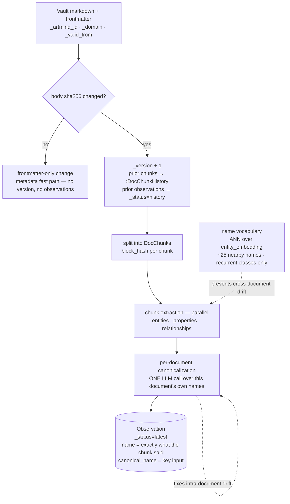
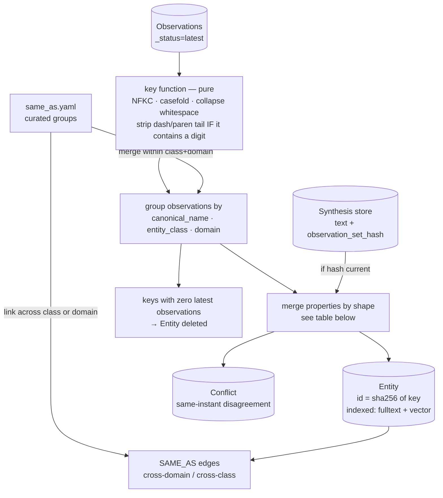
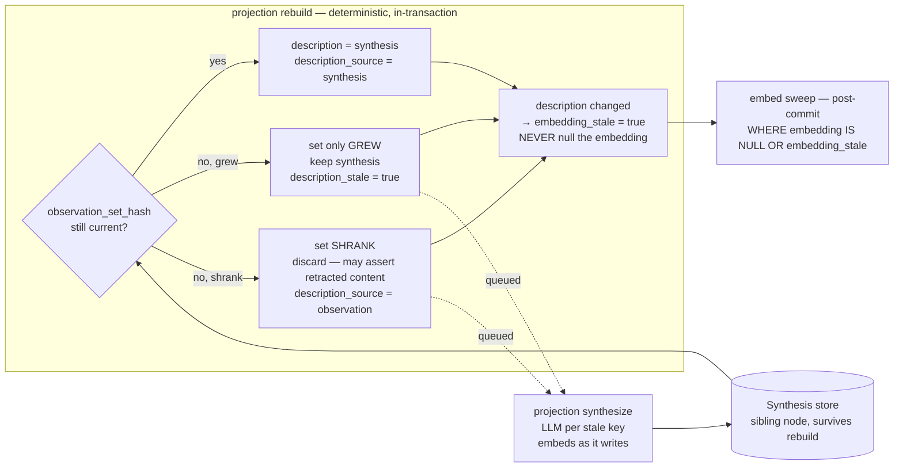
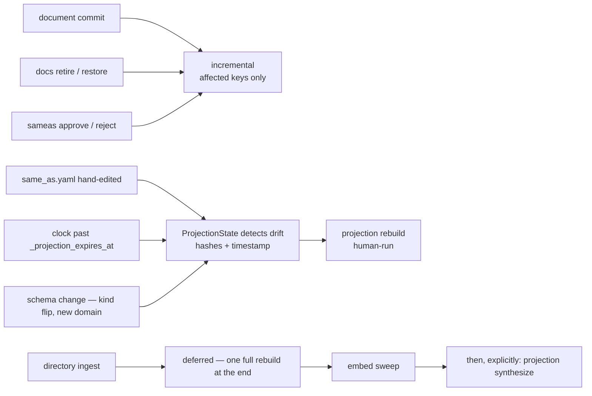

# The observation → projection pipeline

How a document becomes queryable knowledge. Vocabulary is defined in
[CONTEXT.md](../CONTEXT.md); this file is the mechanism.

Two populations exist in the graph:

- **`:Observation`** — the immutable record of what one chunk of one document
  version asserted. Never merged, never overwritten, carries no class label and
  no embedding, so it is in **no index**.
- **`:Entity`** — the projection. One node per aggregate key, holding the current
  best picture. The **only** layer that is indexed and the only layer ordinary
  queries touch.

Everything in `:Entity` is derived. Deleting the whole projection and rebuilding
it from observations produces a byte-identical result, because entity ids are
`sha256(canonical_name | entity_class | domain)` rather than random.

---

## 1. Ingest — one document at a time

The two anti-drift steps attack different problems. Retrieved vocabulary stops a
new document inventing a fresh name for something already in the graph. The
per-document canonicalization pass stops one document producing nine names for one
thing — chunks extract in parallel and cannot see each other, so this runs once,
after all of them, over the document's own output.

### What an Observation carries

| | |
|---|---|
| `id` | `sha256(chunk_id \| canonical_name \| entity_class \| domain)` — deterministic, so a re-write cannot duplicate |
| `name` | **verbatim what the chunk said.** Never overwritten by canonicalisation |
| `canonical_name` | what the key function consumes |
| `entity_class` | a **property**, never a label — see below |
| `domain`, `type`, `description`, `context`, `aliases` | as extracted |
| `_status`, `_valid_from`, `_valid_to` | inherited from the source document unless the fact carries its own dates |
| domain properties | flat scalars and lists — **never a JSON blob** |
| source | `-[:EXTRACTED_FROM]->(:DocChunk)` or `->(:UserChat)` |

**No `:Entity` label** — that is what keeps observations out of `entity_embedding`
and `entity_name_ft`. **No class label** either, and that one matters more than it
looks: `graph_metadata` reports node types by `UNWIND labels(n)`, `text2cypher`
builds its prompt from that output and tells the model to *"label entity nodes
explicitly, e.g. `(p:PERSON)`"*, and `entity_listing` derives an entity's class from
its label rather than its property. A `:POLICY` label on observations would make a
generated `MATCH (p:POLICY)` return superseded facts to a model that was told the
label was safe.

The `:Entity` produced by the projection **does** carry the class label, derived from
`entity_class`. Because that field is part of the aggregate key, two observations
disagreeing on class are simply two different Entities — the label is never
ambiguous, and nothing has to vote on it.

---

## 2. Projection rebuild — deterministic, no LLM

Runs **inside the same transaction** as the observation write. Milliseconds.

### Property merge, by shape

| Shape | Policy | Can conflict? |
|---|---|---|
| scalar domain property — `rate_value`, `owner`, `control_type` | **winner**: observation with the latest document `valid_from` | yes |
| `type` | winner | yes |
| list domain property — `regulatory_basis`, `audience` | **union** | no — a set cannot disagree with a set |
| `context` | union, capped | no |
| `aliases` | union of every observation's raw name + declared aliases | no |
| `name` | longest, tie-broken by frequency | no |
| `description` | synthesis when current, else the winner's | no |

Scalars are **not** unioned. `rate_value: [3.75, 4.60, 4.50]` cannot answer "what
is the rate?" — the winner answers it, `_temporal_props: ["rate_value"]` declares
that it varies, and the observations hold the history.

### Conflict vs. temporal variation

Decided by the class's declared `kind` plus the documents' `valid_from`:

| Class `kind` | Observations disagree, `valid_from` differs | …`valid_from` identical |
|---|---|---|
| **recurrent** — persists and changes | temporal variation → `_temporal_props` | **`:Conflict`** |
| **occurrent** — a completed point event | **`:Conflict`** | **`:Conflict`** |

A completed event's attributes do not drift. Two sources disagreeing about a past
meeting's attendee count is a defect in the corpus, not history.

---

## 3. Synthesize — separate, LLM, always explicit

> **Naming.** The two phases are **rebuild** (deterministic, automatic) and
> **synthesize** (language model, explicit). The word *consolidate* is retired: in
> the old code it meant the LLM description rewrite, but it reads like the
> deterministic step, and an ambiguous word in the central pipeline is not worth
> keeping.

`description` is not just display text: it feeds the `entity_name_ft` fulltext index
and the `entity_embedding` vector. So a synthesis is **copied onto
`Entity.description`** and read from there by every query. Nothing reads
`:Synthesis` at query time.

**When `synthesize` runs:** on demand, or as the deliberate second step of a bulk
load — `ingest sync <dir>` then `projection synthesize`. Never per-document, never
inside a transaction, never automatically. It is the only step that spends
language-model budget without being asked to, and its cost scales with the
*aggregate* count, not with what you fed in.

The synthesis store lives in a sibling node keyed by the Entity's deterministic id,
so a rebuild's `MERGE` + `SET n = $props` never touches it. Drop every `:Synthesis`
and the system degrades to winner-descriptions with nothing broken.

### Invariant: never null an embedding

A null embedding is absent from `entity_embedding`, which makes the entity
**invisible to `entity-resolve`'s vector leg** — not merely less accurate. Today's
code nulls in three places and backfills best-effort, so an embed service that is
down during a rewrite silently removes entities from semantic search.

- **Rebuild** cannot call the embed service (it is inside a Neo4j transaction), so
  it leaves the old embedding in place and sets `embedding_stale = true`. Stale
  still finds the entity; null deletes it.
- **Synthesize** runs outside any transaction and is already making an LLM call, so
  it computes the new embedding *first* and writes `description` + `embedding`
  together. No window exists. If the embed service is down, that entity is skipped
  whole and reported — the command is explicit and re-runnable.
- **The sweep** runs post-commit, scoped to the affected keys rather than the whole
  domain, matching on `embedding IS NULL OR embedding_stale`, and clears the flag.

---

## 4. What triggers a rebuild

### Command sequences

| | Sequence |
|---|---|
| **single file** | write observations + rebuild *(one transaction)* → commit → embed sweep |
| **directory** | per-document observation writes → one full rebuild *(one transaction)* → commit → embed sweep → *(explicit)* `projection synthesize` |

Triggers 1–3 are **invisible**: the rebuild is a step inside the operation that
dirtied the projection, and a failure fails that operation. Nobody types
`projection rebuild` in the normal course of work.

Triggers 4–6 have no natural host — a hand-edited file, a date rolling over, a
schema edit. A singleton `:ProjectionState` node records the `same_as.yaml` hash,
the schema-set hash and the last rebuild time, so `projection status` reports drift
and CLI queries warn. Queries **cannot** self-heal: `read_session()` is opened with
`READ_ACCESS`, and that guarantee is worth more than the convenience.

### Affected keys, on an incremental rebuild

The union of four sets — miss any one and orphans return:

1. keys from the incoming observations
2. keys from the **prior version's** observations — a renamed entity leaves its old key behind
3. keys in any `same_as` group touching either set
4. for retire: keys from the retired document's observations

Then: **any key in that set with zero `latest` observations has its `:Entity`
deleted.** That single rule replaces `_retire_orphaned_entities`, the
`size(docIds)=1` heuristic, and the scoped entity GC.
