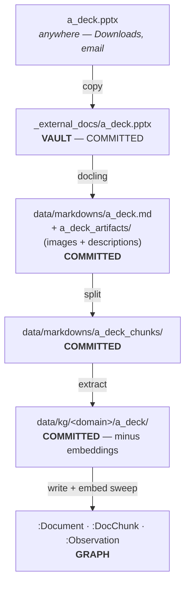
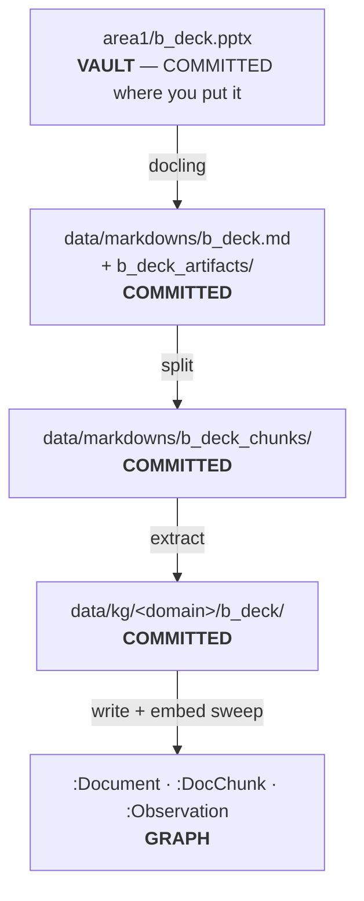
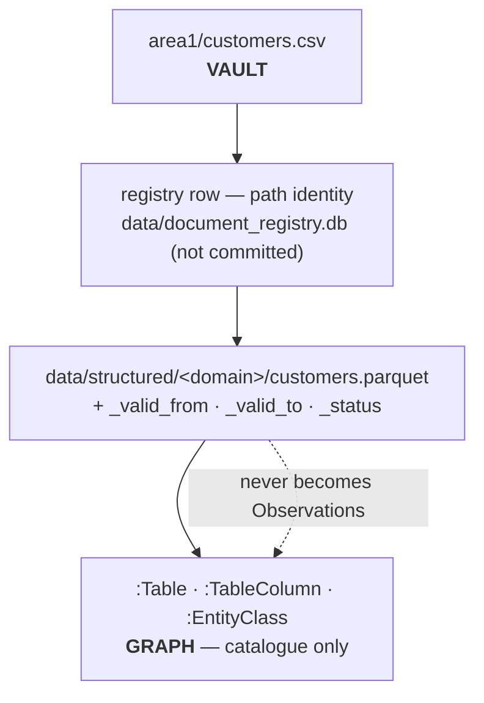

# Stores and repos

**Status: revised for the vault model ([vault.md](./vault.md)) — not yet
implemented.** Substantially revised on 2026-08-30 along with `vault.md`: the
`_derived/` promotion model is withdrawn, and derived output is now committed.
The code still implements the older layout described under "What this replaces".

Where everything lives, who owns it, and what survives what. The column that
used to matter most was **authoritative vs derived**; under the ownership rule
it is **who writes it** — because that is what decides whether artmind can
guarantee the state, and it turns out to decide the rest too.

## The stores

| # | Store | Location | Holds | Authoritative? |
|---|---|---|---|---|
| 1 | **Code repo** | `~/Projects/artmind9` | source · the shipped schema library · agent skills · **reference corpus** · `benchmarking/questions.md` | authoritative for code, shipped assets, and the gold-standard fixture |
| 2 | **The vault** | any directory, e.g. `~/Notes` | documents · binaries · `_external_docs/` · `.artmind/` | **authoritative** — see the split below |
| 3 | **Machine config** | `~/.artmind/config.env` · `~/.artmind/skills/` | LLM provider, credentials, models · the canonical skills copy | authoritative for credentials; skills are derived from the package |
| 4 | **The graph** | `neo4j+s://…neo4j.io` (**hosted AuraDB**) | Documents · DocChunks · Observations · the projection | **derived** |
| 5 | **Installed runtime** | `~/.local/share/uv/tools/artmind9/` (shim at `~/.local/bin/artmind`) | the `artmind` command | derived — editable, points back at the checkout |
| 6 | **Model service** | Ollama (local) or OpenRouter | extraction + embedding models | external dependency, not a store |

There is no run folder, no data dir and no archive root any more. All three were
positions that had to be kept pointing at the right vault; they are now positions
*inside* it.

## Inside the vault

`artmind init` writes the authoritative/derived split as a `.gitignore`, so git
enforces it rather than a reader remembering it. The organising rule is
**ownership**, not derivation (see [vault.md](./vault.md), "The ownership rule"):

> `.artmind/` belongs to artmind. You never edit it; artmind never guesses.

| Path | Holds | Authoritative? | In git |
|---|---|---|---|
| `notes/`, `area1/`, … | your documents and your binaries | **authoritative** | yes |
| `_external_docs/` | copies of sources ingested from outside the vault | **authoritative** — the vault's record of what came in | yes |
| `_Inbox/` | drafts | yours | yes, but never ingested |
| `.artmind/vault.yaml` | folder→domain mapping; the ingest manifest | **authoritative** | yes |
| `.artmind/domains/` | schemas + meta-schema | **authoritative** (hand-edited) | yes |
| `.artmind/same_as.yaml` | curation: merge adjudication | **authoritative** | yes |
| `.artmind/data/markdowns/` | converted markdown, extracted images, image descriptions, chunks | derived | **yes** |
| `.artmind/data/kg/` | extraction output — the expensive layer | derived | **yes**, minus embeddings |
| `.artmind/data/structured/` | DuckDB catalog + parquet | derived | yes |
| `.artmind/config.env` | this vault's graph connection | authoritative | **no** — holds a password |
| `.artmind/data/document_registry.db` | path↔id cache | derived | **no** — binary, churns, rebuilt by `docs reindex` |
| `.artmind/data/graph_snapshot/*.zip` | snapshots | derived | **no** — large, opaque, duplicate |
| `.artmind/logs/`, `state.json`, `serve.json` | machine-local runtime state | derived | **no** |
| `.claude/skills/` | artmind's (symlinked) + your own | mixed | only yours |

### Why derived output is committed

This reverses the older model, which kept everything derived out of git. Two
reasons:

**KG staging is the expensive layer** — hours and real money of LLM extraction
per document. In git, a clone reproduces the graph at zero API cost. The system
was already designed for this: `artmind ingest pull-kg` exists specifically to
fetch KG JSON from a git repo.

**Converted markdown is the readable record of a binary.** A `.pptx` diff tells
you nothing; its markdown diff is the actual content change. Committing both the
binary and its markdown means history shows *what changed*, not just *that*
something did.

The cost is repo growth, and it is worth going in eyes-open: this corpus
averages ~2.8 MB of KG staging per document. Git does not store diffs — it
stores compressed snapshots and delta-compresses at pack time, which works well
for text and badly for `.pptx` (a ZIP) and for embeddings (random floats). That
last one is why embeddings are stripped from committed staging; measured here,
ten versions of one `chunks.json` cost 60 KB with them and 20 KB without.

## What "derived" actually costs

Not all derived layers are equally cheap to rebuild, and conflating them is how
people lose work:

| Layer | Rebuilt from | Cost |
|---|---|---|
| the projection (`:Entity`, conflicts, `SAME_AS` edges) | observations + `same_as.yaml` | **milliseconds** — deterministic, no model calls |
| observations, chunks, documents | KG staging JSON | **minutes** — a graph write, no model calls |
| KG staging JSON | vault documents | **hours and real money** — LLM extraction per chunk |
| `:Synthesis` | observations | one model call per stale entity |
| structured parquet | vault `structured/*.csv` | seconds |
| `document_registry.db` | vault frontmatter (`docs reindex`) | seconds — *except for csv/xlsx, whose identity is path-only and cannot be rebuilt* |
| `data/markdowns/*.md` | the binary, if you still have it | one docling run + image description |
| chunk embeddings | the chunk text + the embedding model | seconds per chunk, **local, no API cost** — which is why they are stripped from committed staging |

**KG staging is the expensive layer.** That is why it is a snapshot component in
its own right, why `archive` bundles it rather than the graph, and why it is now
committed to git — a clone reproduces the graph without paying for extraction
again.

## What a "reset" means

- **Wipe the graph** → `snapshot restore`, or replay KG staging with
  `ingest write-to-graph`, then `projection rebuild`. **No LLM calls** — but
  committed staging carries no embeddings, so the chunk-embed sweep runs, which
  is local and one-off.
- **Wipe `.artmind/data/`** → `git checkout` brings it all back. This stopped
  being a destructive act the moment derived output was committed.
- **Clone the vault fresh** → everything comes back: documents, binaries,
  converted markdown, chunks, KG staging, schemas, curation and the mapping.
  What does not is the graph itself (rebuild it) and snapshots (excluded from
  git by design).
- **Re-derive the vault from the reference corpus** → every `_artmind_id` is lost,
  so every document registers as new. **A total reset**, not a refresh — fine, as
  long as it is deliberate.

Note what is no longer a reset case: "wipe the run folder" cannot orphan curation
any more, because `same_as.yaml` and the schemas live in the vault and in git.

## Reference corpus vs vault

Store 1 keeps a pristine copy of the banking corpus; a vault is a working copy
artmind mutates. They diverge as artmind writes `_artmind_id`, `_version` and
`_content_sha256` into frontmatter — by design.

There is deliberately **no reconciliation mechanism**. The reference is the input
for a from-scratch rebuild and the fixture the benchmark is scored against; the
vault is live state. To update the reference, copy from the vault by hand and
decide what to keep.

`benchmarking/questions.md` stays in the **code repo**, never a vault — and under
the vault model it would be harmless there anyway, since an unmapped path is
never ingested. Keeping it out remains the clearer rule.

## Document flow

Four flows, distinguished by **what the source is** and **where it lives**. In
every one, the converted markdown, its artifacts, its chunks and its KG staging
land in the same place — that uniformity is the point of the ownership rule.

### A — Binary from outside the vault

Identity is the **source path**, not the filename: two different decks both
called `a_deck.pptx` are different documents, and same-path-changed-bytes is a
new version.

### B — Binary already in the vault

**No copy** — the vault file is the source, and git already versions it.

### C — Markdown

An external markdown is copied to `_external_docs/` first, exactly as in flow A;
one already in the vault stays where you put it. Either way the ingested
snapshot lands at `data/markdowns/<stem>.md`.

**`_artmind_id` lives in the vault file**, not in the snapshot — so renaming or
moving your note keeps its history. The `data/markdowns/` copy is immutable and
matches the KG staging beside it: provenance, not redundancy.

### D — Tabular (csv, xlsx)

### What this means for where you work

| Source | You edit | Re-ingest triggered by |
|---|---|---|
| **binary, external** | the original, wherever it lives | re-running `ingest sync` on it |
| **binary, in the vault** | the binary in place | the file changing in the vault |
| **markdown, in the vault** | the note directly | the file changing in the vault |
| **tabular** | the csv | the csv changing |

"Triggered by" means *enqueued by the cursor* — ingestion is always "what changed
between `last_ingested_commit` and `HEAD`", never a filesystem watch. See
[vault.md](./vault.md), "Ingest triggers".

**You never edit `.artmind/data/markdowns/`.** If a conversion comes out wrong,
copy the markdown out into the vault as an ordinary note, move the binary to
`_Inbox/`, and ingest the note. That workflow replaces the promotion machinery
the previous model needed.

## What this replaces

The two-root layout the code still implements: a **run folder** (`ARTMIND_HOME`,
`~/.artmind`) holding `.env`, schemas, skills, curation and logs; and a **data
dir** (`ARTMIND_DATA_DIR`, `~/artmind_data`) holding originals, markdowns, KG
staging, the registry and snapshots — plus an **archive root**
(`ARTMIND_ARCHIVE_DIR`) alongside.

It was decoupled from the checkout but not from *itself*: one global run folder
meant one knowledge base at a time, and the four roots had to be kept pointing at
each other by hand. Folding them into the vault makes the knowledge base the unit
and removes the coupling rather than documenting it.

And an intermediate model, specified here between 2026-08-24 and 2026-08-30: a
user-visible `_derived/<domain>/` folder holding converted markdown, with
binaries gitignored. It was withdrawn for two reasons that only became clear
when the lifecycle was traced end to end.

Making converted markdown editable meant artmind had to detect your edits and
adjudicate between them and the binary — the promotion machinery, a collision
case it refuses to resolve, and a mid-life `git mv` that silently broke the
relative links to a document's own extracted images. And gitignoring binaries
left them with no version history and no second copy, so backing them up became
the user's problem, stated in this document as a consequence to accept.

The ownership rule dissolves both: nothing is editable inside `.artmind/`, so
nothing needs adjudicating; nothing moves, so no links break; and binaries are
committed like everything else, so nothing needs a separate backup story. The
table above is shorter than the one it replaced, which is the argument for it.
