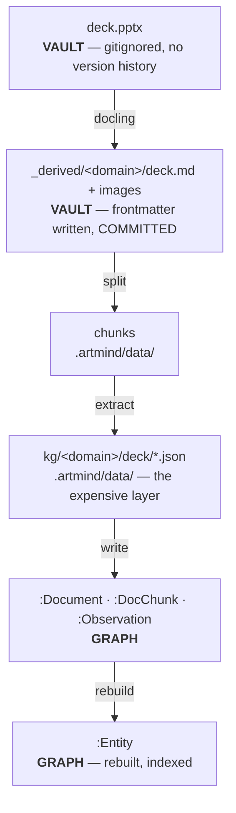
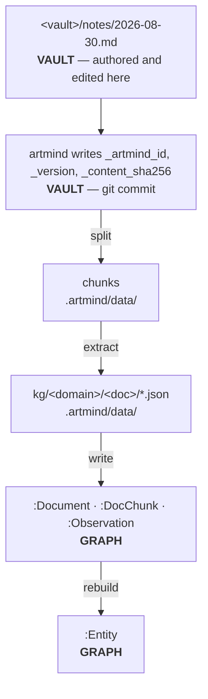
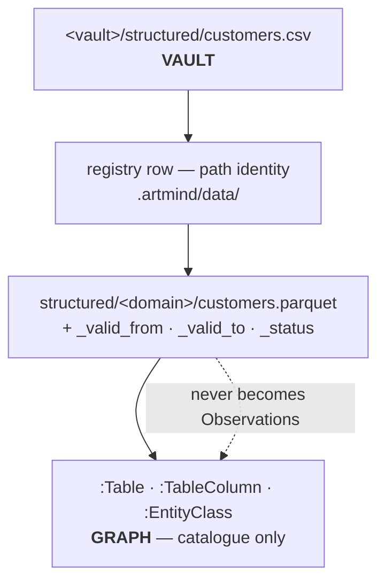

# Stores and repos

**Status: revised for the vault model ([vault.md](./vault.md)) — not yet
implemented.** The sections below describe the target topology; the code still
implements the two-root layout described under "What this replaces".

Where everything lives, who owns it, and what survives what. The column that
matters most is **authoritative vs derived** — it decides what must be backed up,
what can be thrown away, and what a "reset" actually means.

## The stores

| # | Store | Location | Holds | Authoritative? |
|---|---|---|---|---|
| 1 | **Code repo** | `~/Projects/artmind9` | source · the shipped schema library · agent skills · **reference corpus** · `benchmarking/questions.md` | authoritative for code, shipped assets, and the gold-standard fixture |
| 2 | **The vault** | any directory, e.g. `~/Notes` | documents · `_derived/` · `.artmind/` | **authoritative** — see the split below |
| 3 | **Machine config** | `~/.artmind/config.env` · `~/.artmind/skills/` | LLM provider, credentials, models · the canonical skills copy | authoritative for credentials; skills are derived from the package |
| 4 | **The graph** | `neo4j+s://…neo4j.io` (**hosted AuraDB**) | Documents · DocChunks · Observations · the projection | **derived** |
| 5 | **Installed runtime** | `~/.local/share/uv/tools/artmind9/` (shim at `~/.local/bin/artmind`) | the `artmind` command | derived — editable, points back at the checkout |
| 6 | **Model service** | Ollama (local) or OpenRouter | extraction + embedding models | external dependency, not a store |

There is no run folder, no data dir and no archive root any more. All three were
positions that had to be kept pointing at the right vault; they are now positions
*inside* it.

## Inside the vault

The authoritative/derived split is no longer prose to remember — `artmind init`
writes it as a `.gitignore`, so git enforces it.

| Path | Holds | Authoritative? | In git |
|---|---|---|---|
| `notes/`, `policies/`, … | your documents | **authoritative** | yes |
| `_derived/<domain>/*.md` | markdown converted from binaries; editable, promotable | **authoritative once edited** | yes |
| `_derived/**/*_artifacts/` | images extracted during conversion | derived, but cheap and needed for rendering | yes |
| `sources/*.pdf .pptx` | binaries you dropped in | **authoritative and unversioned** — see below | **no** |
| `.artmind/vault.yaml` | folder→domain mapping; the ingest manifest | **authoritative** | yes |
| `.artmind/domains/` | schemas + meta-schema | **authoritative** (hand-edited) | yes |
| `.artmind/same_as.yaml` | curation: merge adjudication | **authoritative** | yes |
| `.artmind/config.env` | this vault's graph connection | authoritative | no — holds a password |
| `.artmind/data/` | originals (external only) · chunks · **KG staging** · registry · structured · snapshots | derived | no |
| `.artmind/state.json` | the ingest cursor (`last_ingested_commit`) | derived | no |
| `.artmind/logs/`, `serve.json`, `worker.pid` | machine-local runtime state | derived | no |
| `.claude/skills/` | artmind's (symlinked) + your own | mixed | only yours |

### The one place backup is now your job

A binary in the vault is gitignored, so it has **no version history and no second
copy**. This inverts the old model, where `documents/originals/` was authoritative
precisely because it was the only copy artmind kept.

What survives regardless is `_derived/<domain>/<stem>.md` — the markdown is in
git, so the *content* is never lost, only the original formatting. And formatting
stops being the source of truth the moment that markdown is edited, which is what
promotion means (see [document-identity.md](./document-identity.md)).

Binaries ingested from **outside** the vault are different: nothing else holds
them, so they are still copied into `.artmind/data/originals/`.

## What "derived" actually costs

Not all derived layers are equally cheap to rebuild, and conflating them is how
people lose work:

| Layer | Rebuilt from | Cost |
|---|---|---|
| the projection (`:Entity`, conflicts, `SAME_AS` edges) | observations + `same_as.yaml` | **milliseconds** — deterministic, no model calls |
| observations, chunks, documents | KG staging JSON | **minutes** — a graph write, no model calls |
| KG staging JSON | vault documents | **hours and real money** — LLM extraction per chunk |
| `:Synthesis` | observations | one model call per stale entity |
| structured parquet | vault `structured/*.csv` | seconds |
| `document_registry.db` | vault frontmatter (`docs reindex`) | seconds — *except for csv/xlsx, whose identity is path-only and cannot be rebuilt* |
| `_derived/*.md` | the binary, if you still have it | one docling run + image description |

**KG staging is the expensive layer.** That is why it is a snapshot component in
its own right, and why `archive` bundles it rather than the graph.

## What a "reset" means

- **Wipe the graph** → `snapshot restore`, or replay KG staging with
  `ingest write-to-graph`, then `projection rebuild`. No model calls.
- **Wipe `.artmind/data/`** → re-ingestion from the vault. Full LLM cost, and
  binaries ingested from outside the vault are gone for good.
- **Clone the vault fresh** → documents, `_derived/`, schemas, curation and the
  mapping all come back from git. Binaries do not.
- **Re-derive the vault from the reference corpus** → every `_artmind_id` is lost,
  so every document registers as new. **A total reset**, not a refresh — fine, as
  long as it is deliberate.

Note what is no longer a reset case: "wipe the run folder" cannot orphan curation
any more, because `same_as.yaml` and the schemas live in the vault and in git.

## Reference corpus vs vault

Store 1 keeps a pristine copy of the banking corpus; a vault is a working copy
artmind mutates. They diverge as artmind writes `_artmind_id`, `_version` and
`_content_sha256` into frontmatter — by design.

There is deliberately **no reconciliation mechanism**. The reference is the input
for a from-scratch rebuild and the fixture the benchmark is scored against; the
vault is live state. To update the reference, copy from the vault by hand and
decide what to keep.

`benchmarking/questions.md` stays in the **code repo**, never a vault — and under
the vault model it would be harmless there anyway, since an unmapped path is
never ingested. Keeping it out remains the clearer rule.

## Document flow

Three flows, distinguished by **where the user actually works**.

### A — Binary source (pdf, pptx, docx)

**No copy into `originals/`** — the binary already lives in the vault. Only a
source from outside the vault is copied, because then nothing else holds it.
Git versions the *markdown*, which is the representation that diffs meaningfully.

### B — Vault-native markdown (journal, notes, policies you author)

**No copy is made** — the vault file *is* the document and git *is* its version
history. Re-editing bumps `_version` only when the body hash changes; touching
frontmatter alone takes the metadata fast path and mints no observations. That
last property is what stops commit-triggered ingestion from looping on artmind's
own commits.

### C — Tabular (csv, xlsx)

### What this means for where you work

| Source | You edit | Vault holds | Re-ingest triggered by |
|---|---|---|---|
| **binary** | the derived markdown, after conversion | binary (ignored) + markdown (committed) | the binary changing, until you edit the markdown — then promotion makes the markdown the source |
| **vault-native markdown** | the vault file directly | the document itself | the file changing |
| **tabular** | the csv in the vault | the csv | the csv changing |

"Triggered by" means *enqueued by the cursor* — ingestion is always "what changed
between `last_ingested_commit` and `HEAD`", never a filesystem watch. See
[vault.md](./vault.md), "Ingest triggers".

## What this replaces

The two-root layout the code still implements: a **run folder** (`ARTMIND_HOME`,
`~/.artmind`) holding `.env`, schemas, skills, curation and logs; and a **data
dir** (`ARTMIND_DATA_DIR`, `~/artmind_data`) holding originals, markdowns, KG
staging, the registry and snapshots — plus an **archive root**
(`ARTMIND_ARCHIVE_DIR`) alongside.

It was decoupled from the checkout but not from *itself*: one global run folder
meant one knowledge base at a time, and the four roots had to be kept pointing at
each other by hand. Folding them into the vault makes the knowledge base the unit
and removes the coupling rather than documenting it.
