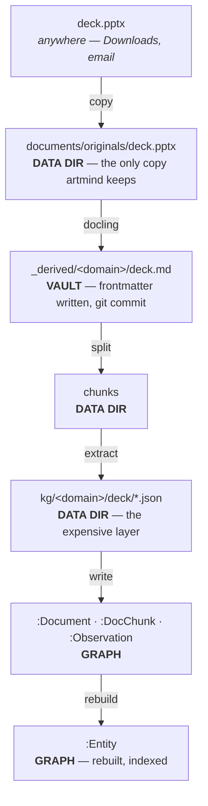
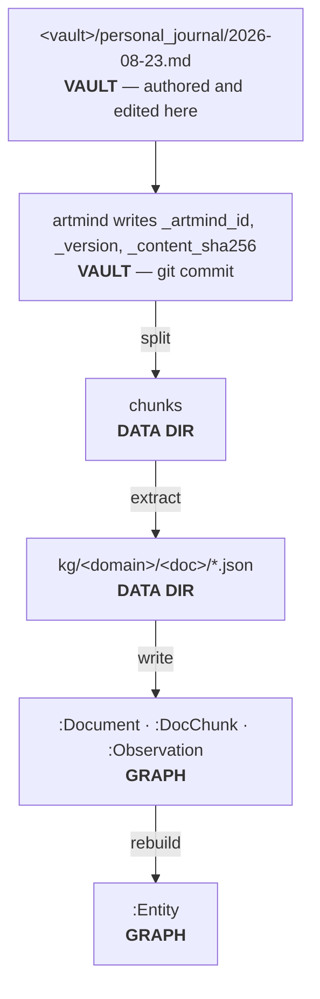
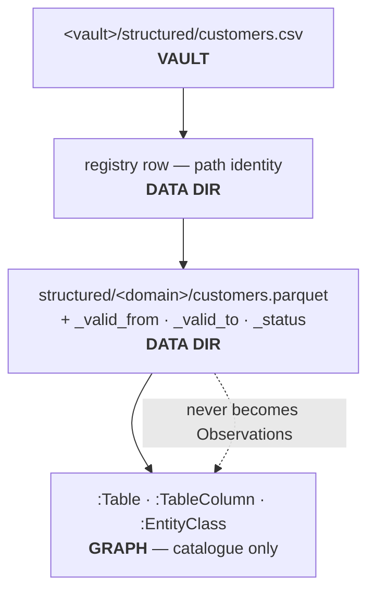

# Stores and repos

Where everything lives, who owns it, and what survives what. The column that
matters most is **authoritative vs derived** — it decides what must be backed up,
what can be thrown away, and what a "reset" actually means.

## The stores

| # | Store | Location | Config | Holds | Authoritative? |
|---|---|---|---|---|---|
| 1 | **Code repo** | `~/Projects/artmind9` | — | source · **reference corpus** · `benchmarking/questions.md` | authoritative (source of truth for code and the gold-standard fixture) |
| 2 | **Vault repo** | new, e.g. `~/Projects/artmind-corpus` | `ARTMIND_VAULT_DIR` | the **working copy** of documents + `structured/*.csv`; artmind writes frontmatter here and commits each ingested version | **authoritative** for document content and identity |
| 3 | **Run folder** | `~/.artmind` | `ARTMIND_HOME` | `.env` · `domains/schemas/` · `domains/meta.yaml` · `.claude/skills/` · `.opencode/` · `logs/` · **`same_as.yaml`** | **mixed** — curation is authoritative, package assets are reseeded by `init` |
| 4 | **Data dir** | `~/artmind_data` | `ARTMIND_DATA_DIR` | originals · markdowns · chunks · **KG staging** · `document_registry.db` · structured parquet · snapshots | derived — **except `documents/originals/`**, see below |
| 5 | **Archive root** | `~/artmind_archive` | `ARTMIND_ARCHIVE_DIR` | portable bundles from `docs archive` | **authoritative** — the only copy of archived content |
| 6 | **The graph** | `neo4j+s://…neo4j.io` (**hosted AuraDB**) | `ARTMIND_KG_NEO4J_*` | Documents · DocChunks · Observations · the projection | **derived** |
| 7 | **Installed runtime** | `~/.local/share/uv/tools/artmind9/` (shim at `~/.local/bin/artmind`) | — | the `artmind` command | derived — editable, points back at the checkout |
| 8 | **Model service** | Ollama (local) or OpenRouter | `ARTMIND_KG_LLM_*`, `ARTMIND_KG_EMBEDDINGS_*` | extraction + embedding models | external dependency, not a store |

## What "derived" actually costs

Not all derived layers are equally cheap to rebuild, and conflating them is how
people lose work:

| Layer | Rebuilt from | Cost |
|---|---|---|
| the projection (`:Entity`, conflicts, `SAME_AS` edges) | observations + `same_as.yaml` | **milliseconds** — deterministic, no model calls |
| observations, chunks, documents | KG staging JSON | **minutes** — a graph write, no model calls |
| KG staging JSON | vault documents | **hours and real money** — LLM extraction per chunk |
| `:Synthesis` | observations | one model call per stale entity |
| structured parquet | vault `structured/*.csv` | seconds |
| `document_registry.db` | vault frontmatter (`docs reindex`) | seconds — *except for csv/xlsx, whose identity is path-only and cannot be rebuilt* |

**KG staging is the expensive layer.** That is why it is a snapshot component in
its own right, and why `archive` bundles it rather than the graph.

## What a "reset" means

- **Wipe the graph** → `snapshot restore`, or replay KG staging with
  `ingest write-to-graph`, then `projection rebuild`. No model calls.
- **Wipe the data dir** → re-ingestion from the vault. Full LLM cost.
- **Re-derive the vault from the reference corpus** → every `_artmind_id` is lost,
  so every document registers as new. **This is a total reset**, not a refresh —
  which is fine, as long as it is a deliberate act.
- **Wipe the run folder** → `artmind init` restores package assets, but
  `same_as.yaml` and any hand-authored domain schema are gone unless restored from
  the `curation` snapshot component.

## Reference corpus vs vault

Store 1 keeps a pristine copy of the corpus; store 2 is the working copy artmind
mutates. They will diverge as artmind writes `_artmind_id`, `_version`, and
`_content_sha256` into the vault's frontmatter — by design.

There is deliberately **no reconciliation mechanism**. The reference is the input
for a from-scratch rebuild and the fixture the benchmark is scored against; the
vault is live state. If you want the reference updated, copy from the vault by hand
and decide what to keep.

`benchmarking/questions.md` stays in the **code repo**, never the vault:
`collect_ingest_files` skips only dotfiles, so a questions file inside the vault
would be ingested as a document — and artmind would then write an `_artmind_id`
into your benchmark fixture.

## Inside the data dir

```
artmind_data/
├── documents/originals/          binaries as ingested
├── documents/markdowns/          docling output (.md)
│   ├── <stem>_chunks/            split markdown — chunk_001.md, chunk_002.md …
│   └── <stem>_artifacts/         images extracted during conversion
├── kg/<domain>/<doc>/            KG staging — the expensive layer
│   ├── document.json  chunks.json  entities.json
│   ├── properties.json  relationships.json
│   └── chunks/chunk_001.json     per-chunk model output
├── document_registry.db          path ↔ id cache, chunk-extraction status
├── structured/                   DuckDB catalog + <domain>/<table>.parquet
├── ingestion_jobs/  refine/      job state, proposal artifacts
└── graph_snapshot/  structured_snapshot/
```

## Document flow

Three flows, distinguished by **where the user actually works**.

### A — Binary source (pdf, pptx, docx)

The user works **outside the vault**, in the authoring application. The vault holds
a derived mirror.



### B — Vault-native markdown (journal, notes, policies you author)

The user works **in the vault**, in their editor. This is the fast-moving case.



**No copy is made** into `originals/` or `markdowns/` — the vault file *is* the
document, and git *is* its version history. Re-editing it and re-ingesting bumps
`_version` only when the body hash changes; touching only frontmatter takes the
metadata fast path and mints no observations.

### C — Tabular (csv, xlsx)

The user works **in the vault**, in a spreadsheet or by regenerating an export.



### What this means for where you work

| Source | You edit | Vault holds | Re-ingest triggered by |
|---|---|---|---|
| **binary** | the original, elsewhere | a derived mirror | re-running `ingest sync` on the binary |
| **vault-native markdown** | the vault file directly | the document itself | the file changing in the vault |
| **tabular** | the csv in the vault | the csv | the csv changing |

The banking corpus is mostly **B** today — the `.md` files are authored, not
converted. A fast-moving domain like `personal_journal` is **B** by nature, and
that is the case the vault design is really for: write in your editor, and the
document's history is its git history.

## One duplication the redesign creates

Ingestion mirrors **derived** markdown (docling output from pptx/pdf/docx) into the vault
at `<vault>/_derived/<domain>/<stem>.md`, so binary-sourced documents get versioned
too. That leaves the same markdown in two places — the vault copy (versioned,
authoritative) and `documents/markdowns/` (working).

For **vault-native** markdown the copy is pure redundancy: today `ingest_file`
does `shutil.copy2(dest_path, md_file)` even when the source is already `.md`.
Under the new model there is no reason to copy it at all — read it from the vault,
and let `documents/markdowns/` hold only the derived output and the split chunks.
