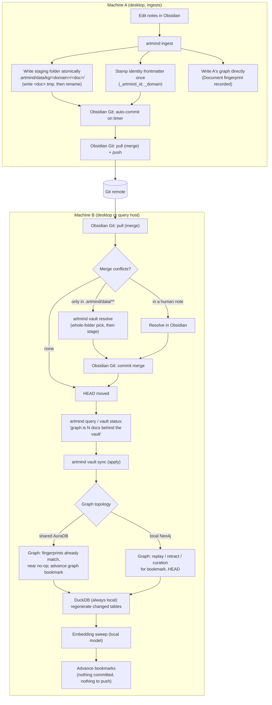
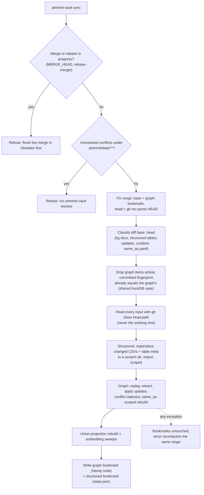

# Vault git transport: Obsidian Git owns git, artmind owns readiness and apply

**Status:** Design — approved in brainstorming
**Date:** 2026-09-26
**Owner:** Surjit Das
**Amends:** [2026-09-25-vault-sync-design.md](./2026-09-25-vault-sync-design.md) — §3 (where
the cursor lives), §5 step 6 (sync commits regenerated tables), and the implicit
"replay reads the working tree". Everything else in that spec stands.

## 1. Purpose

A vault is meant to sync between two (or more) machines through a git remote. Today
artmind takes part in git transport itself, and it does so badly:

- `vault_git.maybe_push` runs a bare `git push` with no fetch/merge first
  (`vault_git.py:174`). The moment the other machine pushes, every push is rejected
  (`! [rejected] main -> main (fetch first)`) — once per ingested file, because the
  worker pushes per file (`worker.py:160`) and the structured pipeline per export
  (`structured/pipeline.py:358`). Local commits pile up and the machines diverge.
- `commit_paths` stages its paths, then runs `git commit` **without a pathspec**
  (`vault_git.py:86`, `:120`), committing the whole index — anything the user or the
  Obsidian Git plugin had staged, and, mid-merge, concluding the user's merge under
  an artmind message.
- KG staging (`.artmind/data/kg/**`) is never committed by artmind at all, while the
  note's frontmatter is — so the other machine can receive a stamped note with no
  graph data behind it.
- `vault sync` classifies from `git diff base..HEAD` but replays from the **working
  tree** (`vault_sync.py:305`), then stamps `HEAD` as synced — uncommitted or
  half-merged content can be applied under a commit that doesn't contain it.
- The cursor is a bare sha in `state.json`; a rebase + `gc` makes it unreachable.
- Hot files guarantee conflicts across machines: the single
  `structured_text/manifest.json`, provenance frontmatter (`_source_commit`,
  `_ingested_at`) in human notes, and `table__*` folders that `vault sync` itself
  commits (`vault_sync.py:329`).
- Commands are built as f-strings through `shlex.split`; a `"` in a path or commit
  message breaks them.

**Goal:** one git writer (Obsidian Git), and a clear split for artmind — keep the vault
*safe to commit and merge* at all times (readiness), and *apply what git brought in* to
whichever Neo4j/DuckDB this machine uses (apply). Support both a shared AuraDB and a
separate local Neo4j per machine with the same code.

## 2. Decisions

| # | Decision |
|---|---|
| D1 | **Obsidian Git owns all git transport and all commits.** artmind never runs `git add/commit/rm/push/pull/merge` against the vault. |
| D2 | **artmind only reads git** (`rev-parse`, `diff`, `show`, `cat-file`, `status`). No write, not even a private ref — see §6 A2's amendment (2026-09-27 vault-sync-completion): a considered `update-ref` pin was dropped as unnecessary and against this decision's intent. |
| D3 | **Mobile never ingests.** Mobile edits notes only; it pulls and pushes through Obsidian Git like any other client. |
| D4 | **Apply is manual** (`artmind vault sync`), with a **staleness warning** on queries and `vault status`. Automatic apply is a later opt-in (§12), not part of this design. |
| D5 | **Merge, never rebase.** Commit shas are provenance and cursors; rewriting them is not supported. |
| D6 | **The graph must be rebuildable from the vault alone.** Anything written only to Neo4j does not travel to a machine with its own local Neo4j (§7). |

## 3. Responsibilities

| Actor | Owns | Never does |
|---|---|---|
| **Obsidian Git** | commit (timer), pull, merge, push, showing conflicts in human notes | — |
| **artmind — readiness** (write side) | writing files in a form that is always safe to auto-commit and merge: atomic staging folders, `.gitignore`/`.gitattributes`, per-table manifests, minimal frontmatter, `vault resolve` for generated-file conflicts, `vault doctor` | any git write |
| **artmind — apply** (read side) | replaying committed changes (`bookmark..HEAD`) into this machine's stores, reading content from git objects, bookmarks, staleness reporting | touching the working tree or index |
| **You** | resolving conflicts in your own notes, running `vault sync` when warned | editing `.artmind/data/**` by hand |

## 4. Flow

### 4.1 Two machines, end to end



### 4.2 One `vault sync` run



## 5. Readiness (write side)

### R1. artmind stops committing

Remove every write call into the vault's git:

| Call site | Change |
|---|---|
| `ingest.py:1048` (`_vault_commit_paths` after frontmatter write) | delete |
| `cli.py:757` (per-file commit in `ingest sync`), `cli.py:802` (`maybe_push`) | delete |
| `worker.py:158-161` (commit + push per file) | delete |
| `structured/pipeline.py:351-359` (commit + push after export) | keep the export, drop commit/push |
| `archive.py:227` (`remove_paths`) | always a plain filesystem delete; the archive bundle is the recovery path, and Obsidian Git records the deletion |
| `archive.py:323` (`commit_paths` on restore) | delete |
| `vault_sync.py:329-340` (commit regenerated `table__*`) | delete — `table__*` becomes gitignored (R4) |

`vault_git.py` shrinks to read-only helpers: `current_commit`, `is_dirty`, plus
`add_remote` (configuration at `init --interactive`, not transport). `commit_paths`,
`remove_paths` and `maybe_push` are deleted. `ARTMIND_VAULT_GIT_PUSH` is deprecated:
`vault doctor` reports it if set, and nothing reads it.

`run_command` gains an argv-list form (`run_command(["git", "show", f"{rev}:{path}"])`)
and every remaining git call uses it — no more f-string + `shlex.split`.

### R2. Atomic staging folders

Auto-commit fires on a timer and can capture a half-written document folder (new
`document.json`, old `observations.json`). Every writer of a staging folder
(`ingest.py:2402-2405`, `table2graph.write_staged`, and the new update writer in §7)
writes into `<docdir>.tmp/`, fsyncs, then swaps it into place with a rename. A rename of
a directory over an existing non-empty one is not atomic on POSIX, so the swap is:
rename old → `<docdir>.old`, rename `.tmp` → `<docdir>`, remove `.old`. `*.tmp/` and
`*.old/` are gitignored, and a stale pair left by a crash is cleaned up by the next
write of that doc.

### R3. `.gitattributes` for generated files

```
# ── artmind ── generated, regenerable; resolve whole-file, never line-merge
.artmind/data/** merge=binary
```

Without this, git can line-merge two extraction runs of the same document **cleanly** —
no conflict, a valid-looking but mixed `observations.json`. `merge=binary` turns that
into a reported conflict with no markers written into the file. Written by `init`
alongside `.gitignore`.

### R4. `.gitignore` additions

```
# derived from structured_text CSV + table mapping; regenerated by vault sync
.artmind/data/kg/*/table__*/
# atomic-write scratch (R2)
.artmind/data/**/*.tmp/
.artmind/data/**/*.old/
```

The `table__*` folders are a pure function of a table's CSV and its mapping, the same
way parquet is. Committing them is what made `vault sync` create commits on the
receiving machine. Track A of the sync spec no longer sees them; track B regenerates
them locally.

**Existing vaults.** `write_gitignore` today skips the whole block once its sentinel is
present (`vault.py:286`), so a changed `GITIGNORE_BLOCK` never reaches a vault that was
already initialised. The block gets a version marker
(`# ── artmind (v2) ─`) and `write_gitignore` **replaces** an older artmind block in
place, leaving the user's own rules untouched. Same mechanism for `.gitattributes`.
Newly ignored paths that are already tracked need a one-off `git rm --cached`; artmind
does not run it (D1) — `vault doctor` prints the exact command.

### R5. One metadata file per table

`structured_text/manifest.json` (the full registry dump, rewritten on every export)
becomes `structured_text/<domain>/<table>.meta.json`, one per table, beside its CSV.
`export_structured_text` writes only the touched tables' files; `import_structured_text`
reads per-table meta, falling back to a legacy `manifest.json` when no `.meta.json`
exists (read-only compatibility; the next export writes the new form and deletes the
legacy file).

### R6. Minimal, write-once frontmatter

Frontmatter in human notes keeps only identity: `_artmind_id` and `_domain`. Everything
that changes per ingest — `_version`, `_content_sha256`, `_source_sha256`,
`_source_commit`, `_ingested_at`, `_source_path`, `_source_type` — moves into the staging
folder's `document.json`. A note is rewritten by artmind at most once (first stamp) and
again only when `_domain` genuinely changes.

This removes artmind's lines from nearly every note conflict, and also the non-git risk
of artmind rewriting a note Obsidian has open while you type. Readers that take these
fields from frontmatter today (`document_identity.decide_version`, `docs reindex`,
`frontmatter_unchanged`) read them from `document.json` instead.

### R7. `artmind vault resolve`

Resolves conflicts under `.artmind/data/**` only; refuses to touch anything else.

- **KG document folder:** pick a whole side, per folder (`document.json` and
  `observations.json` together, never mixed). Rule: the side whose
  `document.json.content_sha256` equals the sha of the merged note's body wins. If both
  or neither match, the side with the greater `document.json` fingerprint
  (lexicographic) wins — arbitrary but identical on every machine, so two machines
  resolving the same conflict converge.
- **Structured table:** whole-file per table (CSV + `.meta.json` together), by the
  meta's `refreshed_at`, then by fingerprint.
- **`same_as.yaml`, curation files (§7):** human-curated — reported, not resolved.

It checks out the chosen side (`git checkout --ours/--theirs -- <paths>`) and stages it
(`git add`). This is the single exception to D1: it writes the index, only for paths
under `.artmind/data/**`, and only while a merge is in progress. It never commits;
Obsidian Git (or the user) concludes the merge.

A resolved-away side costs a re-extraction at most, never knowledge: the note itself is
human content and is always merged by the user.

### R8. `artmind vault doctor`

Read-only checks, each with the exact fix printed:

- `.gitignore` / `.gitattributes` artmind blocks present and current (R3, R4).
- Newly ignored paths still tracked → `git rm -r --cached <paths>`.
- `pull.rebase` is `false` (or unset) for this repo.
- Obsidian Git settings in `.obsidian/plugins/obsidian-git/data.json`: merge (not
  rebase), auto-pull on startup, auto commit-and-sync interval set. The exact key names
  must be confirmed against the installed plugin version (open question §13).
- `ARTMIND_VAULT_GIT_PUSH` set → deprecated, ignored.
- No other sync tool on the same folder (iCloud / Obsidian Sync markers) — warning only.

## 6. Apply (read side)

### A1. Read inputs from git, not the working tree

Every input `vault sync` replays is read at the fixed `head` via `git show
head:<path>`. Structured text is materialised into a scratch directory (`git show` per
changed CSV + `.meta.json`) and passed as `src_dir` to `import_structured_text`, which
already takes one (`text_export.py:129`). KG staging is loaded from blobs rather than
`KG_DIR / domain / docdir`. Uncommitted edits, half-merged files and in-flight atomic
writes are then irrelevant to what gets applied.

### A2. Bookmarks belong to the store, not the machine

A bookmark means "this store reflects commits up to X".

| Store | Bookmark location | Why |
|---|---|---|
| Graph | `(:ArtmindSyncState {vault_id, last_applied_commit, applied_at})` in Neo4j | A shared AuraDB carries one bookmark for every machine using it; a local Neo4j carries its own. Same code for both topologies. |
| Structured store | `state.json` `last_structured_commit` | DuckDB is always a local file, even with a shared AuraDB. |

`vault_id` is minted once by `init` into `vault.yaml` (committed), so two vaults sharing
one AuraDB don't share a bookmark. The existing `last_synced_commit` in `state.json` is
read once as the initial value for both bookmarks, then retired.

artmind only *reads* this vault's git (D2) — never a commit, never a ref, not even a
private one. A bookmark's commit is not pinned against `gc`: Obsidian Git merges rather
than rebases (D5), so an advanced bookmark's commit stays reachable through ordinary
history on its own. Should a bookmark's commit ever become unreachable anyway (a rebase
or reset outside Obsidian Git's normal flow), `vault sync` refuses to diff from it —
it must be an ancestor of `HEAD`, or the refusal names the recovery (`--store <name>
--bootstrapSynced` if that store is already known-current, else `--store <name>
--bootstrapEmpty`) — rather than silently reading everything that bookmark has and
`HEAD` lacks as removals.

`session initiate` (snapshot restore) restores the graph bookmark from the graph
snapshot's own `:ArtmindSyncState` node, exported alongside the rest of the graph's
content (`graph_snapshot.py`'s `SYNC_STATE_LABELS`) — **not** from the unified
snapshot manifest's `vault_commit`, as an earlier version of this section said. A
manifest's `vault_commit` is the vault's HEAD at export time, which can be *ahead*
of what the graph actually received (Obsidian Git pulled another machine's commits,
nobody ran `vault sync` yet, then `snapshot create` ran) — restoring from it in that
case would mark commits applied that the graph never got, silently, forever on a
local Neo4j. The graph's own bookmark is never ahead of the content restored with
it. A snapshot taken before bookmarks existed carries none, and the next sync then
needs `--bootstrapEmpty`/`--bootstrapSynced`, as today; `session initiate` says
which case applies.

### A3. Fingerprints make shared AuraDB cheap

Every graph write of a staging folder (ingest and apply alike) records
`fingerprint = sha256(observations.json bytes)` on the `Document` node. Apply skips any
document whose committed fingerprint equals the graph's. On a shared AuraDB the machine
that ingested already wrote the graph, so the other machine's apply is a near no-op that
just advances the bookmark. On a local Neo4j nothing matches and everything in range is
replayed.

### A4. Staleness warning

`vault status` and every `query` command report pending work cheaply:

1. `git rev-parse HEAD` vs the graph bookmark — equal → current, stop.
2. Otherwise `git diff --name-only bookmark..HEAD` scoped to `.artmind/data/**` and
   `.artmind/same_as.yaml`, then one Cypher read comparing fingerprints (A3).
3. Report `graph is N docs / M tables behind the vault — run artmind vault sync`, on
   stderr, never inside `--compact` JSON output (it is advisory, not data).

A query never blocks or applies on its own (D4).

### A5. Preflight guards

`vault sync` refuses — writing nothing — when a merge or rebase is in progress
(`.git/MERGE_HEAD`, `.git/rebase-merge/`, `.git/rebase-apply/`), when there are
unresolved conflicts under `.artmind/data/**`, or when the ingestion worker is running
for this vault (its pid file), since both write the same graph keys.

## 7. Making graph-only writes travel (D6)

With a local Neo4j per machine, anything written only to Neo4j never reaches the other
machine; with a shared AuraDB it survives only until the next wipe-and-rebuild.

| Write today | Stored as | New file in the vault | Applied by |
|---|---|---|---|
| `artmind update` facts (`update.py`, direct Cypher) | Neo4j + gitignored registry drafts | `.artmind/data/kg/<domain>/update__<session_id>__<draft_id>/` — `document.json` + `observations.json`, the same shape as a document (§14 A9) | track A replay, like any document (as a `:UserChat`, §15 A9) |
| Conflicts and their resolutions (`conflicts.materialize`, `conflicts.resolve_conflict`) | `:Conflict` nodes only | `.artmind/data/curation/conflicts/<id>.json`, one file per conflict record (§14 A6, A9) | new track C: MERGE the record, or remove it when its file is deleted |
| `same_as.yaml` edits | already a vault file | — | new track D: rebuild the keys in groups added/removed/changed between base and head |

`update confirm` still puts the fact in Neo4j immediately (the user expects it now), but
through the folder: it writes the `update__<session>__<draft>` staging folder and commits the
graph *from* it with `ingest._commit_document_tx` as a `:UserChat` (§15 A9), so replaying it
elsewhere is idempotent. Conflict ids are deterministic across machines
(`conflicts.conflict_id`: sha1 of the sorted entity ids plus the aspect; see §15 A9), so track
C's MERGE by id is idempotent.

## 8. Topologies

| | Shared AuraDB | Separate local Neo4j per machine |
|---|---|---|
| Who writes the graph for a new document | the ingesting machine, at ingest | each machine: ingest on A, apply on B |
| B's apply, graph side | fingerprints match → near no-op, bookmark advances | full replay of `bookmark..HEAD` |
| B's apply, structured side | regenerate changed tables into B's DuckDB | same |
| Embeddings | already present | local sweep for touched keys (no API cost) |
| Curation (`update`, conflicts, `same_as`) | visible immediately; survives rebuild via §7 files | reaches B only via §7 files |
| Bootstrap | rarely needed (bookmark lives in AuraDB) | `--bootstrapEmpty` for an empty instance |

## 9. Recommended Obsidian Git configuration

(Setting names differ between plugin versions; `vault doctor` checks the stored values.)

- Sync method: **merge** (D5).
- Auto commit-and-sync interval: 5–10 minutes.
- Pull on startup: on.
- Commit message: anything; artmind no longer reads commit messages.
- Mobile: same settings, and never run artmind there (D3).
- Do not also sync the vault folder with iCloud / Obsidian Sync / Dropbox.

A machine without Obsidian that must follow the remote (e.g. a query-only host) uses a
plain `git pull --no-rebase` on a launchd/cron timer — documented, not built into
artmind.

## 10. CLI surface

| Command | Change |
|---|---|
| `artmind vault sync` | reads from git objects (A1), graph bookmark in Neo4j (A2), fingerprint skip (A3), preflight (A5), tracks C/D (§7); no longer commits |
| `artmind vault status` | adds: HEAD, graph bookmark, structured bookmark, pending docs/tables, merge in progress, unresolved `.artmind/data` conflicts |
| `artmind vault resolve` | new (R7); `--dryRun` shows the chosen side per folder/table |
| `artmind vault doctor` | new (R8); `--compact` JSON |
| `artmind init` | writes versioned `.gitignore`/`.gitattributes` blocks (R3/R4), mints `vault_id`; stops offering `ARTMIND_VAULT_GIT_PUSH` |
| every `query` command | staleness warning on stderr (A4) |

Per CLAUDE.md, the `vault` group docstring, `COMMAND_GROUPS` routing, the relevant
skill(s) in `artmind/skills/`, `docs/vault.md` ("Running alongside the Obsidian Git
plugin" is rewritten around D1) and the `justfile` are updated together.

## 11. Testing

Hermetic tests use real throwaway git repos (`git init` in `tmp_path`), not mocked
`run_command`, since the behaviour under test is git's.

- **No git writes:** after ingest, archive, structured export and `vault sync`, the
  repo's `HEAD` and index are unchanged (`git rev-parse HEAD`, `git diff --cached
  --quiet`).
- **Reads HEAD, not the tree:** commit doc v1, edit `observations.json` on disk
  without committing, sync → the graph write receives v1's observations (assert on the
  parameters sent, per CLAUDE.md §3's `run_side_effect` pattern).
- **Atomic write:** interrupt between the two renames → the folder is either wholly old
  or wholly new; the next write cleans `.tmp`/`.old`.
- **`merge=binary`:** two branches regenerate the same doc with non-overlapping line
  changes → merge reports a conflict (without the attribute it would merge cleanly —
  assert both, so the test proves the attribute is what matters).
- **`vault resolve`:** both machines resolving the same conflict pick the same side;
  a conflict in a human note is left untouched and reported.
- **Bookmarks:** shared-graph case — ingest on "A" writes fingerprints, apply on "B"
  replays nothing and advances the bookmark; local case — replays everything in range.
  A bookmark whose commit has been rewritten away (no longer an ancestor of `HEAD`) is
  refused, not silently diffed.
- **Preflight:** `MERGE_HEAD` present → refuses, bookmarks untouched.
- **§7 tracks:** an `update__*` folder replays; a changed conflict record file
  MERGEs its `:Conflict`; a `same_as.yaml` group change rebuilds exactly its keys.
- **Legacy compatibility:** a vault with `manifest.json` and fat frontmatter still
  imports and versions correctly.

End-to-end (live AuraDB, `ARTMIND_NO_PROXY=1`): two clones of one bare remote in a temp
directory, each with its own `ARTMIND_HOME`, simulating Obsidian Git with plain `git
pull --no-rebase && git push`.

## 12. Phases

1. **Stop the damage:** R1 (no commits/pushes, argv `run_command`), A1 (read from HEAD),
   A5 (preflight). Fixes the reported push rejections and the whole-index commit.
2. **Readiness:** R2 atomic writes, R3/R4 versioned `.gitattributes`/`.gitignore`, R5
   per-table meta, R8 `vault doctor`.
3. **Topologies:** A2 bookmarks in Neo4j, A3 fingerprints, A4 staleness
   warning, extended `vault status`.
4. **Curation travels:** §7 tracks for `update`, conflicts, `same_as.yaml`.
5. **Conflicts and frontmatter:** R7 `vault resolve`, R6 frontmatter slimming with a
   migration (`artmind vault migrate-frontmatter`: move fields into `document.json`,
   rewrite each note once — the one bulk note rewrite, run deliberately, with Obsidian
   Git's auto-commit paused).
6. **Later, opt-in:** automatic apply in `serve` (`ARTMIND_VAULT_AUTO_APPLY=1`) — poll
   `HEAD`, run the same apply when the preflight passes. Out of scope here.

## 13. Open questions

- Does isomorphic-git (Obsidian Git on mobile) honour `.gitattributes` `merge=binary`?
  Under D3 mobile never produces generated files, so a mobile-side merge of
  `.artmind/data/**` is only a fast-forward in practice — but this should be verified.
- The exact Obsidian Git `data.json` keys for sync method, pull-on-startup and auto
  interval, for `vault doctor`.
- ~~Whether conflict ids from `conflicts.materialize` are deterministic across machines.~~
  **Answered 2026-09-27:** yes — `conflicts.conflict_id` is `sha1(sorted entity ids | aspect
  slug)`, and entity ids are `sha256(name|class|domain)`. See §14 A6 for what that changes.
- A machine without Obsidian that **ingests** has no committer under D1. Not a
  supported setup for now; if it becomes one, the answer is a documented git timer, not
  artmind committing again.

## 14. Amendments (2026-09-27)

Found by live testing and by the phase 1 review and phase 2 execution notes
(`docs/superpowers/reviews/2026-09-26-vault-git-transport-phase1-review.md`,
`docs/superpowers/plans/2026-09-26-vault-git-transport-phase2.md` "Execution notes").
Each amends the section named.

**A1. Table sources are a sync input (amends R4, §6 A1).** Gitignoring `table__*` (R4) left
`vault sync` blind to a table whose CSV did not change but whose **table mapping** or **domain
schema** did: the receiving machine kept the old projection, silently. `vault sync` therefore
also diffs `.artmind/domains/table_mappings/*.yaml` and `.artmind/domains/schemas/*_schema.yaml`:
a changed mapping regenerates every registered table its `table:` pattern matches (and, on a
removed mapping, retracts them); a changed schema regenerates that domain's tables. Mappings and
schemas are read from `head`, like every other input — never the working tree.

**A2. A table with no mapping is a structured-store table only (amends §6 track B).** Track B
restores it to DuckDB and skips `table2graph`. It no longer raises `no table mapping`, which
stalled the cursor forever on any vault with unmapped tables.

**A3. Table identity is `(domain, table_name)`, not the SQLite id (amends R5).** Per-table
`.meta.json` files used to carry SQLite's autoincrement `tables.id`, which collides when two
machines each register a new table. Import remaps ids by `(domain, table_name)`; `.meta.json`
carries no machine-local ids at all — neither the table's own id nor any child row's
`table_id` — so a table's meta doesn't churn every time its local id changes, and two
machines' meta for the same table never conflicts on an id that was never shared truth. An
older `.meta.json` (or the legacy `manifest.json`) that still carries ids is still read
correctly.

**A4. Every staging writer is atomic, and track A replays on any change in a document folder
(amends R2, §6 A1).** Archive restore, dashboard artifact import and `kg_pull` join ingest and
`table2graph` in using the atomic swap. Track A replays a folder when any file in it changes, not
only `observations.json`, so a folder committed in two halves still converges.

**A5. Paths are read NUL-separated (amends §6 A1).** Every git listing `vault sync` parses uses
`-z`, so non-ASCII and space-containing names are neither quoted nor split.

**A6. Conflict records travel, not just their status (amends §7).** Conflicts are *detected* by
an LLM and written only to Neo4j, so a machine with its own Neo4j never sees them at all.
The conflict record itself (id, the two entity keys, aspect, verdict, evidence summary, status,
reason, timestamps) travels as a vault file -- one file per conflict, not a shared
`conflicts.yaml` (§14 A9); apply MERGEs `:Conflict` nodes and `CONFLICTS_WITH` edges from it. Ids are deterministic (§13), so re-detecting the same
conflict on another machine MERGEs onto the same record rather than duplicating it.
Same-as **proposals** stay machine-local: they are a review queue, and an approved group already
travels as `same_as.yaml`.

**A7. Preflight scope (amends §6 A5).** Only unresolved conflicts under `.artmind/` block sync.
A conflicted human note does not affect what sync applies, and Obsidian shows it to the user.

**A8. Automatic apply is in scope (amends §12 item 6).** Opt-in `ARTMIND_VAULT_AUTO_APPLY=1`:
`serve` polls `HEAD` and runs the same apply when the preflight passes and the graph is behind.

## 15. Amendments (2026-09-28, phase 4 -- curation travels)

**A9. One file per curation record; update folders per confirmed draft (amends §7, §14 A6).**
Every path under `.artmind/data/**` is `merge=binary` (R3), so one shared `conflicts.yaml` would
turn two machines' independent curation into a whole-file conflict that blocks `vault sync`.
Each curation record is its own file, `.artmind/data/curation/<kind>/<id>.json`, written
atomically and serialised deterministically; `conflicts` is the first kind
(`artmind/curation_records.py`, `artmind/conflict_records.py`). A detection never rewrites an
existing record, so a conflict another machine recorded -- and perhaps resolved -- is neither
reopened nor churned; two machines colliding on one record only happens when both detect it
before either pulls, and then either side may be kept. The graph carries each record's
fingerprint (`:Conflict.record_fingerprint`), so a shared graph skips records it already has, and
`vault status` counts only what is really pending.

An `artmind update` is one folder per confirmed draft,
`kg/<domain>/update__<session_id>__<draft_id>/`, not per session: a session can confirm several
drafts. Its id, `update:<session_id>:<draft_id>`, is deterministic (a retried confirm rewrites the
same folder) and cannot collide across machines (a session's uuid4 lives in one machine's
registry). `update confirm` writes the folder and commits the graph from it through
`ingest._commit_document_tx` -- the transaction `vault sync` replays it with -- as a `:UserChat`
(not a `:Document`). Deleting the folder retracts it everywhere; `artmind update retract`
retracts the graph first and only then deletes the folder, so the retraction travels.

Track D rebuilds with `same_as.yaml` as committed at `head`, never the working tree, and expands
every key it rebuilds to the whole same-as groups touching it.

**A10. Every graph-only curation write travels (extends §7 and A9).** Tracing every command the
chat and admin agents can run found four more writes that lived only in Neo4j or SQLite. Each
is now a curation kind (A9's one file per record) or a table's `.meta.json`:

- **Supersession** (`ingest supersede`, `ingest detect-supersession`, the adjudicator's
  "superseded" verdict): `curation/supersessions/<sha1(newer|older|scope)>.json`. The older
  document's `valid_to` and `superseded_by` are *derived* from every `SUPERSEDES` edge still
  pointing at it (latest `effective` wins, ties by id; both null when none remains), so
  un-asserting one -- deleting its file -- restores exactly what the remaining assertions say,
  on every machine, whatever order they apply in. Only supersession writes those two properties
  (a document's own window is `_valid_from`/`_valid_to`), which is what makes the derivation exact.
- **Retirement** (`docs retire`/`restore`, archive restore, a document-scoped supersession):
  `curation/lifecycle/<sha1(doc_id)>.json`, present exactly while the document is retired. A
  retirement is **sticky**: a later re-ingest or replay of that document commits it and moves it
  straight back to history in the same transaction, and `vault sync` re-applies the record
  committed at `head` after replaying the document. Only `docs restore` (deleting the record)
  brings it back. Un-asserting a supersession does not un-retire; the two records are
  independent.
- **Synthesis** (`projection synthesize`): `curation/syntheses/<entity id>.json` -- the
  `:Synthesis` node plus the entity key, no embedding (derived; re-embedded locally). Applied
  before `vault sync`'s rebuild, with its key in it, so the rebuilt description is the synthesis
  and no machine pays the LLM again.
- **Structured-store curation** (`db grain`, `db mappings`, `db bridge`, `db propose`): the command
  re-exports the table's `.meta.json` (not its CSV). `vault sync` restores only the registry rows
  of a table whose CSV is unchanged and whose meta changed only in curation fields -- no parquet
  rewrite, no `table2graph` -- and re-projects the graph's catalogue subgraph for the domains whose
  registry rows it restored. The projection is called directly, so a failure aborts the sync before
  any bookmark advances and the same range is retried (all-or-nothing, §9).

Limitations, by design:

- The catalogue follows only in a run where the graph *and* the structured store are both in the
  run. A `--store graph` run does not restore curation-only table changes (the structured
  bookmark has not moved), and a `--store structured` run never touches Neo4j; the remedy is
  `artmind db catalogue --domain <d>`.
- Curation that predates records has no file and does not travel until re-asserted. In
  particular a `:Synthesis` written before A10 has no record and no `key`; sync skips it while its
  observation-set hash is current, so it travels only after `projection synthesize --force`.

Still machine-local, by design (§14 A6): same-as proposals (`sameas propose`/`reject`,
`ingest refine-graph`, `detect-conflicts`' same-entity verdicts) -- a review queue whose approved
outcome travels as `same_as.yaml`. `query graph text2cypher` cannot write at all: it runs through
`graph_query.read_session()`, which the server enforces as read-only.
